# preface

- [CUT&TAG数据分析流程](https://www.protocols.io/view/cut-amp-tag-data-processing-and-analysis-tutorial-e6nvw93x7gmk/v1)

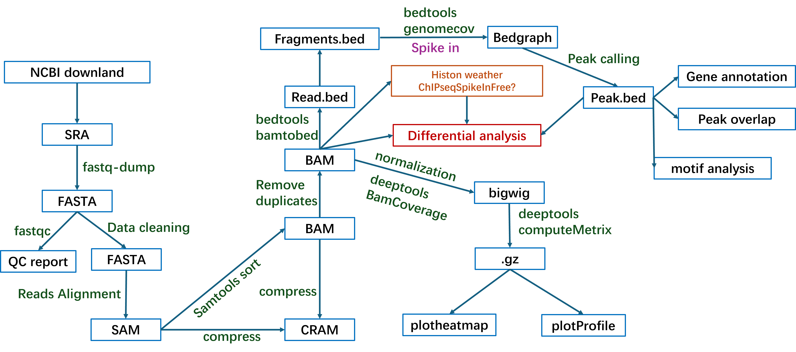

<tr>
  <td>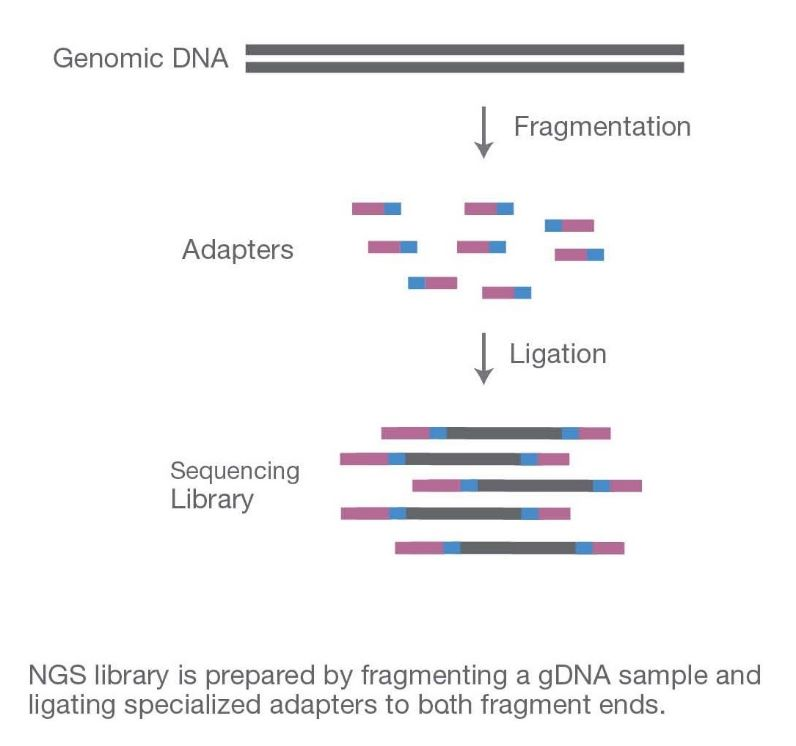</td>
  <td>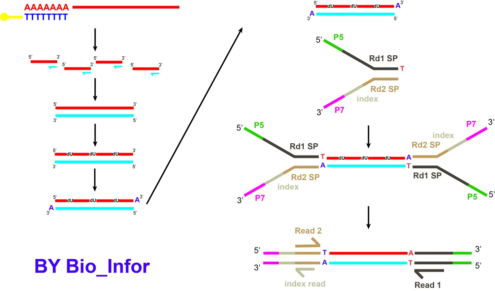</td>
</tr></table>

* **DNA fragmentation**：genomic DNA becomes DNA fragment with 200-500bp in length

* **End Repair**: Blunt-ended fragments are generated

* **A-tailing**: 使用**Klenow酶**来给**3'末端**添加一个突出的**A**，用于连接 **Adapters** 突出的**T**

* **Adapter Ligation**: 

  | 区域              | 功能                                                         |
  | :---------------- | :----------------------------------------------------------- |
  | **P5/P7**         | 与 Flowcell 上的寡核苷酸互补结合，用于桥式PCR扩增和测序引物结合。 |
  | **Rd1 SP/Rd2 SP** | Sequencing Primer 测序引物                                   |
  | **Barcode/Index** | 用于区分不同样本。部分平台在P5 Adapter上增加第二个Index（**双索引设计**） |


> [!TIP]
>
> **双Index设计**
>
> - **Paire-End** 区分两个方向的 reads
> - 单Index在测序中可能因化学错误或交叉污染导致Index误读。双Index需同时匹配i5+i7才认定样本来源，错误率降低至<0.1%
> - 通过组合i5和i7，可生成 **指数级增长的样本容量**
> - 双索引可与**UMI（Unique Molecular Identifier**）联用，进一步消除PCR重复偏差


### Step 2. Cluster generation


> [!NOTE]
>
> **Flowcell**
>
> 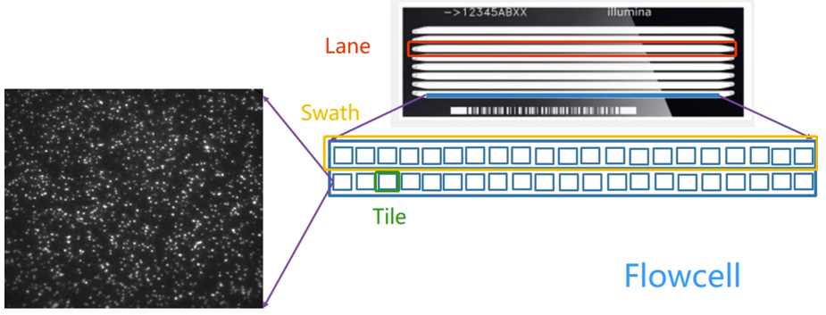
>
> **Flowcell**，我们也可以把它叫做**芯片**，像一个载玻片，上面有一行字母，是这个 **Flowcell**的**编号**
>
> - 中间的通道，我们把它们叫做 **lane**，这里就是我们**测序反应发生的地方**
>
> - **lane** 又被分成了好多行，每一行我们把它叫做 **swath**
>
> - 继续放大！每行 **swath** 又被分成好多小格子，每个小格叫做 **tile**
>
> - **tile**里的DNA片段被扩增就是**簇（Cluster）**生成，一个**Cluster**对应 fastq 中一条 **read**


**Flowcell**，这个结构的底部有很多的多核苷酸链，这些多核苷酸链是与我们的**p5和p7 adapter**互补的。

<table><tr>
  <td></td>
  <td>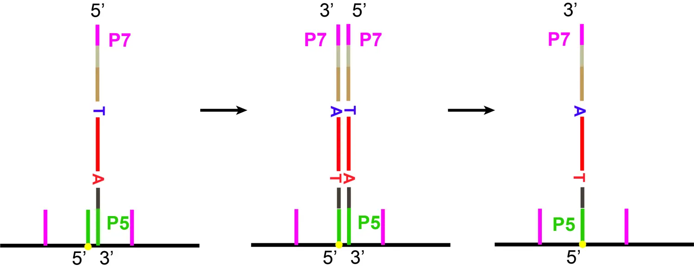</td>
</tr></table>

- P5 adapter 序列会和 Flowcell 上面的P5 adapter互补序列结合

- DNA的合成后，由于 Flowcell 上面的 adapter互补序列是和 Flowcell**共价连接**的（黄色圆圈标出）

- 使用碱性溶液冲洗 Flowcelll 时，靠**共价键连接在 Flowcell 上的链并不会被冲洗掉**，反之**另一条链就被洗掉**了，最后就成了最右边的那种情况。

  

<table><tr>
  <td>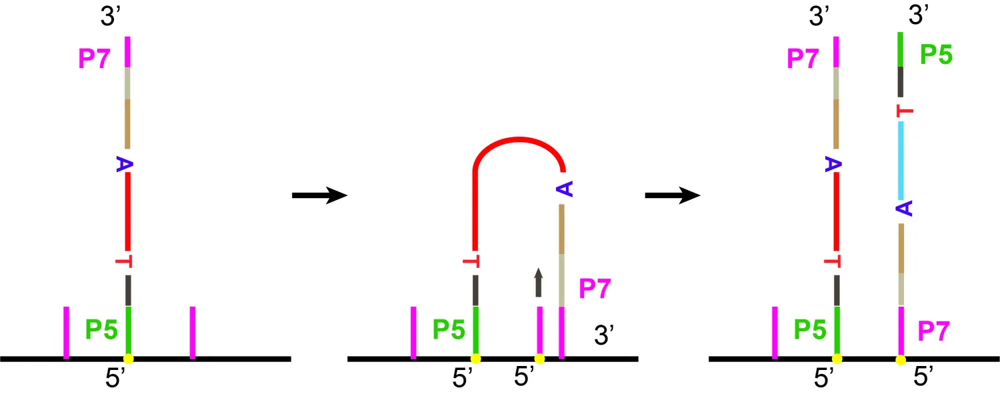</td>
  <td>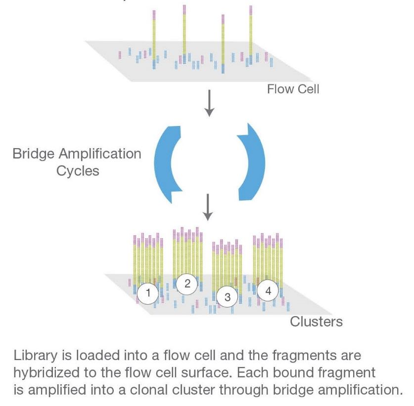</td>
</tr></table>

- P7 adapter 序列会和 Flowcell 上面的P7 adapter互补序列结合

- 形成一个桥，进行**桥式PCR**，DNA合成后用碱性溶液就能使DNA双链解链，

- **簇生成（Cluster generation）**：如此重复进行**桥式PCR**，最终就会形成一个**局部簇（localized cluster）**

  单个碱基的荧光终究是比较弱的，但是很多个碱基的荧光聚在一起就会很明显了

  

### Step 3. Sequencing

<table><tr>
  <td>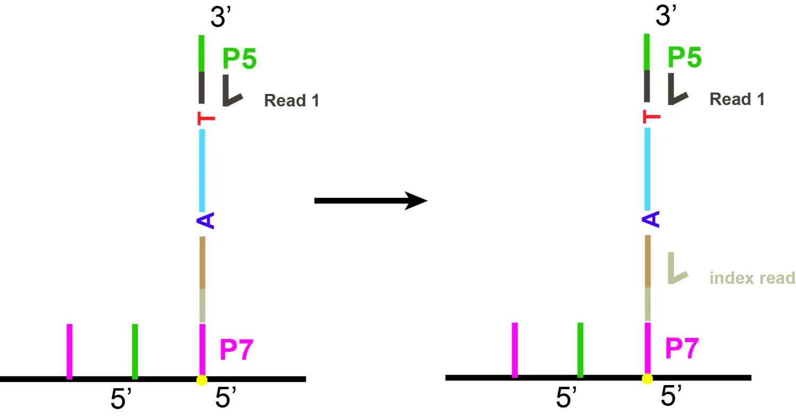</td>
  <td>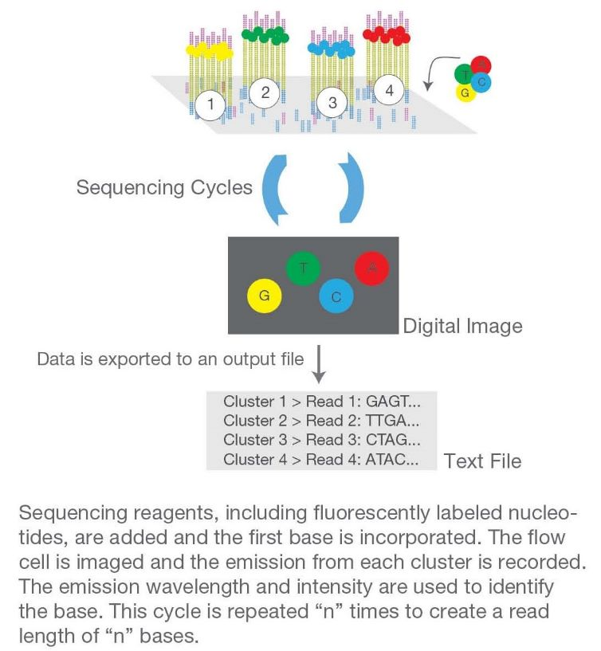</td>
</tr></table>

- 连接在P5上面的序列洗掉，就成了上图左边的情况，然后我们让read1的primer结合上去，边合成边测序，记住，这里一簇DNA有很多这样的链，所以你看到的荧光信号会很强
- **双端测序**: 同样的我们再进行一次桥式PCR，这时候Flowcell上的P5接头也会“长出”一些序列，然后我们这次洗掉连接在P7上的序列，上下的就只有P5连接的序列了，再把Read2的primer加进去就能测得Read2了


### Single-read and Paired-End

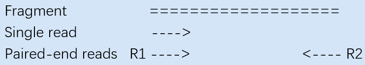

**单端测序**只从一侧读，而**双端测序**是两头同时读然后拼接


#### 单端测序(Single-read)

* **简写:SE50** 只测一个方向，且read长度固定为50 bp
* **Single-read**首先将DNA样本进行片段化处理形成200-500bp的片段，引物 sequence 连接到DNA片段的一端，然后末端加上adapter，将片段固定在Flowcell上生成DNA簇，上机测序单端读取 sequence 。该方式建库简单，操作步骤少，常用于小基因组、转录组、宏基因组测序。
* 测序的质量会随着测序的进行而下降，所以 **reads 约往后面越不准确**，**单端测序下游质量会很差**，所以就引入了双端测序可以大大提高测序的准确率。


#### 双端测序(Paired-End)

* **简写:25x25 PE** 每个片段会从两个方向进行测序，每个read长度为25 bp

* **Paired-end**文库制备，指在构建待测DNA文库时在两端的adapter上都加上测序引物结合位点，在第一轮测序完成后，去除第一轮测序的模板链，用对读测序模块(Paired-End Module)引导互补链在原位置再生和扩增，以达到第二轮测序所用的模板量，进行第二轮互补链的合成测序。

  

***

## What are reads, contigs and scaffold?

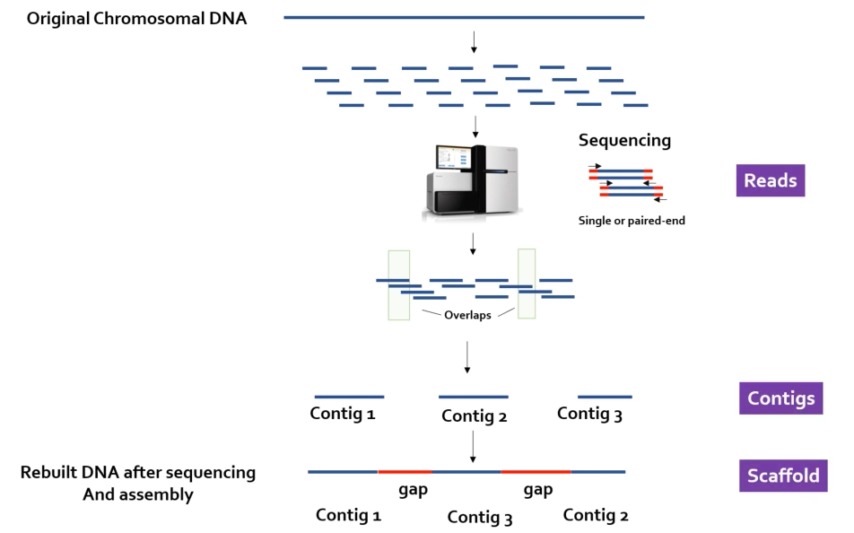

* **Reads**是测序仪直接产生的短片段 DNA  sequence 。它们是基因组 sequence 的基本单位。

* **Contig**是通过将重叠的 **reads** 拼接起来，组装而成的连续 DNA  sequence ，**Contig** 不包含缺口，是从 **reads** 直接拼接得来的最连续的部分

* **Scaffold** 是更高层次的组装结构，它将多个 **contig** 连接在一起，可能使用额外信息（如 mate-pair reads 或物理图谱数据）来排列和定向这些 **contig**。**Scaffold** 之间可能有未知的区域（这些区域用 N 表示）。

  

***

## ChIP-seq theory

- 使用甲醛将目标蛋白（组蛋白，转录因子等）与染色质交联固定起来
  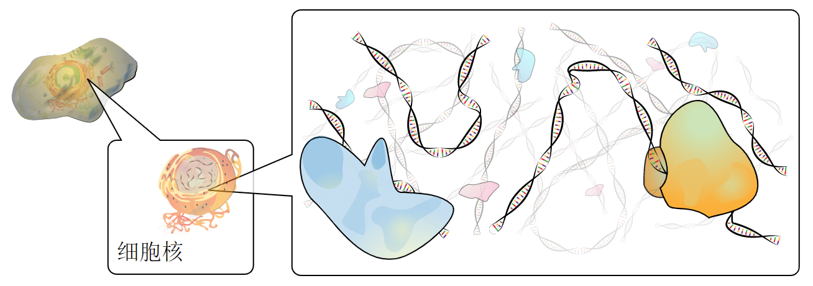

- 从细胞裂解液分离基因组DNA，通过超声打断DNA为一定长度的小片段
  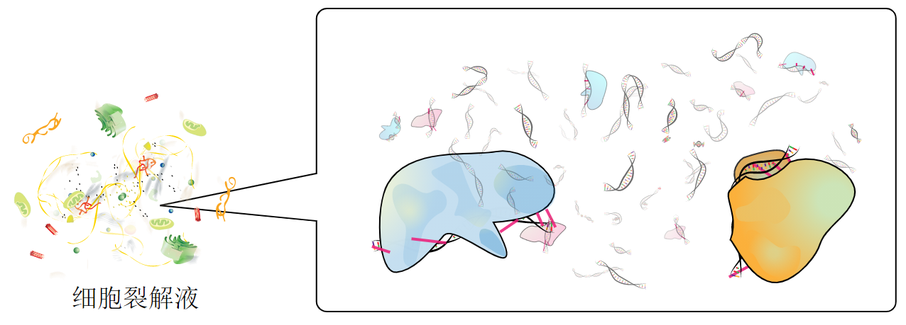

- 添加与目标蛋白质特异的抗体，该抗体会与目标蛋白形成免疫结合复合体沉淀（靶蛋白 + 抗体 + 靶蛋白结合的DNA），收集这些沉淀
  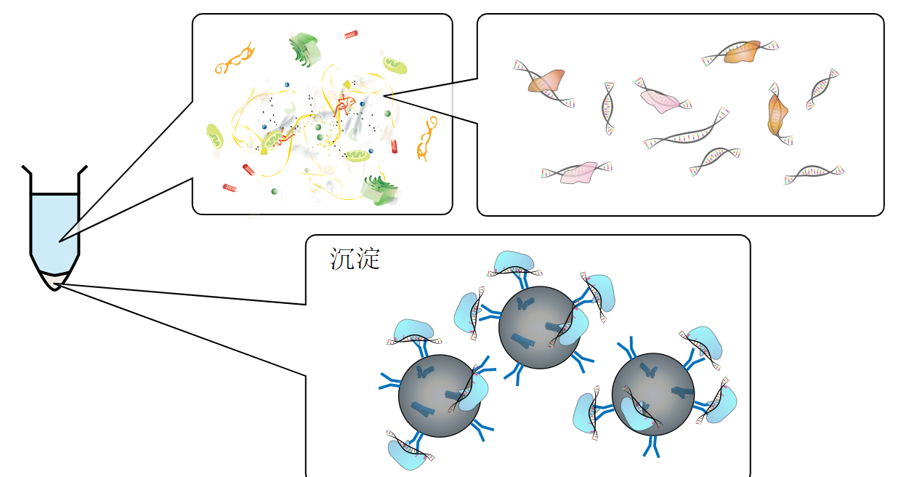

- 去交联，分开蛋白与DNA，纯化DNA即可得到染色质免疫沉淀的DNA样本
  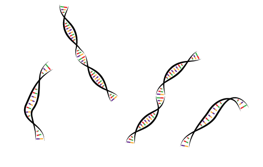

- 建立好文库，用测序仪进行测序
  

  

***

## CUT&TAG theory

* 首先，特异性抗体和靶标蛋白孵育结合；加入Tn5转座酶—Protein A复合物，其中Tn5转座酶两端已装载好建库adapter引物

* 特异性抗体和Protein A相结合，转座酶Tn5被“拉”到转录因子附近；转座酶Tn5一次性完成附近DNA打断并完成NGS加adapter过程，可直接建库

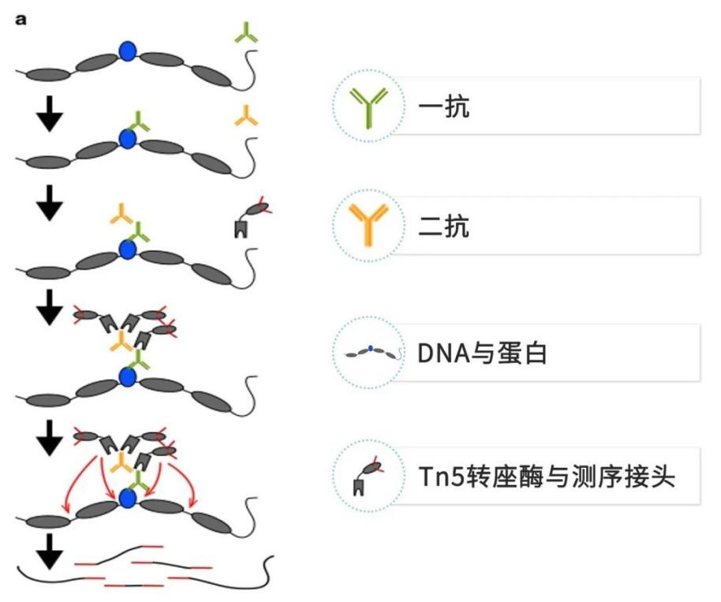


* 对比ChIP-seq，CUT&TAG免去了甲醛交联、超声破碎和免疫共沉淀的过程

* 这样既节省了初始实验材料，需求的细胞量较少，又提高了信噪比、提升了实验重复性


***

# Various types of file structure

## 0-base or 1-base？

* [详见](https://genome-blog.gi.ucsc.edu/blog/2016/12/12/the-ucsc-genome-browser-coordinate-counting-systems/)

* 在**0-based**坐标系中，起始位置从 0 开始计数，范围是 **[start, end)** ，即 **end 位置不包含在区间内**。


* 在**1-based**坐标系中，起始位置从 1 开始计数，范围是 **[start, end]** ，即 **end 位置包含在区间内**。


| 文件格式              | 坐标系统         | 说明                                                    |
| --------------------- | ---------------- | ------------------------------------------------------- |
| **BED (UCSC)**        | **0-based**      | `[start, end)`                                          |
| **GTF/GFF (Ensembl)** | **1-based**      | `[start, end]`                                          |
| **VCF (Ensembl)**     | **1-based**      | 变异位点坐标从 1 开始，不是区间，而是单个碱基的位置     |
| **BAM/SAM**           | **1-based**      | 比对起始位置为 1-based，CIGAR 操作的结果确定终止位置    |
| **LiftOver**          | **0-based**      | 输入文件通常是 0-based（如 BED）                        |
| **CrossMap**          | **根据输入格式** | 支持多种格式，如 BED（0-based）、GTF/GFF/VCF（1-based） |


***

## CIGAR 字符串

CIGAR（Compact Idiosyncratic Gapped Alignment Report） 字符串是一种用于描述比对过程中 sequence 与参考基因组之间关系的格式。CIGAR 字符串以紧凑的方式表示了每个比对中存在的匹配、缺失、插入等操作

- **M**: 匹配（Match）。表示 sequence 和参考 sequence 在这一段上的匹配或者不匹配碱基。通常在 DNA-seq 中仅表示匹配碱基，而在 RNA-seq 中可能还表示不匹配。

- **I**: 插入（Insertion）。表示 sequence 相对于参考基因组有插入碱基。

- **D**: 缺失（Deletion）。表示 sequence 相对于参考基因组有缺失碱基。

- **N**: 跳过区域（Skipped region）。通常用于 RNA-seq 数据，表示剪接事件，即读取的 sequence 跳过了参考基因组中的一段内含子。

- **S**: 软剪切（Soft clipping）。表示读取的 sequence 中有一部分没有比对到参考基因组（这些碱基仍保留在比对的 sequence 中）。

- **H**: 硬剪切（Hard clipping）。与软剪切类似，但这些碱基在输出文件中被完全删除，不再保留。

- **P**: 填充（Padding）。用于在某些比对中添加填充符号（一般用于对齐中间的空隙）。

- **=**:  sequence 匹配（Sequence match）。表示 sequence 与参考基因组完全匹配的部分。

- **X**:  sequence 不匹配（Sequence mismatch）。表示 sequence 与参考基因

  

> [!NOTE]
>
> **例如:10M1I5M1D4M**
>
> - M表示前 10 个碱基与参考基因组匹配
> - 1I表示接下来有 1 个碱基是插入的
> - 5M表示接下来的 5 个碱基与参考基因组匹配
> - 1D表示在参考基因组中缺失了 1 个碱基，这个碱基在比对的 sequence 中不存在
> - 4M表示最后的 4 个碱基与参考基因组匹配组不匹配的部分


***

## SRA

SRA 是 NCBI 及其他数据库（如 EBI、DDBJ）用于存储高通量测序数据的一种特殊格式，采用 **Spot-based 存储方式**。SRA 文件包含 **元数据（Metadata）、测序数据（Reads）、质量值（Quality Scores）** 等信息，并采用 **压缩存储** 以减少文件体积。


一个 `.sra` 文件通常包含：

| **部分**                     | **说明**                                                     |
| ---------------------------- | ------------------------------------------------------------ |
| **Metadata（元数据）**       | 记录实验信息，如测序仪型号、文库构建方法、生物样本信息等。   |
| **Reads（测序数据）**        | 存储实际的Reads，单端数据包含 1 条 Read，双端数据包含 2 条 Read。 |
| **Quality Scores（质量值）** | 记录每个碱基的质量评分（Phred Score），用于评估测序准确性。  |
| **Index（索引）**            | **Spot ID**。用于快速检索。                                  |

> [!TIP]
>
> **Spot ID** 是 SRA 数据中的核心索引，表示 **一条完整的测序记录**（可能包含单端或双端的 reads）


对于 **双端测序（Paired-End Sequencing）**，SRA 文件中的**Index（索引）**、**测序数据（Reads）、质量值（Quality Scores）**可能如下：

| **Spot ID** | **Read 1 (Forward Read)** | **Read 2 (Reverse Read)** | **质量值（Q Score）** |
| ----------- | ------------------------- | ------------------------- | --------------------- |
| 1           | ATCGTACGATCGA             | TAGCTAGCTAGCTAGC          | 40 38 37 35 ...       |
| 2           | GCTAGCTAGCTAGC            | CGTACGTACGTAGCTA          | 39 37 36 35 ...       |
| 3           | TACGATCGATCGTA            | ATCGTAGCTAGCTAGC          | 38 36 34 33 ...       |


***

## FASTQ

### Structure of FASTQ

对于每个通过质控参数的**cluster**，一个 read 被写入相应样本的 R1 FASTQ 文件，而对于双端测序运行，另外一个 read 也被写入该样本的 R2 FASTQ 文件。  

- **FASTQ 文件中的每个条目包含 4 行**

  

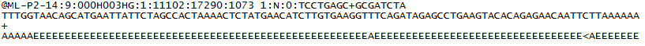

- * **Sequence Identifier**（`@` 开头），包含有关测序运行和Cluster的信息。 该行的具体内容会因使用的 BCL 到 FASTQ 转换软件而不同。
  * ** sequence **（碱基信号；A、C、T、G 和 N）。
  * **分隔符**，仅为一个加号（`+`）。
  * **质量值**，表示每个碱基的测序质量，使用 **Phred +33** 编码的 ASCII 字符。


### FASTQ Sequence Identifier

- **Illumina 新格式 (HiSeq/NovaSeq)**

  ```
  @HISEQ:001:ABC123:1:1101:2071:3156 1:N:0:ATCACG
  
  @<instrument>:<run_number>:<flowcell_ID>:<lane>:<tile>:<x_pos>:<y_pos> <read>:<is_filtered>:<control_number>:<index>
  ```

  | 名称               | 字段     | 说明                                 |
  | :----------------- | -------- | ------------------------------------ |
  | **instrument**     | `HISEQ`  | 测序仪名称（仪器 ID）                |
  | **run_number**     | `001`    | 测序运行编号                         |
  | **flowcell_ID**    | `ABC123` | Flowcell ID                          |
  | **lane**           | `1`      | 测序 lane 号                         |
  | **tile**           | `1101`   | Tile 编号                            |
  | **x_pos**          | `2071`   | x 坐标（像素级别）                   |
  | **y_pos**          | `3156`   | y 坐标（像素级别）                   |
  | **read**           | `1`      | Read 编号（1=Read1，2=Read2）        |
  | **is_filtered**    | `N`      | 是否通过质量控制（N=通过，Y=未通过） |
  | **control_number** | `0`      | 控制位（一般为 0）                   |
  | **index**          | `ATCACG` | 样本的 Index（barcode）sequence      |

  

- **Illumina 旧格式 (Solexa)**

  ```
  @HWI-ST1234_0012:4:1101:2071:3156#ATCACG/1
  ```

  | **字段**          | **说明**                      |
  | ----------------- | ----------------------------- |
  | `HWI-ST1234_0012` | 测序仪 ID                     |
  | `4`               | 测序 lane 号                  |
  | `1101`            | Tile 编号                     |
  | `2071`            | x 坐标（像素级别）            |
  | `3156`            | y 坐标（像素级别）            |
  | `#ATCACG`         | Index（barcode）sequence      |
  | `/1`              | Read 编号（1=Read1，2=Read2） |


### phred33 and phred64 encoding

| 编码方式     | 质量值范围 | ASCII 字符范围 | 适用测序仪                          |
| ------------ | ---------- | -------------- | ----------------------------------- |
| **Phred+33** | 33 - 74    | `!` 到 `J`     | Illumina 1.8 及更新版本（当前主流） |
| **Phred+64** | 64 - 104   | `@` 到 `h`     | 早期 Illumina 1.3 - 1.7 版本        |

Phred 质量分数越高，表示测序碱基的可靠性越高。


### View basic information of FASTQ

获取 sequence 标识符，其中包含有关测序运行和cluster的信息，有些包含测序平台信息：

```bash
zcat <xxx.fastq.gz> | grep "^@" | head -n 5
```


***

## SAM

* [SAM文件详细指南](https://samtools.github.io/hts-specs/SAMtags.pdf)
* **SAM** 文件是 Sequence Alignment/Map 格式的简称，从名字就可以看出，该文件格式设计初衷就是为了记录比对结果的。 但是由于其在记录的比对结果的同时，其实也记录了 sequence 本身，因此也可以作为测序数据的存储格式。
* **SAM**文件是一种平面文件，也就是没有经过压缩，因此一般占用的存储空间相对较大。因此实际工作中，一般不以**SAM**文件格式作为存储形式，而是采用其压缩格式**BAM**形式。
* **SAM** is a tab-delimited format with two main sections: the **Header** and the **alignment section**.


### SAM Header

**SAM Header** 以 `@` 开头，包含元数据，如参考基因组信息、样本信息、比对工具等

```text
@HD    VN:1.4    SO:coordinate
@SQ    SN:CHROMOSOME_I    LN:15072423
UR:ftp://ftp.ncbi.nlm.nih.gov/genbank/genomes/Eukaryotes/invertebrates/Caenorhabditis_elegans/
WBcel215/Primary_Assembly/assembled_chromosomes/FASTA/chrI.fa.gz    AS:ce10    
SP:Caenorhabditis elegans
 
@SQ    SN:CHROMOSOME_II    LN:15279345    
UR:ftp://ftp.ncbi.nlm.nih.gov/genbank/genomes/Eukaryotes/invertebrates/Caenorhabditis_elegans/
WBcel215/Primary_Assembly/assembled_chromosomes/FASTA/chrII.fa.gz     AS:ce10    
SP:Caenorhabditis elegans  
 
@RG    ID:1    PL:ILLUMINA    LB:C_ele_05    DS:WGS of C elegans    PG:BamIndexDecoder
@PG    ID:bwa    PN:bwa    VN:0.5.10-tpx
```

| 标签                         | 含义               | 解释                        |
| ---------------------------- | ------------------ | --------------------------- |
| **@HD(Header)**              | **文件头信息**     | **记录 SAM 版本和排序方式** |
| VN:1.4                       | 版本号             | SAM 文件格式版本            |
| SO:coordinate                | 排序方式           | 按基因组坐标排序            |
| **@SQ(Sequence Dictionary)** | **参考 sequence ** | **记录基因组染色体信息**    |
| SN:CHROMOSOME_I              | sequence 名称      | 染色体 I                    |
| LN:15072423                  | sequence 长度      | 15,072,423 bp               |
| UR:ftp://...                 | 参考 sequence 来源 | 基因组文件的 FTP 地址       |
| AS:ce10                      | 基因组版本         | ce10                        |
| SP:Caenorhabditis elegans    | 物种名称           | 秀丽隐杆线虫                |
| **@RG(Read Group)**          | **读组**           | **记录测序数据的信息**      |
| ID:1                         | 读组 ID            | 读组编号为 1                |
| PL:ILLUMINA                  | 测序平台           | ILLUMINA                    |
| LB:C_ele_05                  | 文库 ID            | C_ele_05                    |
| DS:WGS of C elegans          | 描述信息           | 秀丽隐杆线虫全基因组测序    |
| PG:BamIndexDecoder           | 处理工具           | BamIndexDecoder             |
| **@PG(Program)**             | **处理程序**       | **记录比对软件信息**        |
| ID:bwa                       | 程序 ID            | bwa                         |
| PN:bwa                       | 程序名称           | bwa                         |
| VN:0.5.10-tpx                | 版本号             | bwa 版本 0.5.10-tpx         |


### SAM Alignment

**SAM Alignment**  文件包含测序比对的结果，每一行代表一条**read**的比对信息，字段以 (`\t`) 分隔。

```
3658435    145    CHROMOSOME_I    1    0    100M    CHROMOSOME_II    2716898    0    
GCCTAAGCCTAAGCCTAAGCCTAAGCCTAAGCCTAAGCCTAAGCCTAAGCCTAAGCCTAAGCCTAAGCCTAAGCCTAAGCCTAAGCCTAAGCCT
AAGCCT    
@CCC?:CCCCC@CCCEC>AFDFDBEGHEAHCIGIHHGIGEGJGGIIIHFHIHGF@HGGIGJJJJJIJJJJJJJJJJJJJJJJJJJJJHHHHHFF
FFFCCC    RG:Z:1    NH:i:1    NM:i:0
    
5482659    65    CHROMOSOME_I    1    0    100M    CHROMOSOME_II    11954696    0    
GCCTAAGCCTAAGCCTAAGCCTAAGCCTAAGCCTAAGCCTAAGCCTAAGCCTAAGCCTAAGCCTAAGCCTAAGCCTAAGCCTAAGCCTAAGCCT
AAGCCT    
CCCFFFFFHHGHGJJGIJHIJIJJJJJIJJJJJIJJGIJJJJJIIJIIJFJJJJJFIJJJJIIIIGIIJHHHHDEEFFFEEEEEDDDDCDCCCA
AA?CC:    RG:Z:1    NH:i:1    NM:i:0
```

| **字段**                   | **含义** | **解释**                                                     |
| -------------------------- | -------- | ------------------------------------------------------------ |
| 3658435                    | QNAME    | read的查询名称                                               |
| 145                        | FLAG     | 表示比对特性(如正向/反向、是否配对等)  （二进制字符）        |
| CHROMOSOME_I               | RNAME    | 参考 sequence 的名称 (染色体编号)                            |
| 1                          | POS      | read的起始位置 (1-based)                                     |
| 0                          | MAPQ     | 比对质量分数(0表示未评估)                                    |
| 100M                       | CIGAR    | CIGAR 字符串，比对描述符(如100M表示100bp完美匹配)            |
| CHROMOSOME_II              | RNEXT    | 配对read比对到的参考 sequence 名称                           |
| 2716898                    | PNEXT    | 配对 read 的起始位置                                         |
| 0                          | TLEN     | 片段长度 (若无用 0 代替)                                     |
| GCCTA...                   | SEQ      | 读取的碱基 sequence                                          |
| @CCC?...                   | QUAL     | 碱基质量值（ASCII 编码）                                     |
| RG:Z:1    NH:i:1    NM:i:0 | 可选字段 | 可选字段(如RG:Z:1表示读组1，NH:i:1表示比对到1个位置，NM:i:0无错配) |


### FLAG值

**FLAG值**：在 **SAM/BAM** 格式中，`FLAG` 是一个 **位掩码（bitmask）**，用不同的二进制位表示不同的比对属性。每个位的含义如下（**从右到左**，最低位是 `2^0`）：

| 位（Bit） | 值（2^n） | 含义（SAM FLAG 定义）                                        |
| :-------- | :-------- | :----------------------------------------------------------- |
| 0 (LSB)   | 1         | 模板有多个比对（read 比对到多个位置）                        |
| 1         | 2         | 每个片段都正确比对（paired-end 比对时使用）                  |
| 2         | 4         | 该 read 未比对到参考 sequence                                |
| 3         | 8         | 该 read 的 **mate（指paired-end另一条read）**未比对到参考 sequence |
| 4         | 16        | 该 read 是反向比对（比对到负链）                             |
| 5         | 32        | 该 read 的 mate 是反向比对                                   |
| 6         | 64        | 这是 read 1（在 paired-end 测序中）                          |
| 7 (MSB)   | 128       | 这是 read 2（在 paired-end 测序中）                          |


**FLAG=145 的二进制解析**

`FLAG=145=1+16+128`，二进制是 `10010001`：顺序：**从右到左**

- **Bit 0 (1)**：`1` → 多比对
- **Bit 1 (2)**：`0` → single-read或paired-end中有read未正确比对
- **Bit 2 (4)**：`0` →该 read 本身比对成功
- **Bit 3 (8)**：`0` → mate 比对成功
- **Bit 4 (16)**：`1` → 该 read 是 反向比对
- **Bit 5 (32)**：`0`→ mate 是正向比对
- **Bit 6 (64)**：`0`→ 这不是 paired-end 测序中的 read 1

- **Bit 7 (128)**：`1` → 这是 paired-end 测序中的 read 2


***

## BAM

**BAM** 文件是通过 bgzip压缩过的**SAM**文件。因此二者记录的信息本质是一样的。bgzip 对文件的压缩，其结果使文件被压缩成了一系列的'BGZF block'单元，默认情况下，每个单元大小不超过64K。除了节省存储空间之外，另一个好处就是可以通过建立索引加速查询

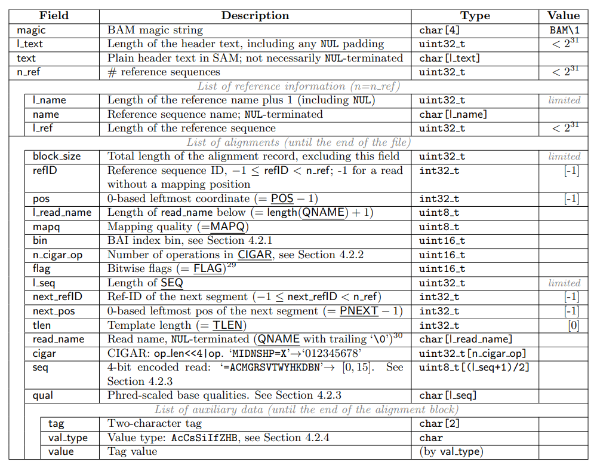

上述表格中基本信息与**SAM**文件的内容存在对应关系，但其每个记录的类型存在转化关系，以seq信息为例，在**SAM**文件中是以**字符串**形式存储的，在**BAM**文件中，该项则是将**字符串集**转化为了[0,15]的**整数**进行存储。


***

## CRAM

* **CRAM** 文件是一种用于存储 DNA  sequence 比对数据的压缩格式，类似于 **BAM** 文件，为**BAM**的高压缩格式，使得**文件体积更小**，从而节省存储空间和传输时间

* **CRAM**一定会取代**BAM**。我想这必将很大程度上解决NGS(Next-Generation Sequencing)数据存储的问题

- **CRAM**大小：

  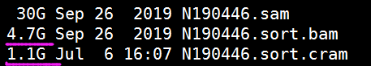

* CRAM 格式**依赖参考 sequence 进行压缩和解压缩**，进行转换时要**指定参考 sequence 文件**


***

## BED

### 基本 BED 格式（BED3）

| Chromosome | Start | End  |
| ---------- | ----- | ---- |
| chr1       | 1000  | 1050 |
| chr2       | 2000  | 2050 |
| chr3       | 3000  | 3050 |

* **chrom**：染色体名称。
* **start**：区间的起始位置（0-based）
* **end**：区间的结束位置（0-based）


### 扩展 BED 格式（BED6）

| Chromosome | Start | End  | Name  | Score | Strand |
| ---------- | ----- | ---- | ----- | ----- | ------ |
| chr1       | 1000  | 1050 | gene1 | 100   | +      |
| chr2       | 2000  | 2050 | gene2 | 200   | -      |
| chr3       | 3000  | 3050 | gene3 | 300   | +      |

- **name**：区间的名称或ID（如基因名称、 sequence ID等）。
- **score**：得分（通常为0-1000之间的整数），可以表示某种权重或置信度。
- **strand**：链方向，+ 表示正链，- 表示负链


### 完整 BED 格式（BED12）

对于描述更复杂的区间，如包含多个**“块”（block）**的区间（如跨多个外显子的转录本）

| Chromosome | Start Position | End Position | Name  | Score | Strand | Thick Start | Thick End | Item RGB | Block Count | Block Sizes | Block Starts |
| ---------- | -------------- | ------------ | ----- | ----- | ------ | ----------- | --------- | -------- | ----------- | ----------- | ------------ |
| chr1       | 1000           | 1050         | gene1 | 100   | +      | 1000        | 1050      | 255,0,0  | 2           | 50,30       | 0,70         |
| chr2       | 2000           | 2100         | gene2 | 200   | -      | 2000        | 2100      | 0,255,0  | 3           | 100,50,30   | 0,100,170    |
| chr3       | 3000           | 3150         | gene3 | 300   | +      | 3000        | 3150      | 0,0,255  | 1           | 150         | 0            |

* **thickStart 和 thickEnd**：表示区间中加粗显示的部分（例如 CDS 区间）。
* **itemRgb**：表示颜色信息，用于可视化（R,G,B格式）。
* **blockCount**：区间中“块”的数量（如外显子数量）。
* **blockSizes**：每个“块”的大小，以逗号分隔。
* **blockStarts**：指示每个“块”（如外显子）在基因组上的起始位置。


### BEDPE 格式

BEDPE 格式（BED Paired-End）是用来描述 **paired-end**  reads在基因组上位置的格式，它包含两个读取对的起始和结束位置等信息。通常用于分析测序数据中成对读取的配对和片段长度等。

| Chromosome1 | Start1 | End1 | Chromosome2 | Start2 | End2 | Name  | Score | Strand1 | Strand2 |
| ----------- | ------ | ---- | ----------- | ------ | ---- | ----- | ----- | ------- | ------- |
| chr1        | 1000   | 1050 | chr1        | 2000   | 2050 | gene1 | 100   | +       | -       |
| chr2        | 3000   | 3050 | chr2        | 4000   | 4050 | gene2 | 200   | -       | +       |
| chr3        | 5000   | 5050 | chr3        | 6000   | 6050 | gene3 | 300   | +       | -       |

> [!IMPORTANT]
>
> **得分列默认使用两端比对质量的最小值**


***

## GFF/GTF

* [基因组注释文件(GFF,GTF)下载的五种方法](https://blog.csdn.net/u011262253/article/details/89363809)

  

### GFF

* [GFF](https://gmod.org/wiki/GFF3) (General Feature Format Version 3) 是一种用于描述基因组 **feature**（如基因、外显子、转录本等）的文本格式。它能够有效地表示生物 sequence 中的不同特征

* 现在我们所使用的大部分都是第三版（`GFF3`）

| seqid | source | type | start | end  | score | strand | phase | attributes            |
| ----- | ------ | ---- | ----- | ---- | ----- | ------ | ----- | --------------------- |
| chr1  | .      | gene | 1000  | 5000 | .     | +      | .     | ID=gene1;Name=Gene1   |
| chr1  | .      | mRNA | 1000  | 5000 | .     | +      | .     | ID=mRNA1;Parent=gene1 |
| chr1  | .      | exon | 1000  | 2000 | .     | +      | 0     | ID=exon1;Parent=mRNA1 |
| chr1  | .      | exon | 3000  | 5000 | .     | +      | 0     | ID=exon2;Parent=mRNA1 |

| 列名       | 描述                                                         |
| ---------- | ------------------------------------------------------------ |
| seqid      | 参考 sequence 的 ID                                          |
| source     | 该特征的来源，未知时用 `.` 代替                              |
| type       | 特征类型，如 `gene`、`exon`、`CDS` 等，建议使用 SO 术语      |
| start      | 起始坐标（1-based）                                          |
| end        | 终止坐标                                                     |
| score      | 量化得分，空值用 `.` 代替                                    |
| strand     | `+` 表示正链，`-` 表示负链，`.` 表示无方向要求               |
| phase      | 编码相位，CDS 需要此列，当前 CDS 片段的起始碱基在密码子中的偏移量。0"、"1 "或 "2 "中的一个。 0 "表示特征的第一个碱基是密码子的第一个碱基，"1 "表示第二个碱基是密码子的第一个碱基，以此类推 |
| attributes | 属性列表，格式为 `key=value`，不同属性用 `;` 分隔            |


### GTF

-   `GTF`(gene transfer format)，主要是用来对基因进行注释

-   当前所广泛使用的GTF格式为第二版（`GTF2`）


| seqname  | source   | feature     | start | end  | score | strand | frame | attributes                                              |
| -------- | -------- | ----------- | ----- | ---- | ----- | ------ | ----- | ------------------------------------------------------- |
| AB000381 | Twinscan | CDS         | 700   | 707  | .     | +      | 2     | gene_id "AB000381.000"; transcript_id "AB000381.000.1"; |
| AB000381 | Twinscan | exon        | 900   | 1000 | .     | +      | .     | gene_id "AB000381.000"; transcript_id "AB000381.000.1"; |
| AB000381 | Twinscan | start_codon | 380   | 382  | .     | +      | 0     | gene_id "AB000381.000"; transcript_id "AB000381.000.1"; |
| AB000381 | Twinscan | stop_codon  | 708   | 710  | .     | +      | 0     | gene_id "AB000381.000"; transcript_id "AB000381.000.1"; |

| 列名       | 描述                                                         |
| ---------- | ------------------------------------------------------------ |
| seqname    | sequence  ID，通常是染色体 ID 或 Contig ID                   |
| source     | 该特征的来源，未知时用 `.` 代替                              |
| type       | 特征类型，特征类型，如 `CDS`、`start_codon`(起始密码子)、`stop_codon`（终止密码子） （**这一列必须注明**） |
| start      | 起始坐标（1-based）                                          |
| end        | 终止坐标                                                     |
| score      | 量化得分，空值用 `.` 代替                                    |
| strand     | `+` 表示正链，`-` 表示负链，`.` 表示无方向要求               |
| frame      | 读码框（0、1 或 2，仅适用于 `CDS`）                          |
| attributes | 其他信息（键值对，`key "value";` 格式）                      |


### Different from GFF of GTF

| 对比项          | **`GFF3`**                                               | **`GTF2`**                                        |
| --------------- | -------------------------------------------------------- | ------------------------------------------------- |
| type/feature    | 必须注明                                                 | 可以是任意名称                                    |
| attributes      | `key=value`                                              | `key "value"`                                     |
| attributes 层级 | 明确层级关系（gene → mRNA → exon/CDS）                   | 层级关系相对不严格                                |
| 支持的特征      | 更丰富（gene, mRNA, exon, CDS, ncRNA, repeat_region 等） | 主要针对转录组数据（gene, transcript, exon, CDS） |


***

## VCF

* [VCF](https://samtools.github.io/hts-specs/VCFv4.5.pdf) (Variant Call Format) 是一种用于存储变异信息（如 SNP、插入、缺失等）的文本格式，通常用于表示基因组 sequence 的变化。

| #CHROM | POS  | ID   | REF  | ALT  | QUAL | FILTER | INFO  | FORMAT | SAMPLE1 | SAMPLE2 |
| ------ | ---- | ---- | ---- | ---- | ---- | ------ | ----- | ------ | ------- | ------- |
| chr1   | 1000 | .    | A    | G    | 99   | PASS   | DP=20 | GT:DP  | 0/1:10  | 0/0:20  |
| chr1   | 1500 | .    | C    | T    | 99   | PASS   | DP=30 | GT:DP  | 0/1:15  | 0/1:15  |

| 字段         | 含义                                                         |
| ------------ | ------------------------------------------------------------ |
| **#CHROM**   | 染色体名称。                                                 |
| **POS**      | 变异在染色体上的位置（1-based）。                            |
| **ID**       | 变异的标识符（如果没有则为 `.`）。                           |
| **REF**      | 参考 sequence 中的碱基。                                     |
| **ALT**      | 变异碱基（可以有多个）。                                     |
| **QUAL**     | 变异质量分数。                                               |
| **FILTER**   | 过滤信息，表示变异是否通过了质量过滤。                       |
| **INFO**     | 附加信息字段，如覆盖深度 `DP`。                              |
| **FORMAT**   | 样本信息的格式。                                             |
| **GT**       | 基因型（Genotype），表示样本的等位基因组合，例如 0/0（纯合参考）、0/1（杂合）或 1/1（纯合变异）。 |
| **DP**       | 覆盖深度（Depth of Coverage），表示该位置的测序读取数量。    |
| **其他信息** | 可能还包括如 **GQ**（基因型质量）、**PL**（后验概率）等。    |
| **SAMPLE1**  | 表示第一个样本的信息，对应 FORMAT 字段定义。                 |
| **SAMPLE2**  | 表示第二个样本的信息，对应FORMAT 字段定义。                  |


***

## chrom.sizes

染色体长度信息文件(**chrom.sizes**)，该文件保存了基因组中的染色体名称已经对应的长度

| Chromosome | Size      |
| ---------- | --------- |
| chr1       | 248956422 |
| chr2       | 242193529 |
| chrX       | 156040895 |
| chrY       | 57227415  |
| chrM       | 16569     |


There are three ways to obtain the **chrom.sizes** file

1. 通过bam文件获取chrom.sizes(**recommend**)

   ```bash
   samtools view -H <bam> |  grep '^@SQ' | awk -F'\t' '{split($3,a,":"); gsub("SN:","",$2); print $2"\t"a[2]}'
   ```

   

2. 从UCSC下载，适用于UCSC数据库中已有的物种

   https://hgdownload.soe.ucsc.edu/downloads.html  找到比对时的index对应的chrom.sizes下载

   > [!WARNING]
   >
   > **该方法获取的染色体格式(ucsc格式)可能与bed文件不一样**
   >
   > <p>例如：chrom.sizes中：</p>
   > 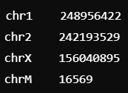
   >
   > <p>而bed文件中：</p>
   > 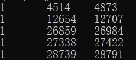
   >
   > * 可以发现一个使用的是裸染色体编号（如 1、2），而另一个使用的是带前缀的染色体名称（如 chr1、chr2）。
   >
   > * 为了使 `bedtools genomecov` 正常运行，必须保证 BED 文件和 .chrom.sizes 文件的染色体名称一致。
   >
   > * 可以通过简单的命令修改 .chrom.sizes 文件，将 chr 前缀去掉
   >
   >   ```bash
   >   # sed 's/^chr//'：去除每一行开头的 chr 前缀
   >   sed 's/^chr//' xxx.chrom.sizes > xxx.fixed.chrom.sizes
   >   ```

   

3. 通过fasta文件获取chrom.sizes

   `samtools faidx`命令可以获取fasta文件中的序列长度信息，从其生成的后缀为fai的文件中可以获得chrom.sizes文件。

   ```bash
   samtools faidx xxx.fa
   
   cut -f1,2 xxx.fa.fai > xxx.chrom.sizes
   ```

   

***

## Bedgraph and BigWIG

### Bedgraph 

* Bedgraph 是一种 **用于表示基因组上连续信号轨迹** 的**文本**格式
* BigWig 是从 bed/bam 文件统计每个**区间**的 read 覆盖度（coverage）得来的

| Chromosome | Start | End  | Coverage |
| ---------- | ----- | ---- | -------- |
| chr1       | 1000  | 2000 | 5        |
| chr1       | 2000  | 3000 | 8        |
| chr2       | 1500  | 2500 | 10       |

* **start**: 基因组上**区间**的起始坐标。

* **end**: 基因组上**区间**的结束坐标。

* **Coverage**: 表示该区域的平均覆盖度。


> [!TIP]
>
> Calculate **Coverage**：
> $$
> \text{Coverage} = \frac{\text{总测序碱基数}}{\text{目标基因组区域的碱基数}}
> $$
>
> - **总测序碱基数**：该区域测序 reads 的总碱基数（测序深度乘以读长）
> - **目标基因组区域的碱基数**：该区域的碱基总长度。
>
> Example of calculate **Coverage**  ：
>
>   * 该区域存在50 条reads
>   * 每条 reads 长度为 150 bp
>   * 目标基因组区域长度为 1000 bp
>
> $$
> \text{Coverage} = \frac{50 \times 150}{1000} = 7.5
> $$


### BigWIG

- BigWig 类似于Bedgraph，是一种 **用于表示基因组上连续信号轨迹** 的**压缩二进制文件**格式。

- BigWig 是从allignment后的 BAM 文件统计每个**Blocks/bin**的 read 覆盖度（coverage）得来的

  ```pgsql
  +--------------------------+       +---------------------+
  |   Header (文件头部)      |-----> |   Data Blocks (数据块)|
  +--------------------------+       +---------------------+
                                        |
                                        v
                              +-----------------------+
                              |   Index (索引)        |
                              +-----------------------+
  
  ```

  **Header**：包含文件版本、染色体信息等元数据。

  **Data Blocks**：存储各个 **bin** 的信号值数据。

  **Index**：记录数据块的位置，支持高效的随机访问。

  

### Different from Bedgraph and BigWIG

| 特性         | **bedGraph**                   | **BigWig**                   |
| ------------ | ------------------------------ | ---------------------------- |
| **格式**     | 文本格式                       | 二进制格式                   |
| **存储效率** | 存储效率低，文件较大           | 存储效率高，文件较小         |
| **访问速度** | 加载和查询速度慢               | 支持高效的随机访问，查询快速 |
| **查询效率** | 无法直接查询，只能加载整个文件 | 可以快速查询指定区域         |
| **可读性**   | 可用文本编辑器查看             | 需要特定工具转换或查看       |


***

# Environment set up

使用conda进行环境的管理

* 创建环境：`conda create --name <environment_name>`
* 激活环境：`conda activate <environment_name>`
* 退出环境：`conda deactivate`
* 查看当前所有的环境： `conda env list`
* 删除环境： `conda env remove --name <environment_name>`


***

# Convert SRA to FASTQ

## parallel-fastq-dump

* `fastq-dump` 是 NCBI SRA Toolkit([**sratoolkit**](https://github.com/ncbi/sra-tools))中的一个工具，用于Convert SSR to FASTQ

* NCBI `fastq-dump` can be very slow sometimes, even if you have the resources (network, IO, CPU) to go faster

* [**parallel-fastq-dump**](https://github.com/rvalieris/parallel-fastq-dump) 是 `fastq-dump` 的并行版本，它利用 GNU parallel 来加速 SRA 数据的转换，适合大规模数据处理

* **Software installation:** `conda install parallel-fastq-dump 'sra-tools>=3.0.0'`

  **Important**: Make sure the sra-tools package being installed is **a recent version(>=2.10.0)** to guarantee compatibility with NCBI servers


**parameters**

```bash
parallel-fastq-dump 
    --sra-id # 输入SRA文件名
    --threads # 用的核数
    --outdir # 输出文件夹
    --split-files # 文件是否切割来运行
    --gzip # 输出文件是否为压缩包
    --minSpotId # Minimum spot id (default: 1)
    --maxSpotId  # Maximum spot id (default: None)
```

**Example**

```bash
parallel-fastq-dump 
    --sra-id IP_H3K27ac_Vehicle \ 
    --threads 11 \
    --outdir fastq.data/ \
    --split-files \
    --gzipconc \
```

> [!CAUTION]
>
> **如果一个 srr 文件转化为两个 fastq 文件，说明该数据为双端测序**


***

# QC Report and Data cleaning—trim-galore

`trim-galore`有2个小软件，分别是 `cutadapt` 用于**去除 adapter **及**质量过滤**，`fastqc` 用于查看**数据质量分布**

* **Software installation**`conda install bioconda::trim-galore `

- **suggestion**: 建议使用 **Python3** 环境，启用多线程（ `trim-galore` 中的 `cutadapt` 在 python2 不支持多线程操作）


***

## QC Report——fastqc

> [!CAUTION]
>
> **生成质控报告，可以先做质控报告，如果都合格就没必要做 Data cleaning**


**parameters**

```bash
fastqc # 输入文件名


# ==input options==
    -f <bam/sam/bam_mapped/sam_mapped/fastq> # 强制指定输入文件格式（FastQC 默认会自动检测格式，一般不需要使用此选项）

    --casava # 处理 CASAVA 生成的 FASTQ 文件
    --nofilter：# 如果使用 --casava 选项，默认会去除低质量 reads，但加上 --nofilter 选项后，将保留所有 reads 进行分析
    --nano：# 用于处理三代测序（Nanopore）测序数据，直接从 .fast5 格式的文件中提取序列


# ==ourput options==
    -o <path> # 输出文件名
    --extract # 解压缩输出文件（deafult）
    --noextract # 不解压缩输出文件	


# ==Computing Optimization and Environment==
    -t <int>  # 线程数，每个线程占用 250MB 内存，所以不建议超过可用内存的上限
    -j <path> # 指定Java路径（FastQC 依赖 Java 运行）。如果不提供，FastQC 会使用系统默认的 Java 


# == Analysis parameters ==
    -k <int> # 指定Kmer内容模块中要查找的 Kmer长度。指定的Kmer长度必须在2到10之间(deafult:5）
    --min_length <int> # 设置要在报告中显示 reads 的最小长度

    -l <file> 
    # 指定一个文件，其中包含一组标准将用于确定各种模块的FALL/错误限制，此文件还可用于有选择地从输出中删除一些模块
     # 该文件的格式需要与 Configuration 文件夹中的默认 limits.txt 文件相匹配

    --nogroup 
    # 禁用碱基分组，对于 >50 bp 的 reads，FastQC 默认会对碱基进行分组以减少计算量。
    # 使用此选项，每个碱基都会单独分析.
    # 纯在非常长的read上使用此选项，将导致 fastqc 崩溃，并且您的图表最终可能会变得非常大


#== Aptamer & Contamination Sequence Analysis ==
    -a <file> # 指定一个文件(包含特定lst of adapter): 分析特定的 adapter污染情况. 不指定：使用常见四种adapter
    -c <file> # 指定一个文件(包含特定lst of 污染物)，分析特定的污染物污染情况 


#== other options ==
    -q        # 静默模式，不显示进度信息，仅报告错误。
    -d <path> # 指定用于存放临时文件的目录（deafult:使用. /tmp）
```


> [!TIP]
>
> `--casava`
>
> 高通量测序 (如 Illumina HiSeqTM/MiseqTM) 得到的原始图像数据文件经 **CASAVA** 软件 Base Calling 分析转化为原始 Sequenced Reads，我们称之为 Raw Data 或 Raw Reads，结果以 FASTQ 文件格式存储
>
> 
>
> **CASAVA** 软件 Base Calling 会将**同一样本**输出**多个 FASTQ 文件**
>
> 
>
> FastQC 提供了 `--casava` 选项，专门用于处理 CASAVA 生成的 FASTQ 文件 
>
> - 将自动识别相同样本的不同 fastq 文件，视为 **同一数据集** 进行分析
>
> - 并**去除低质量的 reads**（CASAVA 在 **FASTQ Sequence Identifier** 里标记了 `Y` 的 reads（[详见点此](#FASTQ Sequence Identifier)）会被去除）
>
>   使用`--nofilter`则保留所有 reads


**Example**

```bash
fastqc IP_H3K27ac_Vehicle_1_trimmed.fq.gz -o fatqc/  -t 12 
```


***

## Stucture of QC report

[QC report详情](https://mugenomicscore.missouri.edu/PDF/FastQC_Manual.pdf)

[QC report reference in CUT&Tag](https://www.bioinformatics.babraham.ac.uk/projects/fastqc/bad_sequence_fastqc.html)


### Basic Statistics

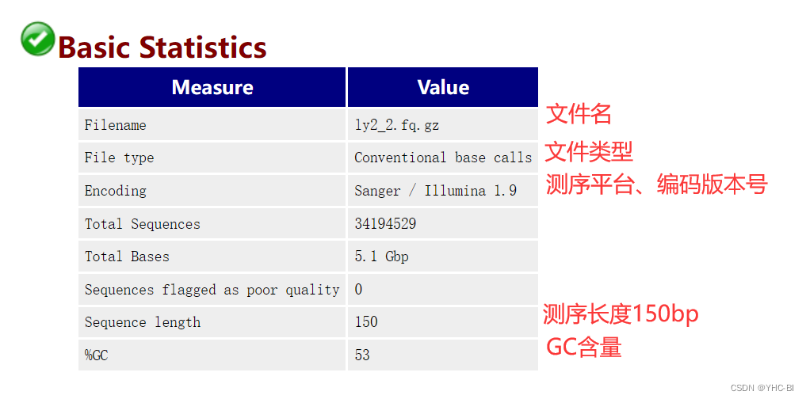

* **%GC**：是我们需要重点关注的一个指标，这个值表示的是整体 sequence 中的GC含量
* **%GC** 这个数值一般是物种特异的，比如 **Human 约 42%**， **mouse 约 41%**，**Rat 约 42%** 
* 如果测序原始数据的GC含量远远偏离这个比例，说明测序数据存在一定偏好性，如果直接用测序数据，会影响后续的CNV和变异检测的分析。


***

### Per base sequence quality

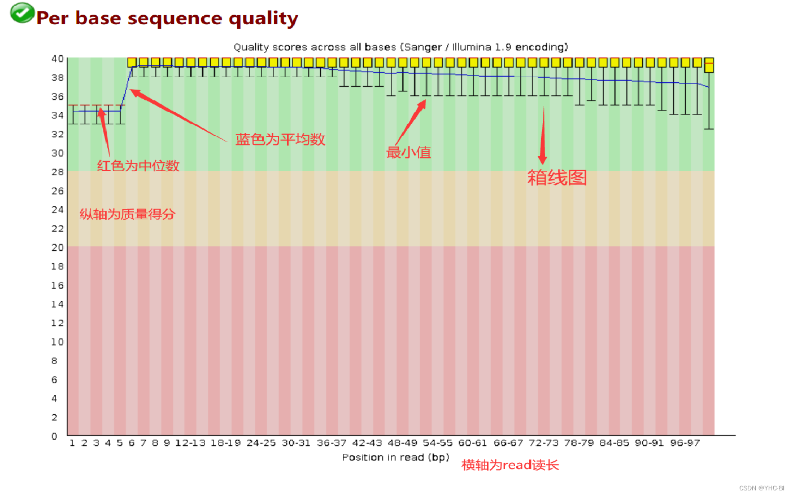

* 箱线图应该位于绿色部分就是合格的，黄色部分出**FALL**，红色部分**WARN**
* 这是 read length = 100 的数据
  * **横轴**为碱基在**read 的位置**
  * **纵轴**是 **quality**。$\text{quality} = -10 \times \log_{10}(p)$，p为测错的概率。
  * 根据 quality 给出质量结果：正常区间（28 - 40），警告区间（20-28），错误区间（0-20）


**标准：** 

- 如果任何一个位置的下四分位数小于10或者中位数小于25，会显示**FALL**；

- 如果任何一个位置的下四分位数小于5或者中位数小于20，会显示**WARN**

  

**注意：** 在FastQ文件中编码质量分数有许多不同的方法。FastQC尝试自动确定使用了哪种编码方法，但在一些非常有限的数据集中，它可能会猜错，图表的标题将描述FastQC认为您的文件使用的编码。


***

### Per tile sequence quality

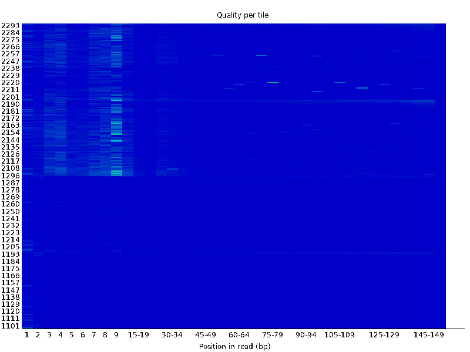

* 横轴为碱基在 read 的位置，纵轴是**tail 编号**

  > [!TIP]
  >
  > **tile编号**通常用于识别Illumina测序仪上的特定物理位置。每个**tile**代表**flowcell**的最小单位 [详情点此](#Flowcell)

* 图中的颜色是从**冷色调**到**暖色调**的渐变

  * **冷色调**表示这个 **tile** 在这个位置上的质量值高于所有 **tiles** 在这个位置上的平均质量值
  * **暖色调**表示这个 **tile** 的在这个位置上的质量值比其它 **tiles** 要差


* 一个非常好的结果，整张图都应该是蓝色

* 如果出现质量问题可能是短暂的，如有气泡产生，也可能是长期的，如在某一小孔中存在残骸，问题不大


**标准：**

- 如果任何 **tile 的平均质量值**与这个位置上**所有tiles的平均质量值**相差**2**以上会显**FALL**
- 如果任何 **tile 的平均质量值**与这个位置上**所有 tiles 的平均质量值**相差**5**以上会显**WARN**


**不好的结果：**

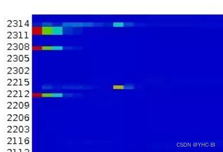


***

### Per sequence quality scores

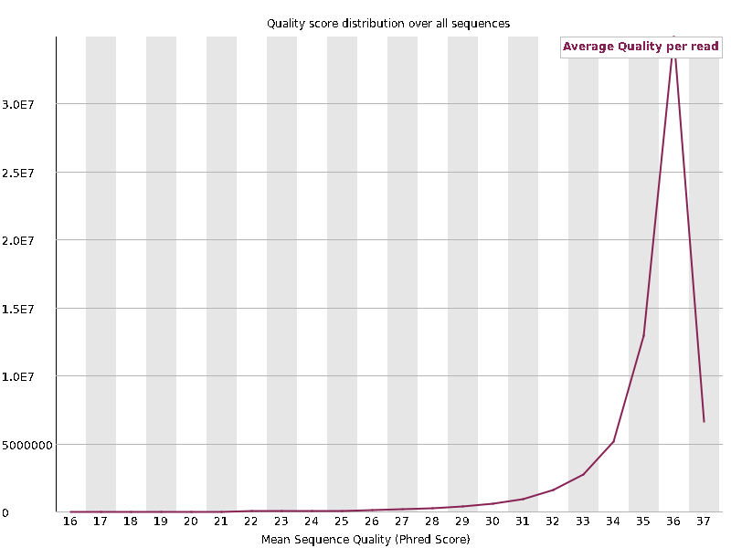

* x轴是平均碱基质量值，y轴是reads数。


**标准：** 

- 如果最高峰的质量值小于27( 错误率0.2%)则会显示**FALL**

- 如果最高峰的质量值小于20(错误率 1 %) 则会显示**WARN**

  

> [!IMPORTANT]
>
> **低质量的会有两或多个峰**


> [!WARNING]
>
> 如果在一次运行中有**相当大比例**的 sequence 整体质量较低，那么这可能表明某种**系统问题**——可能是系统部分运行(例如**one end of a flowcell**)
>
> **One end of a flow cell**：指**flow cell** 的某一端出现 **较多低质量 reads**
>
> - **局部成像问题**：荧光信号在该区域的检测不佳，导致测序质量下降。
> - **试剂分布不均**：某些区域可能受到试剂浓度或分布的影响，导致质量偏差。
> - **污染或残留**：该区域可能有残留试剂、气泡、或者堵塞，影响测序效果。
> - **激光或光学问题**：Illumina 通过光学检测信号，如果某一端的光学系统异常，也可能导致该区域的质量下降。


***

### Per base sequence content


**横坐标**代表 read 的**碱基位置**, **纵坐标**代表**该碱基百分比**

- 一个完全随机的文库内每个位置上 4 种碱基的比例应该大致相同，因此图中的四条线应该相互平行且接近

* 在 **reads 开头**出现碱基组成偏离往往是我们的建库操作造成的

>[!TIP]
>
>比如GBS文库中的**条形码**和**酶切位点**会影响测序reads的开头部分，这可能会在质量控制报告中看到碱基组成的偏离。以下是进一步解释：
>
>- **条形码（Barcode）**：每个样本使用不同的 Barcode sequence，这些 Barcode 位于测序 reads 的开头。由于 Barcode sequence 的多样性，reads 开头的碱基组成不是均一的。
>- **酶切位点**：限制性酶在特定 sequence 处切割 DNA，因此这些酶切位点的碱基组成是固定的。如果这些位点在测序 reads 的开头，可能会导致碱基组成偏离

*  **reads 结尾**出现的碱基组成偏离，往往是测序 **adapter** 的污染造成的，**adapter** 可能没有完全从 reads 中剪切掉，导致 reads 结尾包含**adapter**。

*  在 sequence 前12~15个碱基，可以**使用剪切软件（cutadapt）切除**，切除多少个需要看你的数据，比如上图的结果显示就可以切15个或19个。


**标准：** 

- 如果任何一个位置上的 A 和 T 之间或者 G 和 C 之间的比例相差 10 % 以上则报**FALL**
- 任何一个位置上的 A 和 T 之间或者 G 和 C 之间的比例相差 20 % 以上则报**WARN**


***

### Per base sequence content in CUT&Tag


* **read** 在开始时不一致的 sequence 内容是 CUT&Tag 读长的常见现象。WARN的 **Per base seuqnence**  内容并不意味着您的数据失败。
  * 这可能是由于 **Tn5 偏好性**。
  * 您可能检测到的是 **read 前 10bp**左右呈现为锯齿状。如果是这样，这是正常的，不会影响 **alignment** 或 **peak calling** 。**在任何情况下，我们都不建议进行修剪**，接下来通过**修改 bowtie2 参数无需修剪**即可提供准确的映射信息


***


### Per sequence GC conten

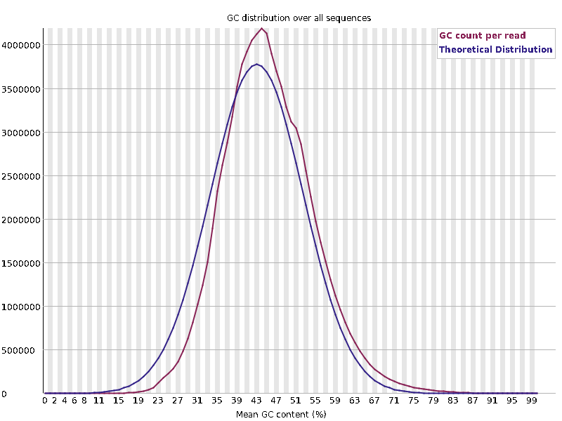

* 这部分表示统计每个 sequence  GC 含量的频数。
* **红色**线是**实际值**，**蓝色**线是**理论值**。
* 峰值位点对应着总体 GC 含量
* 在一个正常的随机文库中，GC 含量的分布应接近正态分布，且中心的峰值和所测基因组的 GC 含量一致
* 由于软件并不知道所测物种真实的 GC 含量，图中的理论分布是基于所测数据计算得来的；**红色线于蓝色线越接近越好**，越接近测序越好，越可靠


**不好的结果：**

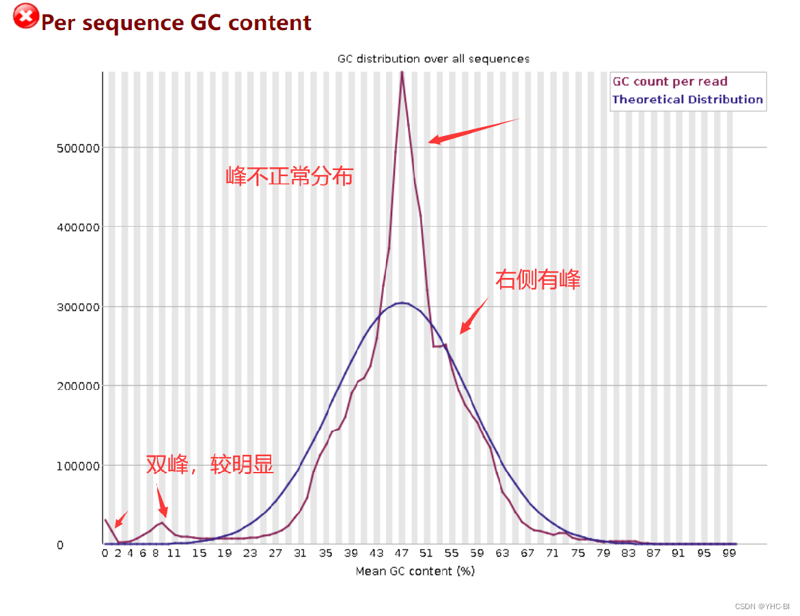

* 如果出现不正常的尖峰分布 (如上图)，则说明文库可能有污染 (如果是 **adapter** 的污染，那么在 **Overrepresented Sequences** 那部分结果还会得到提示)，或者存在其它形式的偏选


**标准：**

- 如果偏离理论分布的 reads 数超过总 reads 数的 15 % 则报**FALL**
- 如果偏离理论分布的 reads 数超过总 reads 数的 30 % 则报**WARN**。


***

### Per base N content

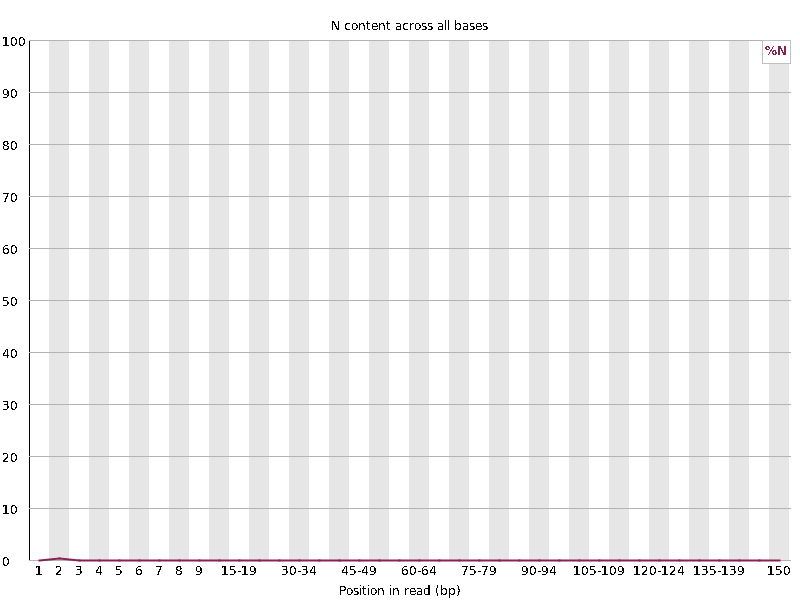

* 在测序仪工作过程中，如果不能正常完成某个 **base calling** (测序仪对每个测序碱基进行检测和识别的过程)，将会以 N 来表示这个位置的碱基，而不是 A、T、C、G

* 出现一定比例的Ns在测序数据中是一个常见现象，通常反映了测序过程中存在某些问题。这种现象的原因可以分为两类，具体解释如下：

  - **普遍的质量丢失 (General Loss of Quality)**

    **原因**：在整个测序过程中，如果测序仪由于多种原因（如化学反应不佳、光学系统问题或 flowcell 污染等）无法准确地**base calling**，可能会导致整个测序文库的质量下降。这样的质量下降通常表现为**较高比例的“N”出现在reads的不同位置**。

    

    **判断方法**：这种情况通常会影响整个文库的测序质量，具体可以通过查看质量控制报告中的多项指标来综合判断，如 **Per Sequence Quality Scores**  和 **Per Base Quality Scores** 等。这些指标可以帮助识别是否存在普遍的质量丢失。

  

  - **Reads 开头出现较高比例的 N**

    **原因**：整体测序质量较高的文库中，**reads 开头碱基组成偏差导致**。例如 **GBS 文库**，reads 开头通常包含**固定 sequence **(如酶切位点和Adapters），这些 sequence 在所有 reads 中都是相同的。然而，在初始测序循环中，由于碱基组成过于单一，测序仪可能无法正确识别荧光信号，导致 base calling 失败，从而在 reads 的开头填充 “N” 

    

    **判断方法**：这种现象可以通过结合 **Per Base Sequence Content** 的结果来判断。在 **Per Base Sequence Content** 中，如果看到**开头几位的碱基质量评分较低**，则可以推测这些位置的 N 是由于碱基组成偏差导致的。

  

- **该N的含量越小越好，为0是最最最理想的。**

  

**标准：**

- N 的比例大于 5 % 则报**FALL**
- N 的比例大于大于 20 % 则报**WARN**。


***

### Sequence Length Distribution


**Data cleaning 前**：


* 该部分是 sequence 长度分布情况，上图例子显示，整个数据 sequence 的长度分布于100~102bp之间。

* 测序仪出来的原始 reads 通常是均一长度的，但经过**Data cleaning 软件等处理过的数据**则不然。

  * **adapter 去除**

    在测序过程中，reads 可能包含 adapter。如果 adapter 没有被去除，Data cleaning 软件会识别并去除这些 adapter。

    adapter 的去除可能导致 reads 长度不再一致，特别是在测序片段较短的情况下，去除 adapter 后剩余的 sequence 长度会变短。

  

  - **低质量碱基的剪切**

    Data cleaning 软件通常会检测并去除 reads 中质量较低的碱基，尤其是 reads 的末端。如果某些碱基的质量低于设定的阈值，这些碱基会被剪掉，从而导致 reads 的长度缩短。由于不同 reads 的低质量区段长度不同，处理后的 reads 长度可能会有所差异。

  

  - **去除污染 sequence **

    在某些情况下，Data cleaning 软件可能会识别并去除污染 sequence 或低复杂度 sequence （如多次重复的碱基）。这些 sequence 的去除同样可能导致 reads长度的变化。

    

  - **质量过滤**

    Data cleaning 软件可能会完全丢弃一些长度过短或质量过低的 reads。这意味着在处理后，剩余的 reads 可能存在不同的长度.

  


**Data cleaning 后**：

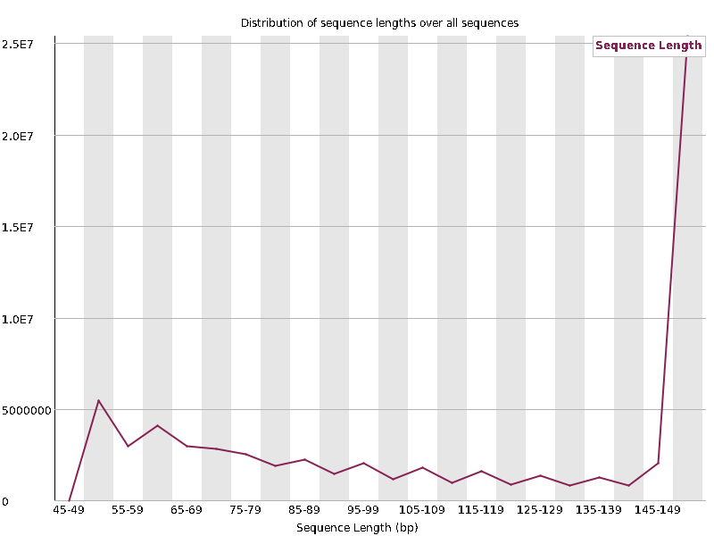


**标准：**

- 当 reads 长度不一致时报**FALL**

- 当有长度为 0 的 reads 时则报**WARN**。


***

### Sequence Duplication Level

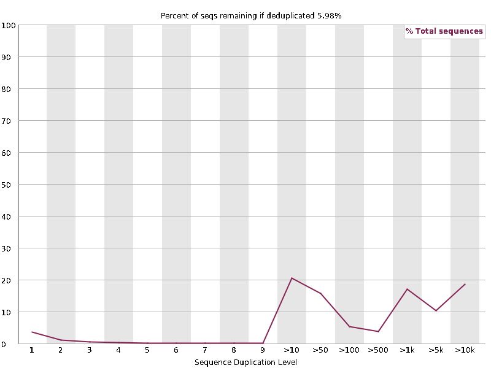

- **横坐标**为**重复（duplication）的次数**

- **纵坐标**为 **reads 的数目**

- 为了减少该模块的内存需求，只分析每个文件中前200,000个 sequences 。

  分析每个文件中的前200,000个 sequence ，但这应该足以对整个文件的重复程度有一个好的印象

  

**低重复度**：在一个多样性的文库中，大多数 sequence 只会出现一次。这通常意味着测序覆盖度高，即测序数据很好地覆盖了目标 sequence 的不同区域

**高重复度**：如果某些 sequence 多次出现，可能表明数据存在偏差，例如PCR过度扩增。高重复度通常意味着测序过程中对某些 sequence 进行了过度扩增


**标准**

- 如果 duplication 占总数的20%以上，该模块将发出经**FALL**

- 如果 duplication 占总数的50%以上，该模块将发出一个**WARN**

  

> [!TIP]
>
> **为什么 ChIP-seq 中 duplication 会过多？**
>
> - 在 ChIP-seq 实验中，样本量通常较少，因此需要进行多轮PCR扩增来生成足够的DNA用于测序
> - 有可能某个转录因子在基因组中的结合位点非常有限，并且这些位点非常集中，那么使用针对该转录因子的抗体进行 ChIP-seq 实验时，测序结果中会有很多 duplication


***

### Overrepresented sequences

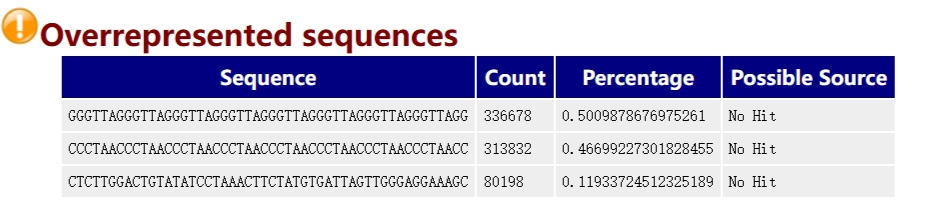


- 它展示了长度至少**20 bp**，数量占总数**0.1%以上**的 reads sequences，它可以帮助判断污染(比如：载体、接头序列)。

- 一个正常的高通量文库将包含一组不同的 sequence，没有单个 sequence 占整体的一小部分。发现单个 sequence 在集合中被Overrepresented，要么意味着它具有高度的生物学意义，要么表明文库被污染了

  - 对于每一个 Overrepresented sequence，程序将在一个常见污染物的数据库或接头数据库中寻找匹配，并报告它找到的最佳匹配

  - 如果不是，可以复制序列去 blast

    


- 为了节省内存，只分析每个文件中前200,000个 sequence 。

  因此，由于某种原因，该模块可能会错过一个被 Overrepresented 但未出现在文件开头的 sequence。

  

- 由于 Overrepresented sequences 检测需要在序列的整个长度上进行精确的序列匹配，因此任何**长度超过75bp的读取都被截断为50bp**


**标准**

- 当发现 Overrepresented reads 超过总 reads 0.1% 的reads时报**FALL**
- 当发现 Overrepresented reads 超过总 reads 1% 的reads时报**WARN**


***

### Adapter Content

**没去除adapter**

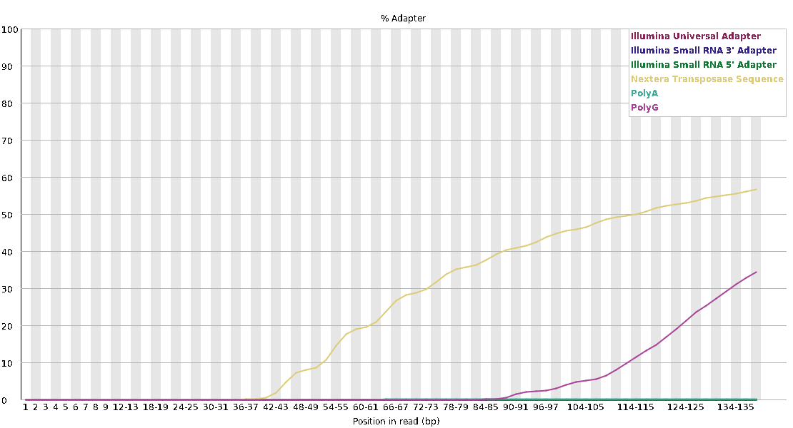

- 上图中 adapter 没有去除，在后续分析的时候需要先使用 Data cleaning 软件进行去接头。


**去除adapter后**

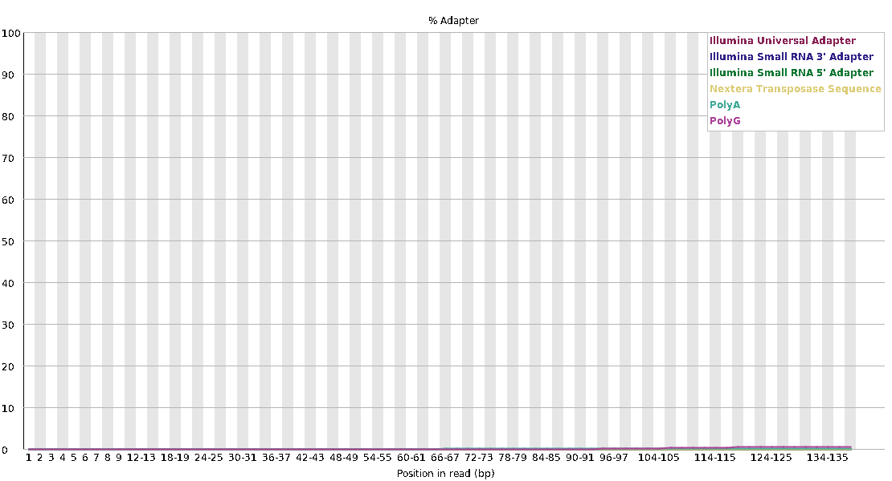

- 当时`fastqc`分析的时候 `-a` 选项没有内容，则默认使用图例中的四种通用adapter序列进行统计


***

### Overrepresented Kmers

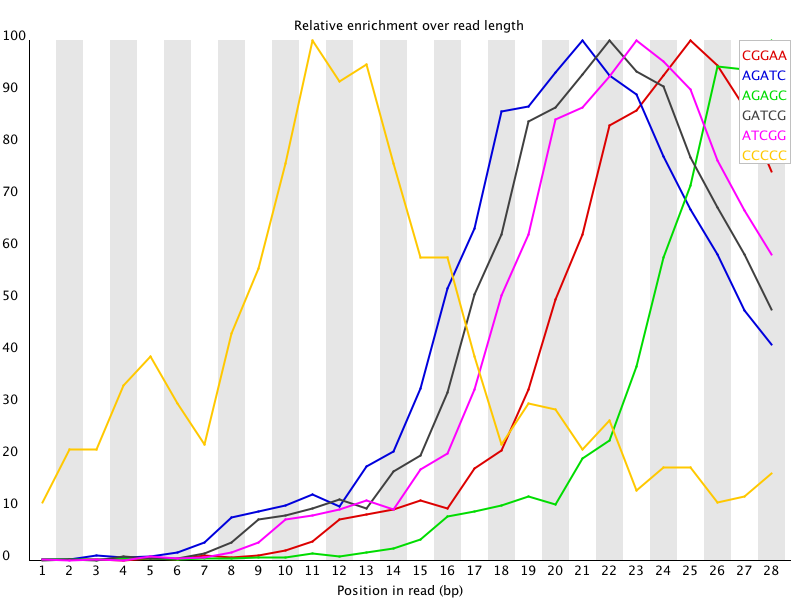

- k bp 的短序列在 reads 中大量出现，其频率高于统计期望的话，将其记为**over-represented k-mer**。
- `-k`可以指定 Kmer 内容模块中要查找的 Kmer 长度。指定的 Kmer 长度必须在`2-10`之间 (deafult:`k = 5`) 
- 出现频率总体上3倍于期望或是在某位置上5倍于期望的 kmer 被认为是 over-represented
- **over-represented kmer** 有可能是**污染**，也可能是与**转录因子的 DNA 结合位点**相关


**标准**

- 当有出现频率总体上3倍于期望或是在某位置上5倍于期望的k-mer时，报**WARN**
- 当有出现频率在某位置上10倍于期望的k-mer时报**FAIL**


**ChIP-seq 中的Kmers**


* 对于 ChIP-seq 数据来说，这一指标出现**FAIL**是意料之中的，而且实际上是数据中信号良好的标志


***

## fastqc是如何检测adapter的呢？

**参考：**[基础——illumina测序原理与细节](https://www.jianshu.com/p/077911bf772d)

```test
Illumina Universal Adapter                  AGATCGGAAGAG
Illumina Small RNA Adapter                  ATGGAATTCTCG
Nextera Transposase Sequence                CTGTCTCTTATA
SOLID Small RNA Adapter                     CGCCTTGGCCGT
```

**为什么这几个序列就能帮我们判断adapter的有无，按照我们的理解来说不应该adapter序列会很多样吗？**

**这几个序列到底在adapter的哪里？**

- 这几个序列在测序**引物的3’端**
- 由于基本上所有的**引物3'端**都是这些序列，所以我们可以通过这几个序列判断adapter
- 无论什么测序，都必须连接在这些**引物3'端**，所以才能检测到adapter

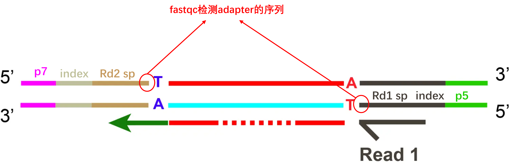


***

## Data cleaning—cutadapt

### Theory

* [cutadapt](https://github.com/FelixKrueger/TrimGalore/blob/master/Docs/Trim_Galore_User_Guide.md)

* **Step 1: Quality Trimming**——去除 reads 3’端的低质量碱基

  illumina平台的测序数据，通常3’端质量较差。`trim_galore` 首先会过滤掉3”端的低质量碱基.

* **Step 2: Adapter Trimming**——去除 adapter

* **Step 3: Removing Short Sequences**——去除长度太短的 reads。默认情况下，如果序列长度少于 20bp，这条序列会被丢掉。

> [!IMPORTANT]
>
> **如果对双端测序中的一个文件单独分析，不建议删除太短的reads**
>
> - 因为这可能会破坏 **成对read** 的顺序，而这种顺序对许多 **alignment** 软件很重要
> - `Trim Galore`对双端测序修剪后验证 **成对read** 的完整性，如果其中一个 **read** 变得太短，整个**成对read**会被移除
> - `Trim Galore`的`--retain_unpaired`：如果**只有一个read**合格，这个**read**会被保存到单独的文件中以便**单端alignment**。这可以确保你最终使用的数据是高质量的。


* Step 4: **Specialised Trimming** **(专业修整)**

  - Hard-trimming to leave bases at the 5'-end

    `--hardtrim5` `<int>`

    这个选项会硬性截短序列，只保留从 5' 端开始的指定数量（int 个碱基）。也就是说，无论序列原来的长度是多少，只会保留序列最前面的 int 个碱基，其余部分会被完全删除。生成硬修整 FastQ 文件

    

  - Hard-trimming to leave bases at the 3'-end

    `--hardtrim3` `<int>`

    这个选项会硬性截短序列，只保留从 3' 端开始的指定数量（int 个碱基）。也就是说，无论序列原来的长度是多少，只会保留序列最前面的 int 个碱基，其余部分会被完全删除。并生成硬修整 FastQ 文件

    

  - 小鼠表观遗传学时钟修整

    `--clock`

    [详见](https://genomebiology.biomedcentral.com/articles/10.1186/s13059-017-1203-5)

    - 在DNA甲基化测序中，PCR扩增不可避免，UMI（唯一分子标识符）的引入可以帮助去除这些PCR重复，使得测序数据更准确地反映真实的甲基化水平

    - 选项用于处理UMI测序数据，特别是用于鼠类表观遗传钟分析。它会识别并移除序列中的UMI和固定的非测序片段，把这些信息记录到每条序列的ID中，然后生成修剪后的文件。

    - 这些文件随后需要进一步修剪掉尾端的15个碱基，以确保所有UMI和固定序列都被移除。之后，数据可以进行allignment，以便于后续的DNA甲基化分析。


- **Trimming whether or not?**

  * **不需要trimming：**

    对于25x25 PE测序，由于每个read长度为25 bp，在这种情况下

    - adapter序列不会出现在read的末端，因为测序长度不足以覆盖整个插入片段并延伸到adapter。

    - read长度也比较短，3'端的质量也比较高

    因此，也就不需要进行read修剪。

  * **需要trimming：**

    对于read长度更长的测序（例如100 bp或更长），测序的长度可能接近或超过插入read的长度。这意味着adapter序列可能出现在read的末端，且3'端的质量也比较差。可能会干扰allignment和后续分析。因此，需要进行read修剪

  * **使用`--local`模式进行比对：**

    对于经过**trimmed read**，建议使用`--local`。`--local`模式允许比对器在read的一部分上寻找匹配，而不要求整个read都参与allignment。这非常适合trimmed read.

    

### parameters

```bash
trim_galore  # 输入文件名


# ==输入选项==  
    --paired 
    # 用于双端测序数据。需要提供两个文件。
    # 对于双端测序结果，一对reads中，如果有一个被剔除，那么另一个会被同样抛弃，而不管是否达到标准

    --retain_unpaired
    # 如果两个配对端读取中只有一个太短，则较长的读取将写入任一文件或输出文件
    # 默认情况下retain_unpaired 是关闭的（OFF）。这意味着如果一对读取中只有一个读取满足长度要求，则整个读取对都会被丢弃
    # 当双端测序数据中两个读取的质量差异较大时，其中一个读取可能会由于低质量区域的修剪变得非常短。如果你希望保留较长的那个读取以进行单端分析，可以启用 --retain_unpaired 选项。

    -r1 <int> # 指保留R1时的最小长度阈值,这个长度是指在经过质量修剪之后，R1 必须达到的最小长度。如果启用了--retain_unpaired，且R1 满足这个长度要求但R2 太短，则R1 会被保留并写入 unpaired_1.fq 文件中。
    -r2 <int> # 指保留R2时的最小长度阈值

    --phred33 # 质量分数为Phred+33编码
    --phred66 # 质量分数为Phred+64编码


# ==输出选项==
    -o # 指定输出目录
    --gzip # 输出文件为解压文件
    --dont_gzip # 输出文件不为解压文件

    --fastqc # 修剪完成后运行fastqc
    --fastqc_args "<ARGS>" 
    # 将额外的参数传递给 FastQC
    # 例如：--fastqc_args "--nogroup --outdir /home/"
    # 参数将自动调用 FastQC，因此不必单独指定。--fastqc


# ==性能优化==
    --cores <int> 
    # 指定使用的核心数。建议使用 4 核，以达到性能和效率的最佳平衡 
    # 只支持python3以上的版本，Python2只能使用单线程


# ==普通修剪选项==
    -q <int> # 设置修剪低质量碱基的阈值，默认为 20（按默认走就行）

    --max_length <int> # 修剪后丢弃长度超过 bp 的读数
    --length <int> # 设置最小read长度，低于此长度的read将被丢弃（默认20）

    --stringency <int>
    # 如果在读取序列的末端找到了一个至少具有指定长度的adapte序列重叠部分，则认为该序列包含adapte，并从该位置进行修剪
    # 默认为1(非常苛刻)可以适度放宽至3到4，因为后一个adapter几乎不可能被测序仪读到
    # 较高的 stringency 值可以减少误匹配的修剪，但可能会导致一些实际包含adapter的序列未被修剪；较低的 stringency 值则相反

    -e <int>
    # 参数用于设置adapte序列匹配时允许的最大错误率（即错配、插入或删除的比例）
    # 错误率越高，匹配adapte的严格性就越低，反之则越严格。
    # 默认为0.1
    


# ==特定修剪选项==
    --clip_R1 <int> # 指 单端测序 或 双端测序中的R1 5' 端去除指定数量的碱基
    --clip_R2 <int> # 指双端测序中的R2 5' 端去除指定数量的碱基
    # 在双端 BS-Seq（双硫化物测序）中，5' 端的碱基可能因为末端修复反应而导致低甲基化偏差。根据M-bias plot section in the Bismark User Guide，适当去除几个位点的碱基

    --three_prime_clip_R1 <int> # 指修剪adapter后，单端测序 或 双端测序中的R1 3' 端去除指定数量的碱基
    --three_prime_clip_R2 <int> # 指修剪adapter后，双端测序中的R2 3' 端去除指定数量的碱基

    --max_n <int> # 参数用于设置允许序列中最大未确定碱基（N）的数量。如果序列中的未确定碱基数超过了这个指定的阈值，则该序列将被完全过滤掉
    --trim-n # 从读取的任一侧删除未确定碱基（N）

    --2colour/--nextseq <int>
    # 在 NextSeq 和 NovaSeq 平台上，G 碱基在没有信号的情况下也可能被标记为高质量，这会导致下游分析中的问题
    # 详细见：https://sequencing.qcfail.com/articles/illumina-2-colour-chemistry-can-overcall-high-confidence-g-bases/.


# ==特定adapter选项==
    -a # 指定特定的adapter
    -a2 # 选项用于指定第二条adapte序列。这在双端测序处理中尤其有用
```


**Example**

```bash
# ==单端测序==
trim_galore IP_H3K27ac_Vehicle_1.fastq.gz -q 25 --phred33 --length 25 -e 0.1 --stringency 4


# ==双端测序==
trim_galore \
    --paired \
    --phred33 \
    --length 50  \
    --fastqc KChIP2-OE-230929S_230929S_R1.fastq.gz KChIP2-OE-230929S_230929S_R2.fastq.gz \
    --stringency 4 --cores 4 --clip_R1 15 --clip_R2 15 \
    -o trim_galore
    
    
# ==不进行trim(step1,step2),只去除太短的reads(step3),对于双端测序,可以用到fastp工具==
fastp \
    -i KChIP2-OE-230929S_230929S_R1.fastq.gz \  # 输入文件1（R1）
    -I KChIP2-OE-230929S_230929S_R2.fastq.gz \ # 输入文件2（R2）
    --length_required 10 \             # 最短reads长度要求
    --disable_adapter_trimming \       # 禁用接头修剪
    --disable_quality_filtering \      # 禁用质量过滤
    -o out.R1.fastq.gz \               # 输出文件1（R1）
    -O out.R2.fastq.gz \               # 输出文件2（R2）
    -w 4                               # 使用的线程数
```

***

# Reads Alignment

## Alignment theory

### 如何评估序列相似？

* 序列相似有2个指标：**一致度(identity)** ，**相似度(similarity)**

* **identity**: 如采两个序列(蛋白质或核酸)长度相同，那么它们的一致度定义为他们对应位置上**相同**的残基占总长度的百分数。

* **similarity**: 如果两个序列(蛋白质或核酸)长度相同，那么它们的相似度定义为他们对应位置上**相似与相同**的残基的数目占总长度的百分数。

* **可为相识与相同的残基？**：
  **替换记分矩阵(Substitution Matrix)** ，反映残基之间相互替换率的替换记分矩阵，它描述了残基两两相似的量化关系。分为**DNA替换记分矩阵**和**蛋白质替换记分矩阵**。

    

  

***

### 常见的DNA替换记分矩阵

  * **等价矩阵(unitarymatrix)** :最简单的替换计分矩阵，其中，相同的碱基之间匹配得分为1，而不同碱基间的替换得分为0。

    

    由于这种矩阵不含有碱基的物理化学信息，而且不区别对待不同的替换，因此在实际研究中运用较少。

    

  

  * **转换-颠换矩阵(transition-transversionmatrix)** :碱基的替换发生在嘧啶之间或嘌呤之间，则称为**转换**；而如果发生在嘧啶和嘌呤之间，则称为**颠换**

    

    在进化过程中，转换发生的频率远比颠换高。为了反映这一情况，通常该矩阵中**转换**的得分为-1，而**颠换**的得分为-5

    

  

  * **BLAST矩阵** :经过在研究过程中的大量实际对比发现，如果令被比对的两个核苷酸相同时得分为+5，反之为-4，则比对效果较好，这就是被广泛使用的BLAST矩阵。

    

  

***

### What is the alignment?

**序列比对法(alignment)** :两条序列的alignment就是把 序列s 和 序列t 这两个字符串上下排列起来，在某些位置插入空格(gap)。

然后依次比较它们在每一个位置上字符的匹配情况

匹配的好，这个位置就会得高分

匹配的不好，看看能不能左右错一错，或填上个空位，让附近的位置更好的匹配在一起，从而**使所有位置的得分之和尽可能的高**。

说白了，就是通过插入空位，让上下两行中尽可能多的一致的和相似的字符对在一起

需要使用专门的**序列比对算法**。分为**全局比对**与**局部比对**

 


***

### Global Alignment

* **Needleman-Wunsch算法**

* 比较复杂，建议看视频：[视频1](https://www.bilibili.com/video/BV13t411372E?spm_id_from=333.788.videopod.episodes&vd_source=951f1d2399bb1456eb6ac0a86e6efdd1&p=37)，[视频2](https://www.bilibili.com/video/BV1qM4y1D7ND?spm_id_from=333.788.videopod.sections&vd_source=951f1d2399bb1456eb6ac0a86e6efdd1)

输入选项有：**（1）序列p和序列q，（2）替换记分矩阵，（3）空位罚分（下图gap=-5）**

其中箭头代表**追溯箭头**代表其最大值从那个方格来。


***

### Local Alignment

* **Smith-Waterman算法**

* 比较复杂，建议看视频：[视频1](https://www.bilibili.com/video/BV13t411372E?spm_id_from=333.788.videopod.episodes&vd_source=951f1d2399bb1456eb6ac0a86e6efdd1&p=38)

* 与全局比对的区别在于，**其s(i,j)最大值多了个0**


* **其得分为矩阵中最大的值：16**

* 追溯箭头不是从右下角到左下角，**而是从刚刚找到的最大值开始追溯到没有箭头为止**


***

### Different of Global Alignment and Local Alignment in reads alignment

| 特征         | 全局比对 (Global Alignment)                                  | 局部比对 (Local Alignment)                                   |
| ------------ | ------------------------------------------------------------ | ------------------------------------------------------------ |
| **定义**     | 将整个查询序列与参考序列进行比对                             | 寻找两个序列中的最优匹配片段                                 |
| **适用场景** | 高相似度的长序列                                             | 存在小片段或插入/删除的情况                                  |
| **常用算法** | Needleman-Wunsch, Smith-Waterman                             | Smith-Waterman                                               |
| **优势**     | 能够检测到插入、缺失等复杂变异，适合高质量的读长较长的数据。 | 在处理质量较差的数据或序列中存在非生物学意义的片段时，比对率更高，能够处理部分匹配的情况。 |
| **劣势**     | 如果读序列中存在低质量区域或adapters等非生物学意义的序列，全局比对可能会产生较低的比对率，计算成本高 | 可能会忽略掉一些复杂的结构变异，尤其是当这些变异涉及较长序列的精确比对时。 |


***

### 一致度(identity)和相似度(similarity)


***

### BLAST

* 具体参考[轻松理解BLAST搜索原理](https://blog.csdn.net/weixin_46432623/article/details/105520286)  [视频1](https://www.bilibili.com/video/BV1oY411p7jV/?spm_id_from=333.337.search-card.all.click&vd_source=951f1d2399bb1456eb6ac0a86e6efdd1)

* 使用**alignment**去比对数据库的每一条序列，耗时比较长。所以使用**BLAST算法**快速从数据库准确找到相似的序列

* **BLAST算法(Basic Local Alignment Search Tool)** 采取**seeding-and-extending**方法。 首先找到query序列和subject序列间匹配的**seed**， 然后沿**seed**向两边延伸，产生**High Scoring Segement Pairs (HSPs)**， 然后在这些特定区域运用**Simith-waterman** 算法，最后评估比对的identify。


**BLAST的主要步骤**

* **分词(Creat a word list)** 

  BLAST首先将输入的序列分解成固定长度的小片段。

  > [!TIP]
  >
  >
  > 假设你的句子是“GATTACA”，BLAST会拆成这些小片段："GAT", "ATT", "TAC", "ACA"  


  * **种子匹配（Seed Matching）**

    BLAST会把这些小片段和数据库中的索引(index)快速匹配，找到所有完全相同的序列（**seed匹配**）。  

    > [!TIP]
    >
    > 这就像在图书馆中快速找到包含“GAT”或“ATT”等关键词的书。

  * **扩展匹配（Extension）**

    一旦找到一个匹配的小片段，BLAST会从这个片段出发，尝试向两侧扩展匹配，计算相似性得分，直到得分下降到一定程度为止（**得分下降阈值**）

    > [!TIP]
    >
    > 如果发现一本书有一句话和你的句子的一部分相同，就继续往前后查找，看整段话是否更相似。

  * **评分系统（Scoring System）**BLAST会对每次比对结果进行打分  

  * **返回最佳结果（High-Scoring Pair, HSP）**

    BLAST会对所有比对结果进行排序，返回得分最高的片段（**HSP**）。这些结果通常用 **E-value** 衡量（值越小，匹配越可靠）。

    > [!NOTE]
    >
    > **E-value**表示在给定数据库规模下，随机出现某个比对得分或更高得分的**预期次数**(其不为概率，应大于1)。其公式如下：
    > $$
    > E = K \cdot m \cdot n \cdot e^{-\lambda S}
    > $$
    > $ E $：期望值，表示随机比对中出现得分不低于 $ S $ 的次数。
    >
    > $ K $：与搜索空间维度及特性相关的常数。
    >
    > $ m $：查询序列（query sequence）的长度。
    >
    > $ n $：数据库的大小。
    >
    > $ S $：比对的原始得分（根据得分矩阵计算）。
    >
    > $ e $：自然对数

  * **序列比对(alignment)得出identify(一致度)**

    BLAST会对所有（**HSP**)片段与query序列进行alignment, 得出**identify(一致度)**

    

    

***

### Different of DNAseq alignment and RNAseq alignment

* **DNAseq**：DNAseq的序列通常是**连续**的，与参考基因组的比对无需考虑剪接事件。

* **RNAseq**：RNAseq比对需要考虑到**mRNA的剪接情况**，因此需要使用能够处理剪接事件的工具，如 `STAR`、`HISAT2` 等。这些工具可以将RNA序列比对到参考基因组的不同外显子上，并处理内含子区域。


***

### Method of DNAseq alignment——seed and extend

[seed-and-extend](https://www.ncbi.nlm.nih.gov/pmc/articles/PMC4695832) **类似于blast算法**

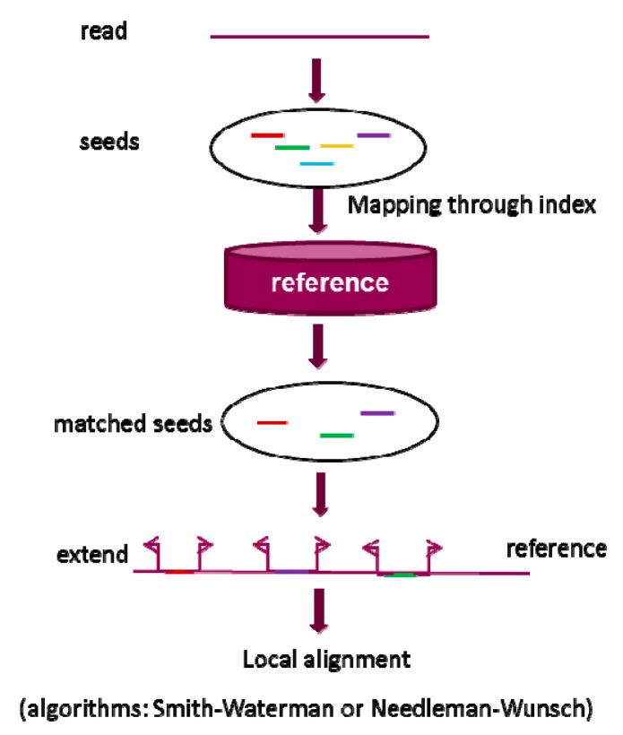

1. 通过扫描参考基因组序列，对参考基因组序列建立哈希表，将序列分成一定长度的小片段（k-mer），这种小片段也被称之为**seed**。实施基于**Needleman-Wunsch**算法或**Smith-Waterman**算法的标准动态程序来进行**seed**与**index**对齐
2. 在目标序列中查找和种子序列相同的片段并标记，以这些标记点为锚点**向左右最大限度延伸，并且中间不能有gap**
3. 将不合条件的舍弃，符合条件的结果将输出保存

* 不同软件的算法在比对层面（sensitivity and precision）和运算层面（消耗的时间和内存）各异；并且选择的seed长度不同，比对和运算结果也不同

  **短的seed**可以**提高allignment的敏感度**，

  **长的seed**可以**提高allignment速度**

  大部分算法都会给allignment结果提供一个质量值（在`SAM/BAM`的结果有体现） 


***

### Different of Signle-read alignment and Paired-End alignment

**假设一条DNA序列包含许多重复序列（下图红色）**

* 假设单端测序片段为重复序列片段，在allignment的时候，有可能映射到多个重复序列，导致结果不准确

* 而双端测序，需要2端一起匹配上，才会映射，防止映射到多个重复序列

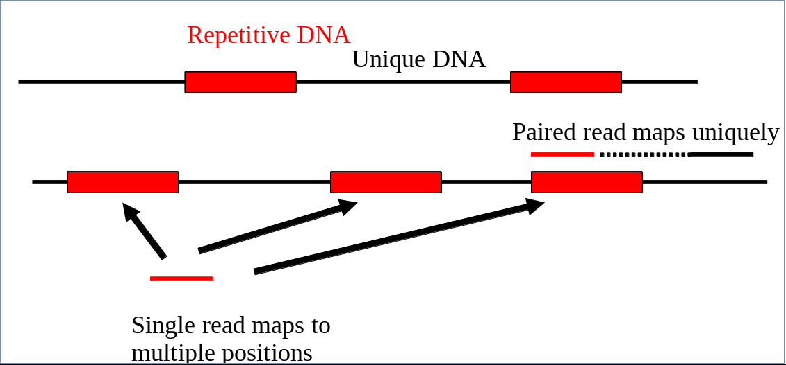


***

## Software selection of Alignment

* **Bowtie2**

  - 特别适合处理小片段的 DNA 或 RNA 序列,擅长对齐 大约 50 到 100 或 1,000 个字符。适合处理小片段、**较短的 RNA-seq 或 ChIP-seq** 数据

  - 内存占用小：对于人类 基因组，其内存占用量通常约为 3.2 GB

  - 不擅长处理长的读长或有复杂拼接结构的序列，或具有大量插入或缺失（Indel）的序列。

* **STAR**

  - `STAR`是ENCODE官方推荐的RNA-seq比对工具，特别适合 **RNA-seq** 数据的处理，尤其是需要检测可变剪接的研究

  - 速度快，但内存消耗较大

* **HISAT2**

  - `HISAT2` 是基于 `Bowtie2` 开发的一款新一代比对工具，特别针对 **RNA-seq** 数据设计，同时也能有效处理 DNA-seq 数据。

  - 内存占用少，比 `Bowtie2` 处理复杂剪接的能力更强


***

## Bowtie2

### Bowtie2 preparation

* **index download**：[Bowtie2 官方网站](https://bowtie-bio.sourceforge.net/bowtie2/index.shtml)

  

* **Software installation**
  `conda install bowtie2`

  

* **index准备**

  - 创建一个index文件夹放index，并到其目录下

  - 安装解压程序`sudo apt-get install unzip`

  - 解压index文件`unzip hg19.zip`

  - 查看index路径`pwd`

    

* **Building an Bowtie2 index**

  - `bowtie2-build` builds a Bowtie index from a set of Fasta file

  - `bowtie2-build` outputs a set of 6 files with suffixes `.1.bt2`, `.2.bt2`, `.3.bt2`, `.4.bt2`, `.rev.1.bt2`, and `.rev.2.bt2`.  

    A large index these suffixes will have a `bt2l` termination.

    ```bash
    # ==Building a small index==
    bowtie2-build example/reference/lambda_virus.fa example/index/lambda_virus
    
    
    # ==Building a large index==
    bowtie2-build --large-index example/reference/lambda_virus.fa example/index/lambda_virus
    ```

    

* **Bowtie2 index inspect**

  - `bowtie2-inspect` extracts information from a Bowtie 2 index about what kind of index it is and what reference sequences were used to build it

  - the tool will output a FASTA file containing the sequences of the original references (with all non-A/C/G/T characters converted to Ns)

  - It can also be used to extract **just the reference sequence names** using the `-n/--names` option or a **more verbose summary** using the `-s/--summary` option.

    ```bash
    # ==output result to the hg19.fasta==
    bowtie2-inspect index/bowtie2/hg19/hg19 -o index/bowtie2/hg19/hg19.fasta
    grep "^>" index/bowtie2/hg19/hg19.fasta | head -n 10  # 查看前10条序列的头部信息
    
    
    # ==just the reference sequence names==
    bowtie2-inspect --n example/index/lambda_virus
    
    
    # ==more verbose summary==
    bowtie2-inspect --summary example/index/lambda_virus 
    ```

    

### Bowtie2 parameters

[Bowtie 2: Manual](https://bowtie-bio.sourceforge.net/bowtie2/manual.shtml#the-bowtie2-aligner)


**Bowtie2 的比对流程分为两个阶段：**

1. **快速单错配阶段（Fast 1-mismatch phase）**
   - 对每个seed，允许最多 **1个碱基错配**。
   - 使用 **哈希表或FM-index** 快速定位基因组中的候选位置。
   - 若找到至少一个候选位置，立即终止搜索并报告结果。
2. **最优种子扫描阶段（Optimal seed search phase）**
   - 快速阶段未找到任何有效比对，对每个seed进行比对
   - 根据比对得分（如匹配/错配的权重、gap惩罚）选择全局最优解


**parameters**

```bash
bowtie2


# ==输入===   
    -x <bt2-idx> # 指定Bowtie2索引文件的路径和前缀（去掉后缀.bt2）
    
    -1 <m1> -2 <m2>   # 指定 paired-end序列文件
    -U <r>            # 指定 single-read的序列文件
    --interleaved <i> # 指定包含paired-end的交错文件 (单个文件，其中 read1 和 read2 交替存储)


# ==输入选项==
    -q # 输入文件为FASTQ格式（默认）。
    -f # 输入文件为FASTA格式。
    
    --tab5	# 输入为 TAB5 格式（旧式 Illumina 格式）
    --qseq	# 输入为 Illumina QSEQ 格式
    
    -c：<m1>, <m2>, <r> 
     # 当你使用-c时，你不需要指定输入文件，而是将序列直接写在命令中，序列以字符串形式输入
    
    -r     # 输入文件为无FASTA/FASTQ头部的纯序列格式
    
    -F k:<int>,i:<int>  # 从连续的FASTA文件（如长序列组装结果）中提取k-mer，并按指定间隔比对（k长度，i间隔）
                        # 主要用于宏基因组或长序列的局部比对分析
    
    --phred33         # 质量分数为Phred+33编码（默认）。
    --phred64         # 质量分数为Phred+64编码。
    --int-quals       # 质量分数为空格分隔的整数
    --ignore-quals    # 忽略质量分数


# ==BAM文件输入控制==
    -b <bam> # 指定未比对的BAM文件（需按read name排序） 
    --align-paired-reads      # 强制将BAM中的reads作为双端处理
    --preserve-tags           # 保留原始BAM的扩展标签


# ==序列预处理选项==
    -s/--skip <int>  # 跳过输入中的前<int>个读取或配对（默认不跳过）。
    -u/--upto <int>  # 在处理前<int>个读取或配对后停止（默认不限制）。
    
    -5/--trim5 <int>          # 从读取的5'/左端剪切<int>个碱基（默认0）。
    -3/--trim3 <int>          # 从读取的3'/右端剪切<int>个碱基（默认0）。
    --trim-to [3:|5:]<int>    # 截断reads至<int>长度（默认3'端）


# ==比对模式==
    --end-to-end # 要求整个读序列进行比对，不允许部分比对（默认开启）。
    --very-fast # 对应于-D 5 -R 1 -N 0 -L 22 -i S,0,2.50。速度非常快。
    --fast #对应于-D 10 -R 2 -N 0 -L 22 -i S,0,2.50。速度较快。
    --sensitive #对应于-D 15 -R 2 -N 0 -L 22 -i S,1,1.15（默认）。灵敏度较高。
    --very-sensitive #对应于-D 20 -R 3 -N 0 -L 20 -i S,1,0.50。灵敏度非常高

    --local # 允许局部比对，序列末端可能被软剪切
    --very-fast-local # 对应于-D 5 -R 1 -N 0 -L 25 -i S,1,2.00。速度非常快。
    --fast-local # 对应于-D 10 -R 2 -N 0 -L 22 -i S,1,1.75。速度较快。
    --sensitive-local # 对应于-D 15 -R 2 -N 0 -L 20 -i S,1,0.75（默认）。灵敏度较高。
    --very-sensitive-local # 对应于-D 20 -R 3 -N 0 -L 20 -i S,1,0.50。灵敏度非常高。
    


# ==比对核心参数==
    -D <int>  # 设置在延长（扩展）比对时，如果连续遇到int次失败，便会放弃继续延长。
    -R <int>  # 当遇到重复的seed序列（即多个地方可能与参考序列匹配的seed序列），它会尝试int组不同的seed序列（其他位置）来进行比对。
    -N <int>  # 允许seed序列比对中最多有int个碱基错配（mismatch）。can be 0 or 1 (deafult:0)
    -L <int>  # 设置seed序列的长度为int个碱基。
    -i S,<int1>,<int2> 
    # 设置seed序列的间隔函数，用于决定seed序列比对的策略。
    # S表示间隔函数类型，这里是线性间隔函数（S for "Step" function）。
    # int1表示seed序列之间的距离
    # int2这是间隔的增长率。这个值决定了seed序列之间的间隔随着比对过程的推进如何增长。
    # 具体来说，每提取一个新的seed序列，其位置会在之前seed序列位置的基础上，按照公式 int2 × <current seed length> 向前移动。
    # 较高的增长率（如 2.50）适用于对速度有较高要求的场景，而较低的增长率（如 0.50）则更适合对准确性要求较高的场合
    
    --n-ceil <func>   # 允许非ATCG的最大比例（默认L,0,0.15） 详细见下面tips
    --gbar <int>      # 禁止在reads两端<int>碱基内出现gap（默认4）
    --ignore-quals    # 忽略质量分数
    --nofw                    # 不比对正向序列
    --norc                    # 不比对反向互补序列
    
    --no-1mm-upfront          # 禁止快速单错配预比对模式，直接进行最优种子扫描阶段。
                              # 耗时较长
                              # 启用 --no-1mm-upfront 时会忽略 -N 1	


# ==for paired-end==
    -I/--minins <int> # 最小插入片段长度（默认0）。详细见下面tips
    -X/--maxins <int> # 最大插入片段长度（默认500）。详细见下面tips
    
    --fr/--rf/--ff    # 定义两个 reads 的 预期相对方向
                      # --fr:  R1 -->       <-- R2
                      # --rf:  R1 <--       --> R2
                      # --ff:  R1 -->       --> R2
  
   --no-mixed         # paired-end reads必须同时成功比对，否则丢弃该对read
   --no-discordant    # 仅输出符合 -I/-X 长度范围和 --fr/--rf/--ff 方向的配对。
   --dovetail         # 允许 部分重叠或延伸 的 reads 被视为有效配对
   --no-contain       # 如果一个 read 的比对区域完全包含另一个 read 的比对区域，则不算有效配对
   --no-overlap       # 如果两个 reads 的比对区域有任何重叠，则不算有效配对


# ==输出==
    -S <sam>    # 输出SAM格式的文件。如果未指定，结果输出到标准输出。
    
    -t          # 打印各阶段耗时
    
    --un <path>       # 将未比对的单端读序列写入指定路径。
    --al <path>       # 将至少比对过一次的单端读序列写入指定路径。
    --un-conc <path>  # 输出非一致配对的reads
    --al-conc <path>  # 输出一致配对的reads
    
    --no-unal   # suppress SAM records for unaligned reads
    --no-head   # suppress header lines, i.e. lines starting with @
    --no-sq     # suppress @SQ header lines
    
    --rg-id <text>            # 设置SAM的@RG ID(记录测序数据的信息)
    --rg <text>               # 添加@RG字段（需配合--rg-id）
    
    &>          # 将命令的标准输出和错误输出重定向到指定的日志文件


# ==性能优化与扩展== 
    -p/--threads <int>        #指定使用多少线程进行比对（默认1）
    --mm                      # 使用内存映射索引（多进程共享）
                              # 当你运行多个 bowtie2 进程时，它们可以共享索引数据的内存映射副本，而不是每个进程都单独载入一份索引，节省了内存并加快启动速度
    
    --reorder                 # 强制SAM输出顺序与输入一致
    

    --seed <int>              # 随机数种子（默认0）
    --non-deterministic       # 使用非确定性随机种子
```


> [!IMPORTANT]
>
> 对于经过**trimmed read**，建议使用`--local`。`--local`模式允许比对器在read的一部分上寻找匹配，而不要求整个read都参与allignment。这非常适合**trimmed read**.


> [!TIP]
>
> **插入片段长度？**`-I` `-X`  Deafult `0` `500`
>
> * **背景** 在paired-end 中，每个paired-end reads来自同一个DNA片段的两端。理论上，这两个read在参考基因组上比对的位置应该有一个合理的间隔，称为**插入片段长度**
>
>   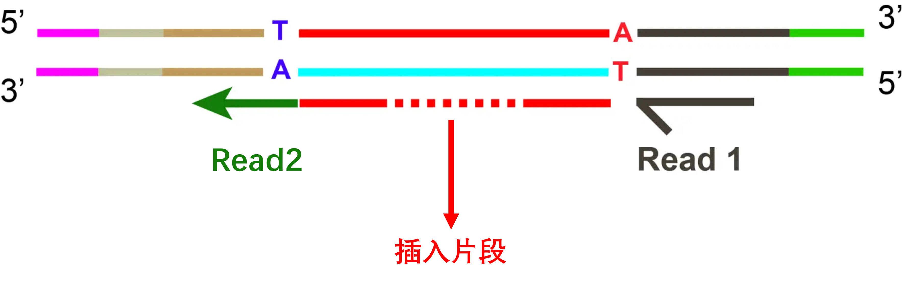
>
> * **实际应用**
>
>   - 选择适当的**最小插入片段长度**可以帮助排除那些可能由于测序或库构建过程中产生的异常情况。例如，在**DNA片段化**过程中，有时可能会产生**非常短**的read，而这些片段可能导致两个read之间的间隔太小
>
>   - 选择适当的**最大插入片段长度**可以帮助排除那些比对到不合理远的区域的read。例如，如果成对read的间隔过大，这可能表明这些read并非来自同一片段，而是由于重复序列或其他原因错误地配对在一起
>
>     
>
> * **parameter suggestion**
>
>   - 对于**25x25 PE**，`-I`可设置为`10` `-X`可设置为`700`
>   - 对于长读长read，不建议设置`-I`


> [!TIP]
>
> **允许非ATCG的最大比例**`--n-ceil`    Deafult: `L,0,0.15` 
>
> - 其值由三部分组成：`<类型>,<最小值>,<最大值>`
>
>   | 类型 | 含义                 | 示例                                     |
>   | :--- | :------------------- | :--------------------------------------- |
>   | `L`  | read长度（Length）   | **`L,0,0.15`**=允许 `0%-15%`个非 A/T/C/G |
>   | `C`  | 固定数值（Constant） | `C,0,5` = 允许 `0-5` 个非 A/T/C/G        |
>   | `S`  | 分段函数（Step）     | `S,1,0.1` = 每 `1`bp 允许 `0.1` 个       |
>
> 


**Example**

```bash
# ==单端测序==
bowtie2 \ 
        -p 12 \
        -x  /mnt/e/test/index/ucsu.hg19/hg19 \
        -U IP_H3K27ac_Vehicle_1_trimmed.fq.gz \ 
        -S IP_H3K27ac_Vehicle.sam


# ==双端测序==
bowtie2 \
        -1 trim_galore/KChIP2-230929S_230929S_R1_val_1.fq.gz -2 trim_galore/KChIP2-230929S_230929S_R2_val_2.fq.gz\
        -x  ../index/bowtie2/Rnor_6.0/Rnor_6.0\         # index location
        -p 10 \                                         # 核心数
        -S bowtie2/KCHIIP2.sam \                        # 指定输出SAM文件的路径 
        --end-to-end \                                  # 全局比对模式   
        --very-sensitive \                              # 启用非常灵敏的参数设置
        --no-mixed \                                    # paired-end reads必须同时成功比对，否则丢弃该对read
        --no-discordant \                               # 仅输出符合 -I/-X 长度范围和 --fr/--rf/--ff 方向的配对。
        --phred33 \                                     # 指定质量得分的编码格式为Phred+33   
        -I 10 \                                         # 设置paired-end reads之间的最小插入片段长度为10 bp     
        -X 700                                          # 设置paired-end reads之间的最大插入片段长度为700 bp
```

> [!CAUTION]
>
> **比对率大于75%才比较可以**

> [!IMPORTANT]
>
>  有时候相同物种不同版本的index其比对率也有很大差别，如果比对率过低建议更换index试一下


***


## Use the E.coli genome to normalize data (optional/CUT&Tag)(step1)

- **背景**：

  在**CUT&Tag**实验中，**Tn5的转座酶**复合物带有细菌来源的DNA（如E.coli的DNA），由于**pA-Tn5**转座酶通常是在细菌（如E.coli）中表达和纯化的。在这个过程中，不可避免地会有一部分细菌的DNA残留

- **非特异性标签化**：

  在实验中，**pA-Tn5**蛋白带有的E.coli DNA可能会被非特异性地标签化。因此，在测序数据中可能会发现一部分read是与E. coli基因组比对的，而不是与目标基因组比对的。

- **恒定的E.coli DNA量**：

  由于在实验中加入的**pA-Tn5**蛋白的量是恒定的，因此每个反应中的E. coli DNA量也是固定的。这意味着E. coliread可以作为一个内参（spike-in control）来进行数据的标准化处理。


1. **比对E.coli Index** 

   下载对应版本的E.coli 的fasta文件 ：https://www.ncbi.nlm.nih.gov/datasets/genome/?taxon=562

   > [!TIP]
   >
   > 如果不确定版本，可以下载前两个

2. **将fasta文件转换成index**

   `bowtie2-build Ecoil-ASM584v2.fasta Ecoil-ASM584v2/genome`

3. **比对E.coli Index**

   ```bash
   bowtie2 
          --end-to-end          #全局比对模式
          --local               #局部比对模式
   
          --very-sensitive      #启用非常灵敏的参数设置
   
          --no-mixed            #paired-end reads必须同时成功比对，否则丢弃该对读段
          --no-discordant       #paired-end reads必须在合理的距离和并且方向一致内比对，否则丢弃该对读段
   
          --phred33             #指定质量得分的编码格式为Phred+33
       
          -I 10                 #设置paired-end reads之间的最小插入片段长度为10 bp
          -X 700                #设置paired-end reads之间的最大插入片段长度为700 bp
   
          -p <int>              #核心数
          -x <Ecoil-index> 
          -1 <R1.fastq.gz> 
          -2 <R2.fastq.gz> 
          -S                    #指定输出比对Ecoil的SAM文件的路径 
          &>                    #将命令的标准输出和错误输出重定向到指定的日志文件
   
   # 在与E.coil比对时候加上以xia2种参数，提供了额外的限制条件，确保了比对的准确性。
          --no-overlap          #防止paired-end reads比对到重叠的位置
          --no-dovetail         #防止paired-end reads在比对时出现交叉现象
   ```

   

   **Example**

   ```bash
   bowtie2 \
           -1 trim_galore/KChIP2-230929S_230929S_R1_val_1.fq.gz -2 trim_galore/KChIP2-230929S_230929S_R2_val_2.fq.gz\
           -x  ../index/bowtie2/Ecoil-ASM584v2/genome\
           -p 10 \
           -S bowtie2/Ecoil/KCHIIP2.sam \
           --local \
           --very-sensitive \
           --no-mixed \
           --no-discordant \
           --phred33 \
           -I 10 \
           -X 700 \
           --no-overlap\
           --no-dovetail 
   ```


[Click here to view step 2](#Use-the-E.coli-genome-to-normalize-data-(optional/CUT&Tag)(step2))


***

# samtools

* samtools是一个用于操作sam和bam文件的工具合集。能够实现二进制查看、格式转换、排序及合并等功能，结合sam格式中的flag、tag等信息，还可以完成比对结果的统计汇总

* Software installation: `conda install -c bioconda samtools`


***

## Samtools sort

* `samtools sort`可以将sam转化为BAM或CRAM，并进行排序

* `samtools sort`可以对文件就行自定义排序

* [samtools sort](https://www.htslib.org/doc/1.14/samtools-sort.html)


**parameters**

```bash
   samtools sort #输入文件名


# ==输出选项==
    -o #指定输出文件的名称
    
    -O #指定输出文件的格式，如 SAM、BAM 或 CRAM
    
    -l <int>
    #设置输出文件的压缩级别，范围从 0 到 9。
    #0 表示不压缩，9 表示最高压缩级别。压缩级别越高，输出文件的大小越小，但压缩所需时间更长


# ==排序选项，默认使用的是按参考基因组位置（coordinate）进行排序==
    -n  #按读取名称对文件进行排序

    -t <TAG>
    # 根据指定的 TAG 字段的值对文件进行排序。使用位置作为次级排序标准，如果设置了 -n，则使用读取名称作为次级标准。
    # 例如，-t NM 可以根据比对不匹配数 (NM tag) 排序。

   -T <PREFIX>
   #指定排序过程中使用的临时文件的前缀，临时文件会命名为 PREFIX.nnnn.bam。排序完成后，这些临时文件会被自动删除

   --reference
   #指定参考序列的 FASTA 文件。
   #如果你在输出 CRAM 文件时没有指定参考序列，某些操作可能会失败或输出数据不完整。


# ==性能优化==
    -m <int>
    #设置每个线程可使用的最大内存量，默认为 768MB。
    #支持使用 K（千字节）、M（兆字节）、G（千兆字节）作为后缀。例如，-m 2G 

    -@ <int> #指定使用的线程数量,默认值为 1，即只使用一个线程
```


**Example**

```bash
samtools sort  Input_H3K27ac_XY108.sam \
               -O bam \
               -@ 10 \
               -o Input_H3K27ac_XY108.bam
```


***

## Samtools idxstats——view the alignment with chromosome

samtools idxstats 命令可以显示 BAM 文件中所有染色体（参考序列）的名称、长度，以及每个染色体上比对的片段数量。

* 首先，需要确保 BAM 文件已经建立了索引文件（.bai），如果没有，可以先生成索引

  `samtools index` `<in.bam/sam/cram>`  

* 然后使用以下命令查看染色体信息

  `samtools idxstats` `<in.bam/sam/cram>`

* 输出将类似如下内容

  | Chromosome | Length    | Mapped Reads | Unmapped Reads |
  | ---------- | --------- | ------------ | -------------- |
  | chr1       | 248956422 | 10000        | 200            |
  | chr2       | 242193529 | 8000         | 150            |
  | chrX       | 156040895 | 5000         | 100            |
  | chrM       | 16569     | 200          | 50             |
  | *          | 0         | 0            | 0              |

  - **Chromosome**：染色体名称

  - **Length**：染色体长度

  - **Mapped Reads**：比对到该染色体的已比对序列数量

  - **Unmapped Reads**：表示这些序列在比对时没有成功比对到该染色体，但可能被比对到其他染色体

  - ***行**：在比对过程中没有成功比对到参考基因组的任何染色体，contig或scaffold的reads总数


***

## Samtools flagstat——view the alignment results

* 比对结束后，需要了解比对结果的情况，可以采用`samtools flagstat`

  ```bash
  samtools flagstat <in.bam/sam/cram> >> historydata.txt
  ```

- the explanation of alignment results

  ```bash
  14608455 + 0 in total (QC-passed reads + QC-failed reads)     ## reads总数
  37967 + 0 secondary                                           ## 出现比对到参考基因组多个位置的reads数
  0 + 0 supplementary                                           ## 可能存在嵌合的reads数
  0 + 0 duplicates                                              ## 重复的reads数
  14590894 + 0 mapped (99.88% : N/A)                            ## 比对到参考基因组上的reads数
  14570488 + 0 paired in sequencing                             ## 属于PE read的reads总数。
  7285244 + 0 read1                                             ## PE read中Read 1 的reads 总数。
  7285244 + 0 read2                                             ## PE read中Read 2 的reads 总数。
  14507068 + 0 properly paired (99.56% : N/A)                   ## 完美比对的reads总数。PE两端reads比对到同一条序列，且根据比对结果推断的插入片段大小符合设置的阈值。
  14551500 + 0 with itself and mate mapped                      ## PE两端reads都比对上参考序列的reads总数。
  1427 + 0 singletons (0.01% : N/A)                             ## PE两端reads，其中一端比上，另一端没比上的reads总数。
  26260 + 0 with mate mapped to a different chr                 ## PE read中，两端分别比对到两条不同的序列的reads总数。
  17346 + 0 with mate mapped to a different chr (mapQ>=5)       ## PE read中，两端分别比对到两条不同的序列，且mapQ>=5的reads总数。
  ```

  > [!IMPORTANT]
  >
  > **测序深度 = reads总数**

  > [!TIP]
  >
  > `+0` 表示没有任何reads因相关原因而被标记为未通过质量控制（QC）的reads


***

# Convert SAM to BAM/CRAM

We use the [Samtools sort](#Samtools-sort) to convert SAM file to BAM/CRAM file ,and sort the file by coordinate.

```bash
samtools sort  Input_H3K27ac_XY108.sam \
               -O bam \
               -@ 10 \
               -o Input_H3K27ac_XY108.bam
```

> [!CAUTION]
>
> 建议按coordinate进行排序，在remove duplicates 中的Picard MarkDuplicates需要按照coordinate排序bam文件


***

# Remove duplicates

## Remove duplicates theory

* **PCR duplicates**：不同的序列在进行PCR扩增时，扩增的倍数应该是相同的。但是由于聚合酶的偏好性，PCR扩增次数过多的情况下，会导致一些序列持续扩增，而另一些序列扩增到一定程度后便不再进行，也就是我们常说的PCR偏好性。

* **Optical duplicates**：测序仪的光学传感器错误地将单个扩增的簇检测为多个簇。

* **PCR duplicates**的比例会因测序量的增加而增加，**Optical duplicates**是随机分布的。

  <table>
    <tr>
      <td></td>
      <td>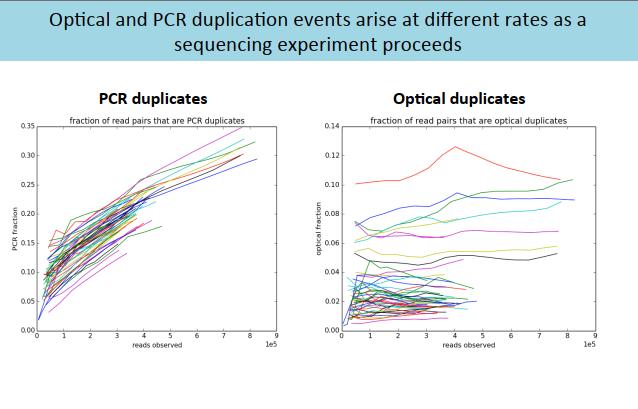</td>
    </tr>
  </table>


**Should we remove duplicates?**

* **RNA-seq**时，我们所得到的reads覆盖度通常是不均匀的（由于不同的基因表达水平不同），如果我们不加区分地remove duplicates，可能会导致大量重要信息的丢失   
  * RNA-seq由于其建库起始量一般都很高所以不需要去除重复
  * RNA-seq数据中经常会出现某些基因的表达量十分高，因此这些reads的比对位置往往高度一致，这种“重复”是生物学本身的体现，而非技术噪音
  
* **ChIP-seq**中，由于起始量不高，且没有那种富集程度很高的位点，因此通常需要考虑去除PCR重复。

* **call SNP**中，起始量一般都高（因为要保证测序深度），此外由于PCR扩增会导致一些序列复制错误，这将严重影响SNP位点识别的置信度。因此一般需要remove duplicates。

* 利用**reads mapping的均匀程度**判断是否具有重复。

  - 若富集位点周围的reads均匀覆盖，那么没有重复；

  - 若富集位点周围覆盖度不均匀，某些区域猛然升高，那么很有可能需要进行PCR去重复


**Key point**

* 起始量很多时，不需要去重复

* 扩增数很少时，15个cycle以内，不需要去重复

* 双端测序由于其两个reads的位置矫正，有助于去除PCR重复

* reads长度越长，越容易识别真正的PCR重复


**Theory**

测序所得到的reads是由于超声波或者酶切断裂得到的，因此这些reads比对到基因组上的位置是**完全随机的**。那么两个reads**比对到相同位置**的概率是非常低的。如果两个reads比对情况相同或者极其相似，则很有可能是由于PCR重复所导致的


***

## Patterned Flowcell?

### 传统未图案化流动池(Non-Patterned Flowcell)

* 在**Non-Patterned Flowcell**中，DNA 片段随机地附着在流动池的表面上，并形成测序cluster。这种随机分布可能导致一些区域的cluster密度过高，而其他区域的cluster密度过低，从而影响测序的均匀性和数据产出

* 在**Non-Patterned Flowcell**中，每个 lane 通常被分为**较少数量的 tiles**，tile 数量有限，编号也较小

  

### 图案化流动池(Patterned Flowcell)

* **Patterned Flowcell**的表面覆盖着一层规则排列的纳米井（nanowells），这些nanowells的作用是控制 DNA 簇的生长位置。每个nanowells只能容纳一个测序cluster，因此cluster的分布更加均匀。
* 由于每个nanowells都可以独立形成一个测序cluster，这种设计大大增加了流动池上的有效cluster数，显著提高了测序的通量。
* **Patterned Flowcell**的设计减少了cluster之间的相互干扰（cluster间竞争和cluster重叠），从而提高了数据的准确性和质量。

<table>
  <tr>
    <td>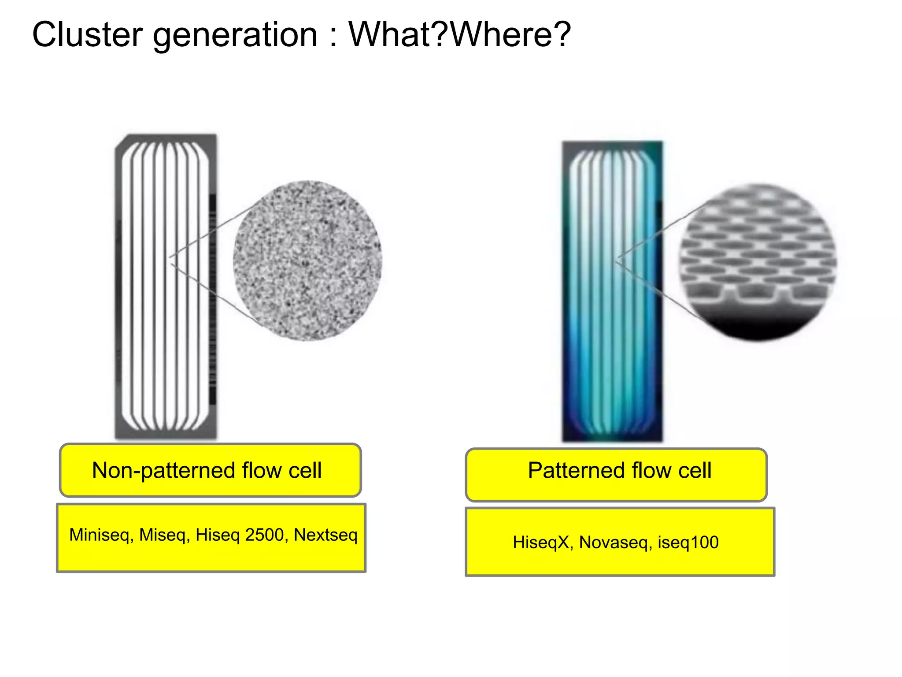</td>
    <td>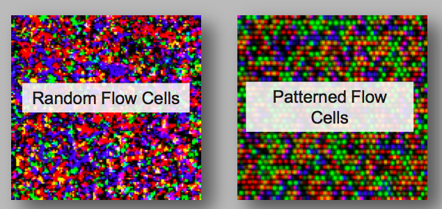</td>
  </tr>
</table>


### Patterned Flowcell与光学重复检测的关系

由于**Patterned Flowcell**中的测序cluster位置是预先确定的，因此光学重复（optical duplicates）在这种设计下变得更容易识别和控制。`Optical Duplicate Pixel Distance` 的默认值在图案化流动池中通常设置得更高（如 2500），以适应这种新型设计


### 如何查看自己数据是否使用Patterned Flowcell？

**查看FASTQ文件中@行信息来推断** `zcat <xxx.fastq.gz> | grep "^@" | head -n 5`

- **Patterned Flowcell** 通常用于 HiSeq X、NovaSeq 系列、以及部分 MiSeq 和 NextSeq 仪器

- Tile 编号很大（例如 1101，1201），并且X坐标值也很大，那么有可能使用的是 **Patterned Flowcell**。

  


***

## Software selection of remove duplicates

### samtools rmdup

* 如果多个reads具有相同的比对位置时，`samtools rmdup`将它们标记为duplicates，然后去除重复，通常只保留第一个识别到的reads。

* 该方法对于以下两种情况，有很好的去除效果：
  * 一些来源于相同 DNA 分子的 reads 由于测序错误可能在序列上存在差异，但它们的比对位置一致
  * 比对错误导致不同的序列比对到相同的位置（可能性不大）

* **Shortcoming**：由于`samtools rmdup`去重只考虑reads比对上的起始终止位置，不考虑比对情况，这种去重有时会导致测序信息的丢失。


### Picard MarkDuplicates

* 与`samtools rmdup`不同的是，`Picard MarkDuplicates`仅仅是对duplicates做一个标记，只在需要的时候对reads进行去重。而`samtools rmdup`则是直接将其识别出来的重复reads去掉。

* `Picard MarkDuplicates`另一个不同之处在于它不仅考虑reads的比对位置，还会考虑其中的插入错配等情况（即会利用sam/bam文件中的CIGAR值），甚至reads的tail，lane以及flowcell。

* `Picard MarkDuplicates`主要考虑reads的5'端的比对位置，其可以从一定程度上认为，5'端的位置，方向，以及碱基比对情况相同，`Picard MarkDuplicates`就将这些reads中碱基**比对值Q>15**的看作是**best pair**而其他的reads则当作是duplicate reads。甚至当reads的长度不同时，`Picard MarkDuplicates`依然利用上述原理进行去重。

  > [!TIP]
  >
  > `Picard MarkDuplicates`中，reads的5'端信息更为重要.若duplicates是PCR重复，那么它们的序列不一定完全相同。但是由于PCR扩增时，酶的前进方向是5'——3'方向，PCR重复序列中5'端的部分相似的可能性更高。


***

## Picard MarkDuplicates

* [Picard MarkDuplicates](https://gatk.broadinstitute.org/hc/en-us/articles/360037052812-MarkDuplicates-Picard)
* `Picard MarkDuplicates` ,它会对 **reads 做一种临时排序（sort）**，以便找出哪些是重复的（duplicates）
* **Software installation** `conda install -c bioconda picard`
* **需要准备按基因组位置（coordinate）进行排序的Bam file**


### Picard MarkDuplicates parameters

```bash
picard MarkDuplicates


# ==基本设置==
    -I                         # 输入一个或多个（排序后）SAM 或 BAM 文件
    -O                         # 输出文件（去除重复后的 BAM 文件）
    -M                         # 输出的度量文件（报告重复情况）
    --REMOVE_DUPLICATES        # 如果设置为 true，会完全移除重复的 reads(dafult:false)

    
    
#  ==其他输入设置==
    --arguments_file              # 可指定一个或多个参数文件，代替手动在命令行写参数，文件格式见下 
    --REFERENCE_SEQUENCE          # 提供参考基因组序列的路径(deafult:null)
    
    --ASSUME_SORT_ORDER           # 如果不是null,则强制程序假设输入文件是指定的排序方式，而忽略 header中的排序声明 
                                  # optional parameters:unsorted、queryname、coordinate、duplicate、unknown 或 null(deafult)
 
    --GA4GH_CLIENT_SECRETS        # 提供 GA4GH 客户端密钥的 JSON 文件路径，用于与 Google Genomics API 交互。 (deafult:client_secrets.json)

    
    --VALIDATION_STRINGENCY        # 控制当程序在读取 BAM/SAM 文件时遇到格式错误或不规范内容时的行为。
                                   # STRICT(deafult):一旦发现格式错误，立即停止运行并报错。
                                   # LENIENT:报出警告(warning)，但不会终止程序。
                                   # SILENT:完全忽略格式错误，不报错也不报警。(适合提高性能)


# ==去重策略== 
     --DUPLICATE_SCORING_STRATEGY   # 判断哪个 read 被保留用的非重复的策略 
                                    # optional parameters：# SUM_OF_BASE_QUALITIES(deafult)
                                                           # TOTAL_MAPPED_REFERENCE_LENGTH(read在参考基因组上比对的总长度)
                                                           # RANDOM 
                                                           
                                                           
                                                                                                                    
# ==光学重复检测选项==
    --REMOVE_SEQUENCING_DUPLICATES
    # 如果设置为 true，则删除光学重复。deafult: falue
    # 如果设为 true，即使 REMOVE_DUPLICATES 为 false，也会去除这类重复 

    --READ_NAME_REGE '<your regex>'
    # 在一些定制化平台或非标准 read 名字格式中，使用自定义 regex 解析 reads 名称，从而提取出 tile 坐标、x、y 坐标，用于估算光学重复率。
    # 如果不想做光学重复估算，可以将其设为 null

    --OPTICAL_DUPLICATE_PIXEL_DISTANCE
    # 选项定义了2个clusters之间的最大偏移量（以像素为单位），超过此距离的cluster将不被视为光学重复。
    # 对于未设计过的 Non-Patterned Flowcell（例如早期版本的平台），默认值 100 是适用的。
    # 新的设计过的 Patterned Flowcell，光学重复的检测要求更高，因此建议将此值设置为 2500

    --MAX_OPTICAL_DUPLICATE_SET_SIZE=
    # 用于确定最大光学重复集大小的阈值。如果一组重复 reads 超过这个数目，程序会尝试识别哪些是光学重复。
    # 请注意，如果设置值过高且确实遇到非常大的重复read集，它将严重影响工具的运行时间。
    # 要完全禁用此检查，请将值设置为 -1。(deafult:300000)

  
  
 # ==Header(HD)标签==     
     --COMMENT                # 添加注释（comment）到 BAM HD标签中，
                              # 可以添加多个注释，只需要多次使用 --COMMENT
                              # example:--COMMENT "This is a comment about the experiment."


# ==duplicate type (DT)标签==
    --CLEAR_DT                  #从输入的 SAM 记录中清除 DT 标签。deafult: true
 
    --TAGGING_POLICY
    # 决定如何在 DT 可选属性中记录重复类型。
    # optional parameters：DontTag（不标记,deafult）、OpticalOnly（仅标记光学重复）、All（标记所有重复）

    --TAG_DUPLICATE_SET_MEMBERS  
    # 如果read属于重复集，则添加两个标签 （deafult: false）
    # 第一个标签 DS 表示重复集的大小。最小的 DS 值为 2，表示两个read映射到参考基因组的相同位置，其中一个被标记为重复。
    # 第二个标签 DI 表示重复集的唯一标识符。


# ==Barcode 或 UMI==
# SAM/BAM文件中 BC(Barcode)或 10X Genomics 的 BX(Cell Barcode + UMI) 标签包含用于标识不同样本或分子库的 barcode 信息。
# barcode通常会在测序过程中被添加到每个 DNA 片段的两端，允许区分不同样本或分子。
    --BARCODE_TAG              # 指定用于区分 barcode 的标签(deafult:null)
    --READ_ONE_BARCODE_TAG     # 为第一条read指定barcode 的 标签(deafult:null)
    --READ_TWO_BARCODE_TAG     # 为第二条read指定barcode 的 标签(deafult:null)


# 双链 UMI 通常由两个相等长度的字符串组成，这两个字符串由一个连字符（例如 "ATC-GTC"）分隔
# 双链 UMI 通常储存在 RX (Read-specific UMI) 或 MI (Molecular Identifier)标签中
    --MOLECULAR_IDENTIFIER_TAG # 指定用于区分 UMI 的标签(deafult:null)。使用此选项时，必须将 BARCODE_TAG 选项设置为非空值,deafult:null
    --DUPLEX_UMI
    # 双链 UMI 通常由两个相等长度的字符串组成，这两个字符串由一个连字符（例如 "ATC-GTC"）分隔
    # 双链 UMI 通常储存在 RX (Read-specific UMI) 或 MI (Molecular Identifier)标签中
    # 启用后，工具会自动识别 RX或 MI 标签，根据双链 UMI 来区分重复reads。


# ==Program(PG)标签==
    --PROGRAM_GROUP_COMMAND_LINE  #	生成 PG 标签时，使用的命令行参数。(deafult:程序会自动生成这个值)
    --PROGRAM_GROUP_NAME          # 生成 PG 标签中PN(program name)(deafult:MarkDuplicates)
    --PROGRAM_RECORD_ID           # 生成 PG 标签中ID(program ID)，如果设置为 null 则不会生成该标签(deafult:MarkDuplicates)
    --PROGRAM_GROUP_VERSION       # 生成 PG 标签中VN(verson)。如果不指定，程序会自动检测当前版本
    --ADD_PG_TAG_TO_READS         # 是否为每个 read 添加 PG 标签(deafult:true)
    


# ==输出压缩设置==
    --COMPRESSION_LEVEL            # 输出压缩文件（例如 BAM 文件）的压缩级别，0 是最小压缩，9 是最大压缩(deafult:5)
    --USE_JDK_DEFLATER             # 是否使用  Java 内置(JDK) 提供的 Deflater 压缩工具，而非默认的 Intel Deflater。(deafult:false)
    --USE_JDK_INFLATER             # 是否使用 Java 内置(JDK) 提供的 Inflater 解压工具，而非默认的 Intel Inflater。(deafult:false)


# ==日志输出设置==
    --QUIET                        # 抑制日志中大部分标准输出，仅保留错误信息。 (deafult:false)
    --VERBOSITY                    # 设置日志输出的详细程度，
                                   # optional parameters:INFO(deafult)、 DEBUG 或 ERROR


# ==其他输出设置==    
    --CREATE_INDEX                 # 如果输出是 BAM 文件，是否自动为其生成 .bai 索引文件。 (deafult:false)
    --CREATE_MD5_FILE              # 是否生成 .MD5 校验文件。 (deafult:false)
    --TMP_DIR                      # 临时存储工作的目录    
    
    
    
# ==性能优化== 
    --SORTING_COLLECTION_SIZE_RATIO       # 控制在排序过程中，Picard 使用内存的比例来缓存记录，超过这个比例后就会写入临时文件进行磁盘排序。(deafult:0.25) 
                                          # 设置太低，速度慢
                                          # 设置太高，可能会 导致内存溢出（OutOfMemoryError）
    
    --MAX_FILE_HANDLES_FOR_READ_ENDS_MAP  # 允许同时打开的文件句柄(每个read的数据块可能需要一个文件句柄来存储)数量 (deafult:8000)
                                          # 当内存不足，遇到“too many open files”错误，可以适当调小  
    
    --MAX_RECORDS_IN_RAM                  # 控制写入文件时，RAM 中能存储的最大记录数。超出该数目会将数据写入磁盘。 (deafult:500000)
```


> [!TIP]
>
> `--arguments_file`可指定一个或多个参数文件，代替手动在命令行写参数，其文件格式如下
>
> ```
> -I sorted_input.bam
> -O deduplicated_output.bam
> -M output.metrics.txt
> --REMOVE_DUPLICATES true
> --OPTICAL_DUPLICATE_PIXEL_DISTANCE 2500
> ```


***

### Remove duplicates strategy

**策略:先查看重复数，再考虑是否去除重复**

1. **Check the duplicates**

   ```bash
   picard MarkDuplicates \
       -I sorted_input.bam \
       -O deduplicated_output.bam \
       -M output.metrics.txt \
       --REMOVE_DUPLICATES false \                # 只标记不去除重复   
       --OPTICAL_DUPLICATE_PIXEL_DISTANCE 2500    
   ```

   

2. **Check the `output.metrics`**

   `Picard MarkDuplicates`会生成一个`output.metrics.txt`，来查看我们的重复情况

   | LIBRARY         | UNPAIRED_READS_EXAMINED | READ_PAIRS_EXAMINED | SECONDARY_OR_SUPPLEMENTARY_RDS | UNMAPPED_READS | UNPAIRED_READ_DUPLICATES | READ_PAIR_DUPLICATES | READ_PAIR_OPTICAL_DUPLICATES | PERCENT_DUPLICATION | ESTIMATED_LIBRARY_SIZE |
   | --------------- | ----------------------- | ------------------- | ------------------------------ | -------------- | ------------------------ | -------------------- | ---------------------------- | ------------------- | ---------------------- |
   | Unknown Library | 0                       | 64747726            | 0                              | 4910198        | 0                        | 62515854             | 2919405                      | 0.96553             | 2231872                |

   - **LIBRARY**：文库的名称。

   - **UNPAIRED_READS_EXAMINED**：检查的单端（unpaired）reads数量。在这个例子中，这个值是 0，表示所有reads都是paired-end reads。

   - **READ_PAIRS_EXAMINED**：检查paired-end reads的数量。

   - **SECONDARY_OR_SUPPLEMENTARY_RDS**：二次或补充（secondary or supplementary）reads的数量。这些reads通常不用于重复率计算。

   

   > [!TIP]
   >
   > - **Secondary Reads**：是指在比对过程中，一个reads可能比对到多个位置（即存在多重比对）。在这种情况下，比对工具会选择一个主要的比对位置（通常是得分最高的那个），并将其他位置标记为次要比对（**secondary alignment**）。这些次要比对位置的reads就被称为 **Secondary Reads**
   >
   > - **Supplementary Reads**：是指在比对过程中，一个长的reads（或 read pair）由于结构变异或其他复杂原因，比对到多个不连续的位置。为了完整描述这种情况，原始的读数会被拆分成几段，每段的比对结果都保留，并被标记为 **Supplementary Reads**。

   - **UNMAPPED_READS**：未比对的reads数量。

   - **UNPAIRED_READ_DUPLICATES**：单端（unpaired）reads中的重复读数数量。

   - **READ_PAIR_DUPLICATES**：paired-end reads中的重复reads数量。

   - **READ_PAIR_OPTICAL_DUPLICATES**：由于光学重复配对reads数量。

   - **PERCENT_DUPLICATION**：重复reads所占的百分比。

   - **ESTIMATED_LIBRARY_SIZE**：估计的文库大小，即根据观察到的重复率估算的原始分子数目。

     > [!TIP]
     >
     >  **Estimated library size ?**
     >
     > Estimated Library Size 是根据重复读数的比例估算的原始分子数目。常见的估算公式如下：
     > $$
     > \text{Estimated Library Size} = \frac{C_1 \times C_0}{C_1 - C_{opt}}
     > $$
     > $ C_1 $ 是所有配对 reads 的总数（包括重复的）。
     >
     > $ C_0 $ 是唯一的配对 reads 数目（非重复的）。
     >
     > $ C_{opt} $ 是光学重复的 reads 数目。
     >
     > 
     >
     > * The estimated library sizes are **proportional** to the abundance of **the targeted epitope** and to the **quality of the antibody** used
     >
     > * The estimated library sizes of **IgG sample**s are expected to be very low.

   

3. **Remove duplicates when we need**

   ```bash
   picard MarkDuplicates \
       -I sorted_input.bam \
       -O deduplicated_output.bam \
       -M output.metrics.txt \
       --REMOVE_DUPLICATES true \                   
       --OPTICAL_DUPLICATE_PIXEL_DISTANCE 2500 \   # 定义了2个clusters之间的最大偏移量（以像素为单位），超过此距离的cluster将不被视为光学重复
       --CREATE_INDEX true  
   ```

   > [!IMPORTANT]
   >
   > **Sometimes the duplicates rate of IgG is relatively high ???**
   >
   > * 因为 IgG 是一种非特异性的抗体，在实验中不与目标蛋白或特定的 DNA 片段结合。
   >
   > * 因此，IgG 对照样本中大部分的测序 reads 是由非特异性结合引起的
   >
   > * 在下游分析之前，从 IgG 数据集中移除重复样本是合适的。


***

## Remove duplicates in CUT&Tag

* 在 **CUT&Tag**实验中，DNA被转座酶（Tn5）切割并标记，形成包含抗体靶向区域的短片段。这些短片段通常会映射到染色体的特定位置

  但由于DNA的可及性及Tn5转座酶的**偏好性**，具有相同起始和终止位置的片段是常见的。

  

* 在实践中，我们发现**高质量的 CUT&Tag** 数据集的明显**重复率很低**，即使是明显的 "重复 "片段也可能是真实的片段。 因此，我们不建议删除重复片段。

> [!IMPORTANT]
>
> **Should duplicate reads been removed in CUT&Run data ???**
>
> * 如果重复率很低，比如**20-30%**，则不需要删除它们。
>
> * 然而，如果这个比率很高，大约有**80-100%**。您需要检查是否在实验阶段过度测序，或者是否有其他潜在问题导致实验失败。
>
> * 如果一切看起来都很好，在继续下游分析之前，您应该考虑remove duplicates


***

#  Assess mapped fragment size distribution(optial)

## What is the fragment ?

- read1 和 read2 比对到参考基因组后，**从 read1 的 5' 端到 read2 的 3' 端之间**（无论方向），就是 **fragment** 

- 在 BAM 文件中，第9列（`TLEN`，即 Template Length）记录了 **read pair 所对应的 fragment length**

- read1 的 TLEN 是正值，read2 的 TLEN 是负值，用 `abs($9)` 取其绝对值来表示**fragment length**

- **fragment Count** 则对**fragment length**出现的次数**除以2**

  双端测序中, 每对 reads 都记录了 **fragment length**，且出现了两次，除以 2得到真正的**fragment count**


## Tn5 转座酶偏好性

* 以**组蛋白修饰为靶标**的 CUT&Tag  反应主要产生**核糖体长度（约 180 bp）**或**该长度倍数**的片段

* 以**转录因子为靶标**的 CUT&Tag 反应主要产生**核糖体大小的片段**和**数量不等的较短片段**，分别来自邻近的核糖体和因子结合位点

  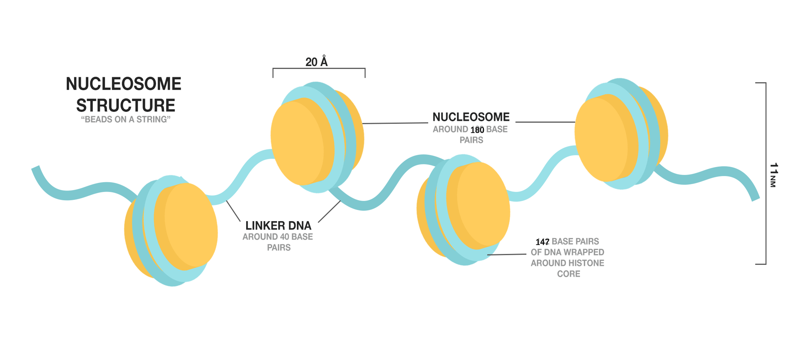

* **10-bp sawtooth periodicity**

  核小体上的 DNA 是以约10个碱基对为一组的周期性缠绕在组蛋白上的。由于核小体结构的这种规律性，**Tn5 转座酶**在核小体表面切割 DNA 时，会产生一种锯齿状周期性（Sawtooth Periodicity）现象
  $$
  147/1.75/8=10base
  $$

  - $1.75$：DNA绕核小体1.75圈

  - $8$：每个核小体由8个组蛋白组成

    

  在片段长度的绘图中，随着片段长度的增加，可以看到大约每隔10 bp 就有一个小峰值。这种锯齿状模式是成功的 **ATAC-seq / CUT&Tag** 实验的特征之一，表明 **Tn5 转座酶**切割主要发生在核小体表面，并且具有高度的结构依赖性。

  | 项目                 | ATAC-seq / CUT&Tag                     | ChIP-seq                             |
  | -------------------- | -------------------------------------- | ------------------------------------ |
  | 酶类型               | Tn5 转座酶（直接切 DNA）               | 超声破碎或酶消化                     |
  | 切割机制             | 定位性强、与染色质结构直接相关         | 非定向，破碎随机                     |
  | 是否与核小体周期有关 | 是，有强烈的10-bp sawtooth periodicity | 否，不显示10-bp sawtooth periodicity |

  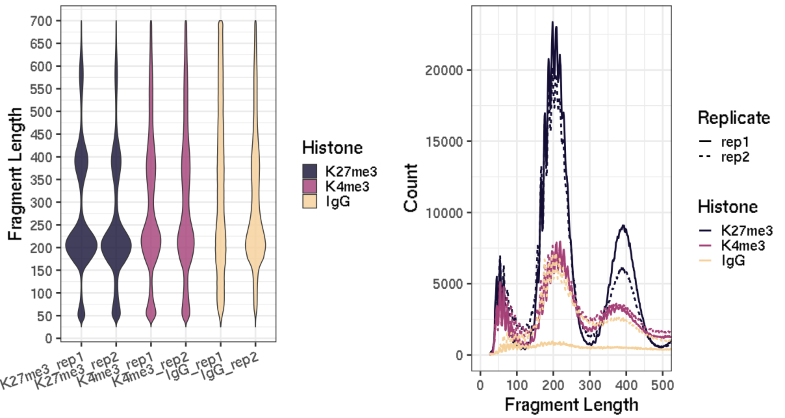


- **The smaller fragments (50-100 bp)**
  - Tn5它也可以在核小体表面暴露的 DNA 上进行和核小体之间的链接区域切割。这可能会产生较小的 DNA 片段。
  - 这些**小DNA 片段可能不是背景**。


## Extract fragment length and count

```bash
# -F 0x04参数过滤掉未比对的read。
# 0x04 表示未比对的标记
samtools view -F 0x04 <in.bam/sam/cram>| \


# 使用 awk 工具处理输出，以制表符（\t）为字段分隔符
# 定义了一个 abs 函数：提取第9列（fragment length），并取其绝对值
awk -F'\t' 'function abs(x){return ((x < 0.0) ? -x : x)} {print abs($9)}'| \


# 将片段长度的输出排序，然后使用 uniq -c 统计每个fragment出现的次数
sort | uniq -c | \


# 再次使用 awk，将输出格式化为制表符分隔的格式。$2 是fragment length
# $1 是该fragment出现的次数。这里将fragment次数除以2得到 fragment count
awk -v OFS="\t" '{print $2, $1/2}' > fragmentLen.txt
```


## Draw picture

### python

```python
import pandas as pd
import matplotlib.pyplot as plt
from matplotlib.font_manager import FontProperties


# 设置字体属性（假设你使用的是 Windows 系统）
font = FontProperties(fname='C:/Windows/Fonts/simhei.ttf')  # 黑体


# 读取数据
df = pd.read_csv('fragmentLen.txt', sep='\t', header=None, names=['Fragment_Length', 'Frequency'])


# 使用数据频数扩展为实际数据点
data = df.loc[df.index.repeat(df['Frequency'])]['Fragment_Length']


# 创建子图
fig, axs = plt.subplots(1, 2, figsize=(12, 4))  # 1行 2列的子图


# 绘制片段长度频数图
axs[0].bar(df['Fragment_Length'], df['Frequency'], color='skyblue', width=0.8)
axs[0].set_xlabel('fragment length', fontproperties=font)
axs[0].set_ylabel('fragment Count', fontproperties=font)
axs[0].set_title('Frequency chart of fragment length', fontproperties=font)
axs[0].grid(True)


# 缩窄 x 和 y 轴的范围
axs[0].set_xlim(df['Fragment_Length'].min() - 10, df['Fragment_Length'].max() + 10)
axs[0].set_ylim(0, df['Frequency'].max() * 1.1)


# 绘制频数分布图（直方图）
axs[1].hist(data, bins=30, color='skyblue', edgecolor='black')
axs[1].set_xlabel('fragment length', fontproperties=font)
axs[1].set_ylabel('fragment Count', fontproperties=font)
axs[1].set_title('Frequency distribution chart of fragment length', fontproperties=font)
axs[1].grid(True) # 启用网格


# 调整子图布局
plt.tight_layout()
plt.show()
```


***

# Alignment filtering

## Alignment filtering with MAPQ (optinal)

### Filtering with MAPQ

**Some projects may require more stringent filtering on the alignment quality score**

- **MAPQ（Mapping Quality）**是衡量 allignment 质量的分数，表示某个比对结果被错误映射的概率。计算公式为：
  $$
  MAPQ(x) = -10 \times \log_{10}\left(P(x \text{ is mapped wrongly})\right) = -10 \times \log_{10}(p)
  $$
  MAPQ 值通常范围在 0 到 37、40 或 42 之间，这取决于所使用的比对工具。值越高，表示比对的置信度越高


```bash
samtools view -q <int> <before.bam/sam/cram> -o <after.bam/sam/cram>
# int为minQualityScore
# 推荐为2，将比对质量分数小于 2 的比对结果过滤掉
```


###  View the reads before and after filtering

- 创建一个bashrc脚本`vim filter_contrast.bashrc`

```bash
#在bashrc配置脚本中复制粘贴
#定义一个函数
filter_contrast() {
    before=$1
    after=$2
    output_file=$3

    echo "$before" >> "$output_file"
    samtools flagstat "$before" >> "$output_file"
    echo "--------------------" >> "$output_file"
    echo "reads with chromosome:$before" >> "$output_file"
    # samtools idxstats用于查看每条染色体的read数    
    samtools idxstats "$before" >> "$output_file"
    echo "--------------------" >> "$output_file"

    
    echo "$after" >> "$output_file"
    samtools flagstat "$after" >> "$output_file"
    echo "--------------------" >> "$output_file"
    echo "reads with chromosome:$after" >> "$output_file"
    samtools idxstats "$after" >> "$output_file"
    echo "--------------------" >> "$output_file"
}
```

- 在终端使配置脚本生效 `source filter_contrast.bashrc`


- 在终端运行函数 `filter_contrast <before.bam/sam/cram> <after.bam/sam/cram> <output_file.txt>`


***

## Alignment filtering with Mapped Read Pairs

**注意： 我们需要过滤掉对未必对的reads。**

* 否则，在生成的bed文件会出现 `.`**的染色体条目**（未比对的reads）。
* 在将bed文件转换成bedgraph时，因为 `.`**的染色体条目**与NCBI下载的chrom.sizes里的染色体名称对应不上，会出现报错。
* 可以通过bam文件生成的chrom.sizes解决上面的问题，把未必对的reads也输出到 Bedgraph 文件，[详情点此](#chrom.sizes)

```bash
# -F 0x04：-F 选项用于排除标志为 0x04 的reads，这表示排除未比对的reads。仅保留那些已成功比对到参考基因组的reads。
samtools view -F 0x04 <before.bam/sam/cram> -o <after.bam/sam/cram>
```


***

# Bedtools

## Bedtools introduction


Bedtools（[bedtools: a powerful toolset for genome arithmetic — bedtools 2.31.0 documentation](https://bedtools.readthedocs.io/en/latest/index.html)） 被誉为基因组分析中的“瑞士军刀”，提供了一系列多功能的工具，用于操作和分析基因组区间。其最广泛使用的工具可以进行**基因组算术**操作，即在基因组上执行集合理论相关的操作。


**主要功能**

- **交集 (Intersect):**查找不同基因组数据集之间的重叠区间。

- **合并 (Merge):**将重叠的区间合并成单一区间。

- **计数 (Count):**统计与其他区间重叠的区间数量。

- **互补 (Complement):**识别基因组中不与任何给定数据集的区间重叠的区域。

- **随机打乱 (Shuffle):**随机排列基因组上的区间，以创建对照数据集。


**支持的文件格式**

- **BAM**: 用于比对序列的二进制文件格式。
- **BED**: 用于注释轨道的文本文件格式。
- **GFF/GTF**: 用于基因注释的文件格式。
- **VCF**: 用于变异检测数据的文件格式。


**Bedtools installation** `conda install -c bioconda bedtools`


***

## Bedtools genomecov

* [Bedtools genomecov](https://bedtools.readthedocs.io/en/latest/content/tools/genomecov.html)

* 使用`bedtools genomecov`可以计算基因组水平上的reads **Coverage**，并生成各种各样的文件（包括`Bedgraph`）


**parameter**

```bash
    bedtools genomecov 


# ==输入选项==
    -i <bed/gff/vcf>  # 输入文件，注意BED 文件必须按染色体进行排序
    -ibam <bam>       # 输入文件是 BAM 格式。注意 BAM 文件必须按照位置排序才能正确处理

    -g <genome_file>  # 提供染色体长度信息文件(chrom.sizes)路径，不使用 -ibam 选项时必须提供。


# ==输出选项==
    -bg 
    # 生成BedGraph格式（适用于基因组浏览器等工具）输出
    -bga：
    # 与-bg相似，但会输出覆盖度为 0的区间。这可以帮助用户快速提取覆盖度为 0 的基因组区域
    
    -d   
    # 报告每个基因组位置的覆盖深度，使用1-based
    # 默认情况下，genomecov 报告的是一个覆盖度直方图，而使用 -d 会输出每个位置的详细深度信息
    -dz
    # 类似于 -d，但使用0-based 

    -split
    # 对BAM 或 BED12 文件中的split区间进行独立处理。
    # 在 RNA-Seq 数据中，经常会有 spliced reads（即 read 被分割成多个片段），使用此选项可以分别计算每个片段的覆盖度
    # 对于 BAM 文件，它使用 CIGAR 字符串中的 "N" 和 "D" 操作来推断覆盖区间
    # 对于 BED12 文件，它使用 BlockCount、BlockStarts 和 BlockEnds 字段

    -max <int>
    # 将覆盖度大于等于指定最大值的所有位置合并为一个区间。与 -d 和 -bg 一起使用时无效


# ==特殊选项==
    -scale
    # 按常数因子缩放覆盖度。每个覆盖度值将乘以此因子。这个选项常用于标准化覆盖度数据。
    
    -ignoreD
    # 在 BAM 文件中忽略局部缺失（CIGAR 字符串中的 "D" 操作），计算覆盖度时不会考虑这些删除位点

    -strand <+ or ->
    # 仅计算特定链上的覆盖度。对于 BED 文件，文件需要至少包含 6 列，链信息位于第 6 列

    -pc
    # 计算paired-end的覆盖度，仅适用于 BAM 文件

    -fs <int>
    # 强制使用指定的片段长度而不是 read 长度。仅适用于 BAM 文件

    -du
    # 对于paired-end，将两个配对的 read 看作是同一条链上的数据（用于链特异性数据分析）。仅适用于 BAM 文件

    -5 # 只会统计每个 read 在 5' 端第一个碱基的converage
    -3 # 只会统计每个 read 在 3' 端第一个碱基的converage
    # 适用于需要关注 read 起点或终点的分析场景，例如转录起始位点 (TSS) 或终止位点 (TES) 的converage


# ==上传UCSC基因组浏览器选项==
   -trackline
   # 在输出的 BedGraph 文件的第一行添加一个 UCSC 基因组浏览器的 track line 定义，以便将生成的文件直接上传到 UCSC 基因组浏览器作为自定义轨迹
   # 注意：如果输出文件中包含了 track line，不能直接将该文件转换为 BigWig 文件，除非手动删除第一行
 
   -trackopts 'name="My Track" visibility=2 color=255,30,30'
   # 在第一行输出中添加的 track line参数，用于自定义 UCSC 基因组浏览器的轨迹定义。
```


> [!CAUTION]
>
> * 输入的 BED 文件必须按染色体进行排序
> * 输入格式为 BED 文件，则需要提供染色体长度信息文件([chrom.sizes](#chrom.sizes))。[chrom.sizes文件详细点此](#chrom.sizes)
> * 输入的chrom.sizes文件与BED文件染色体格式必须要相同
> * 输入的 BAM 文件必须按位置排序


**Example**

```bash
#!/bin/bash

# 输入样本名
sample="sample"

# 提供染色体长度信息文件(chrom.sizes)路径。
chromSize="<xxx.chrom.sizes>"

# 定义比对到主基因组的文件路径
primary_alignment="${sample}.fragments.bed"

# 将bed转换成bedtools
bedtools genomecov -bg  -i $primary_alignment -g $chromSize > ${sample}.fragments.bedgraph
```


***

## Bedtools intersect

* [bedtools intersect](https://bedtools.readthedocs.io/en/latest/content/tools/intersect.html): This command is used to find overlapping features between two datasets
* if you have **large file to intersect** ,suggesting you sort your file ,and add `-sorted` option in the `bedtools intersect` to reduce memory, Otherwise Out of Memory will kill the program.  


**Parameters**

```bash
bedtools intersect


# ==input option==
    -a <A>    # Specifies the file "A", which could be in BED/BAM/GFF/VCF format. Each feature in A is compared with B to look for overlaps
    -b <B>    # Specifies the file "B", which can be one or more BED/BAM/GFF/VCF files. You can pass multiple files or use wildcards (e.g., *.bed)
    


# ==output option==
    -ubam      # Outputs the BAM file as uncompressed. (Default:compressed BAM)
    -bed       # When using BAM input for "A", this option outputs the results in BED format. (Default:BAM format)

    -header    # Print the header from the A file to results
   
    -names     # When using multiple databases (-b),  provide an alias for each that will appear instead of a file ID in DB record.
    -filenames # When using multiple databases (-b), show each complete filename instead of a file ID in DB record.

    -sortout   # Sorts the output hits from B for each record in A. This can be useful when you're using multiple databases in -b.


# ==Reporting Options==
    -wa	 # Write the original entry in A for each overlap.
    -wb	 # Write the original entry in B for each overlap. (Restricted by -f and -r)

    -loj # meaning that each feature in A will be reported with its overlaps in B
         # If no overlaps are found, report a NULL feature for B.
         
    -wo  # Write the original A and B entries plus the number of base pairs of overlap between the two features. 
         # Only A features with overlap are reported. (Restricted by -f and -r).   
    -wao # Similar to -wo, but also reports A features with no overlap. (Restricted by -f and -r)

    -u   # Writes the original entry from A once if any overlap is found with B. (Restricted by -f and -r)
    -v   # Only reports those entries in A that have no overlap with B. (This is the opposite of -u)


# ==Counting Options==
    -c # For each feature in A, reports the number of overlaps found in B. (Restricted -f, -F, -r, and -s)
    -C # For each feature in A, it reports the number of overlaps with each B file on separate lines. (Restricted -f, -F, -r, and -s)
 


# ==Overlap Requirements==
    -f # Minimum overlap required as a fraction of A. (Default: is 1E-9 (1bp))
    -F # Minimum overlap required as a fraction of B. (Default: 1E-9 (1bp))

    -r # Requires reciprocal overlap between A and B, meaning that both must satisfy the minimum overlap fractions.
       # For example, if -f is 0.90 and -r is used, this requires that B overlaps at least 90% of A and vice versa.

    -e # Requires that the overlap fraction be satisfied for A or B 
       # In other words, if -e is used with -f 0.90 and -F 0.10 this requires that either 90% of A is covered OR 10% of B is covered. 
       # Without -e, both fractions would have to be satisfied.


# ==Strand-Specific(+-链) Options==
    -s # Enforces "strandedness", meaning that only overlaps on the same strand are considered. (Default: strand is ignored)
    -S # Enforces "opposite strandedness", meaning only overlaps on the opposite strand are reported.


# ==Special Options for BAM Files==
    -split # Treat “split” BAM (having an “N” CIGAR(Skipped region)operation) or BED12 entries as distinct BED intervals


# ==performance optimization==
    -sorted # For very large B files, invokes a "sweeping" algorithm that requires the input to be sorted by chromosome and position 
            # (e.g., sort -k1,1 -k2,2n).
            # This reduces memory usage for large files.  
   
    -g <genome file> # pecifies a genome file that defines the expected chromosome order for use with the -sorted option.

    -nobuf # Disables buffered output, meaning each line is printed immediately. 
           # This can slow down large outputs but is useful when output is processed line-by-line.

    -iobuf <size> # Sets the size of the read buffer (in bytes). 
                  # Supports suffixes like K, M, or G . 
                  # Currently has no effect with compressed files.
```


***

## Bedtools bamtobed

## 

[bedtools bamtobed](https://bedtools.readthedocs.io/en/latest/content/tools/bedtobam.html) 用于将 BAM 文件转换为 BED 格式。

```bash
bedtools bamtobed -i sample.bam > sample.bed -bedpe
```

* 默认的输出格式为**BED6**格式 ，如果为paired-end reads，则把paired ends 分开几行输出，而不在一行

* 如果为paired-end reads，可以选择 `-bedpe`来方便后面的过率，对于生成的 BEDPE 文件。

* `-mate1`：当使用 `-bedpe`时，`-mate1` 参数确保输出的 BEDPE 条目中的第一对片段（第一个 "block"）始终是 read 1

  不使用`-mate1`：

  - **第一个片段（block1)** 通常对应于在基因组中较小的起始位置的片段（即，Start1）

  - **第二个片段（block2)** 则对应于较大的起始位置的片段（即，Start2）

* `-bed12`：输出为BED12格式
* `-color`：指定用于 BED12 格式中的颜色，使用 R,G,B 字符串，默认颜色为 (255,0,0)，即红色，在可视化时，此选项可以用来定义显示的颜色
* `-cigar`：将 CIGAR 字符串添加为 BED 文件的第七列。
* `-split`：如果 BAM 文件中包含有“分割”的比对（例如，跨多个外显子或重复区域的比对），此选项会将这些比对拆分成多个单独的 BED 条目
* `-splitD`：用于将 BAM 文件中的比对按照 N 和 D 的 CIGAR 操作符进行拆分，并将每个拆分后的片段作为单独的 BED 记录
* `-tag`：使用其他数值类型的 BAM 标签作为 BED 文件中的得分。默认情况下，BED 文件使用比对质量作为得分。不允许与 BEDPE 格式一起使用
* `-ed`： 参数用于将 BAM 文件中的编辑距离（即 NM 标签）（即比对过程中引入的错配、插入和删除的总数）作为生成的 BED 文件的得分列的值。


***

# Convert BAM to BED and BED Operate

## Convert BAM to BED with bedtools

[bedtools bamtobed](#Bedtools bamtobed) 用于将 BAM 文件转换为 BED 格式。

```bash
bedtools bamtobed -i sample.bam > sample.bed -bedpe
```


***

## Keep the read pairs that are on the same chromosome and fragment length less than 1000bp（optial）

- 对于**Paired-End**需进一步过滤并保留位于相同染色体上且fragment长度小于 1000bp 的read pairs

- `bowtie2`设置以下parameter可以逃过此步：

  `--no-discordant` together with `-I` `10` `-X` `700` ensures that the fragment is 10-700bp long which will also exclude read pairs that are on the different chromosome.

- **Code**

  ```bash
  awk '$1==$4 && $6-$2 < 1000 {print $0}' sample.bed > sample.clean.bed 
  # $1==$4：表示过滤掉那些不在同一染色体上的读取对（即第一列和第四列的染色体名称必须相同）
  # && 的作用是 仅当前一个命令成功执行（即返回状态码为 0）时，才会执行下一个命令。
  # $6-$2 < 1000：过滤条件，表示保留片段长度小于 1000bp 的读取对。第六列和第二列分别代表片段末端和起始位置，计算差值即为片段长度。
  ```

  

***

## Extract the fragment related columns

我们可以提取**fragment**从**bedpe**文件中

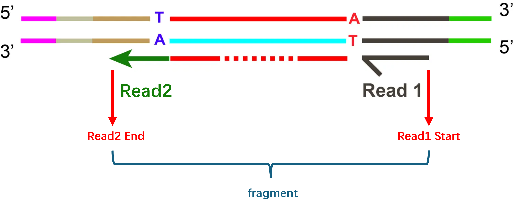

```bash
cut -f 1,2,6 sample.bed | \
# cut 命令用于从文件中提取指定列。
# -f 1,2,6 表示提取第 1、2 和 6 列
#第 1 列：代表染色体（Chromosome）。
#第 2 列：代表较小的起始位置的片段（Start1）。
#第 6 列：代表较大的起始位置的片段（End2）


sort -k1,1 -k2,2n -k3,3n > sample.fragments.bed
#这个命令将对数据进行多级排序：
#第一步：按照第 1 列（-k1,1）进行排序。这一步按字母顺序进行。
#第二步：在第 1 列相同的情况下，按第 2 列（-k2,2n）进行排序。这一步按数字大小排序，确保数值上较小的排在前面。
#第三步：如果第 1 列和第 2 列都相同，再按第 3 列（-k3,3n）进行排序，也按数字大小排序。
```

> [!WARNING]
>
> **这里输入的bed格式为bedpe格式，否则第1，2，6列不对应，需要根据情况更改。**


***

## Evaluate the reproducibility of replicate samples(optial)

为了评估不同重复样本之间以及不同条件下的重现性：首先将基因组分成**500 bp** 的窗口（bin），然后计算每个窗口中**read count的 log2 转换值**。接着，计算每对重复样本之间的 **Pearson 相关性**，并通过层次聚类的方式展示。


1. **计算每个窗口的read count**

   **如何计算每个窗口的read count？**计算每个read中点所在的窗口中心位置

   * 计算每个 Read 的中点

     $$
     \text{midpoint}_i = \frac{\text{start}_i + \text{end}_i}{2}
     $$

   * 计算每个中点所在的窗口索引
      $$
      \text{window\_index}_i = \left\lfloor \frac{\text{midpoint}_i}{\text{binLen}} \right\rfloor
      $$
      $\left\lfloor \cdot \right\rfloor$ 表示向下取整（floor）
   
   * 计算该索引窗口的起始位置
      $$
      \text{window\_start}_i = \text{window\_index}_i \times \text{binLen}
      $$
   
   * 计算该索引窗口的中心位置
      $$
      $\text{window\_center}_i = \text{window\_start}_i + \frac{\text{binLen}}{2}
      $$
   
   * 把上面公式合在一起
       $$
       \begin{align*}\text{window\_center}_i & = \left( \left\lfloor \frac{\frac{\text{start}_i + \text{end}_i}{2}}{\text{binLen}}\right\rfloor \times \text{binLen} \right) + \frac{\text{binLen}}{2} \end{align*}
       $$
   
   - 计算该索引窗口的中心位置
   
   $$
   $\text{window\_center}_i = \text{window\_start}_i + \frac{\text{binLen}}{2}
   $$


   * 对同一条染色体上相同的$\text{window\_center}_i$ 计数为该窗口的read count

     

   ```bash
   #定义窗口大小为 500 bp。
   binLen=500
   
   #计算每个read中点所在的窗口中心位置。 $1是染色体位置， $2是片段的起始位置，$3是终止位置。
   awk -v w=$binLen '{print $1, int(($2 + $3)/(2*w))*w + w/2}' sample.fragments.bed | \
   
   # 对片段的染色体位置（k1）和所在的窗口中心位置（k2）进行排序。
   sort -k1,1V -k2,2n | \
   
   # 去除重复，并对重复行进行计数（每个窗口中有多少个片段），计数放在第一列
   uniq -c | \
   
   # 按（\t）分割输出染色体位置($2),窗口中心位置($3),所在计数($1)
   awk -v OFS="\t" '{print $2, $3, $1}'| \
   
   # 对染色体位置(k1)和窗口中心位置(k2)进行排序并输出
   sort -k1,1V -k2,2n > sample.fragmentsCount.bed
   ```

   

2. **Pearson相关性matrix**

   - **Pearson 相关性系数**（Pearson Correlation Coefficient, PCC）用于衡量两个变量之间的线性相关性，值的范围在 -1 到 1 之间：

      - **1** 表示完全正相关，两个变量同步变化。
      - **-1** 表示完全负相关，一个变量增加时，另一个减少。
      - **0** 表示无线性相关性。

   

   - **Pearson计算公式**

   $$
   r = \frac{{\sum (X_i - \overline{X})(Y_i - \overline{Y})}}{{\sqrt{\sum (X_i - \overline{X})^2} \cdot \sqrt{\sum (Y_i - \overline{Y})^2}}}
   $$

   $ X_i $ 和 $ Y_i $ 是两个变量的值。

   $ \overline{X} $ 和 $ \overline{Y} $ 是两个变量的均值。

   

   ```python
   import pandas as pd
   import numpy as np
   import seaborn as sns
   import matplotlib.pyplot as plt
   from scipy.stats import pearsonr
   import matplotlib.colors as mcolors
   
   
   # 读取并合并多个样本的片段计数数据
   frag_count = None
   
   
   # 输入样本名
   sample_list=['KCHIP2','KCHIP2-OE']
   
   
   # 遍历样本列表,并把所有样本都整合在一个表格内frag_count
   for sample in sample_list:  
       frag_count_tmp = pd.read_csv(f"./fragmentsCount/{sample}.fragmentsCount.bed", 
                                    sep="\t", header=None, 
                                    names=["chrom", "bin", sample],
                                   dtype={"chrom": str, "bin": int, sample: int})
       
       if frag_count is None:
           frag_count = frag_count_tmp
       else:
           frag_count = pd.merge(frag_count, frag_count_tmp, on=["chrom", "bin"], how="outer")
   
   frag_count
   ```

   ```python
   # 进行log2(x + 1)转换
   frag_count_data = frag_count.drop(columns=["chrom", "bin"]).apply(lambda x: np.log2(x + 1))  # 添加1以防止取log时出现负无穷
   
   # 计算Pearson相关系数矩阵
   corr_matrix = frag_count_data.corr(method='pearson')
   
   
   corr_matrix
   ```

   

3. **Pearson相关性热图**

   ```python
   # 创建热图
   plt.figure(figsize=(6, 5))
   
   # 定义颜色映射：从深蓝到白色再到深红
   cmap = mcolors.LinearSegmentedColormap.from_list('custom_cmap', ["midnightblue", "white", "darkred"])
   
   # 使用 seaborn 绘制热图
   sns.heatmap(corr_matrix, 
               annot=True,  #表示在单元格内显示相关系数数值
               fmt=".2f",   #控制显示数值的格式。".2f" 表示保留两位小数
               cmap=cmap,   #颜色
               linewidths=0.5, 
               linecolor='darkgray', 
               cbar_kws={"shrink": 0.8})  #用于传递与颜色条的参数。这里的 {"shrink": .8} 颜色条的高度将缩小为原来的 80%
   
   # 设置热图标题
   plt.title("Correlation Matrix Heatmap", fontsize=16)
   
   # 设置x轴和y轴的标签旋转角度
   plt.xticks(rotation=90, fontsize=10, color='darkred')
   plt.yticks(fontsize=10, color='darkred')
   
   # 显示图像
   plt.tight_layout()
   plt.show()
   ```

   

***

# Convert BED to Bedgraph

## Convert BED to Bedgraph

* 在**CUT&Tag**和**CUT&RUN**中的`SEACR`的**peak calling**需要Bedgraph文件作为输入

* 使用`bedtools genomecov`将BED文件转换为Bedgraph [详见点此](#Bedtools genomecov)

  ```bash
  #!/bin/bash
  
  # 输入样本名
  sample="sample"
  
  # 提供染色体长度信息文件(chrom.sizes)路径。
  chromSize="<xxx.chrom.sizes>"
  
  # 定义比对到主基因组的文件路径
  primary_alignment="${sample}.fragments.bed"
  
  # 将bed转换成bedtools
  bedtools genomecov -bg  -i $primary_alignment -g $chromSize > ${sample}.fragments.bedgraph
  ```

  

***

## Use the E.coli genome to normalize data (optional/CUT&Tag)(step2)

* [Click here to view step 1](#Use-the-E.coli-genome-to-normalize-data-(optional/CUT&Tag)(step1))

* Using tools：[Bedtools genomecov](#Bedtools-genomecov)


**Step 2 Spike-in calibration** 

假设：对于每个使用相同数量细胞的样本，比对到主基因组和 E. coli 基因组的片段比例应该是相同的。

* 通过对E. coli 基因组作为内参对主基因组进行**calibration**

* 缩放因子 $ S $的定义：为了避免归一化数据中的小数，使用一个常数 $𝐶$（通常是 10,000）来定义的
  $$
  S = \frac{C}{\text{比对到 } E. coli \text{ 基因组的片段数}}
  $$
  
* 归一化的计算公式为：
  $$
  \text{Normalized coverage} = (\text{primary genome coverage}) \times S
  $$


**calibration process**

* 根据比对到Ecoil的reads计算测序深度,其输出到`sample.Ecoil.seqDepth`文件

* 计算缩放因子

* 使用[Bedtools genomecov](#Bedtools-genomecov)工具对文件执行 normalization

  ```bash
  #!/bin/bash
  
  # 输入样本名
  sample="sample"
  
  # 提供染色体长度信息文件(chrom.sizes)路径。
  chromSize="<xxx.chrom.sizes>"
  
  # 定义比对到E.COli的文件路径
  Ecoil_alignment="Ecoil/<sample.bam/sam/cram>"
  
  # 定义比对到主基因组的文件路径
  primary_alignment="${sample}.fragments.bed"
  
  # 创建bedgraph文件夹用于输出
  mkdir -p ./bedgraph
  
  # samtools view查看比对成功的reads（-F 0x04）
  # wc -l 执行后返回的行数，即比对成功的 reads 数量
  seqDepthDouble=$(samtools view -F 0x04 $Ecoil_aligement | wc -l)
  
  # 测序深度等于 reads 数量除以 2（假设是双端测序）
  seqDepth=$((seqDepthDouble / 2))
  
  # 输出测序深度到sample.Ecoil.seqDepth文件
  echo $seqDepth > Ecoil/${sample}.Ecoil.seqDepth
  
  
  # 检查seqDepth（测序深度）是否大于 1，大于1后进行以下操作
  if [[ "$seqDepth" -gt "1" ]]; then
  
      # 计算缩放因子S
      # bc -l 会加载数学库，从而允许进行浮点数运算并支持一些数学函数（如正弦、余弦、对数等）
      # 此外，它还会将默认的小数位数设为 20 位，这样可以进行更精确的浮点计算。
      scale_factor=$(echo "10000 / $seqDepth" | bc -l)
  
      # 使用echo把缩放因子S打印到终端
      echo "Scaling factor for $sample is: $scale_factor!"
      
      # 使用bedtools生成归一化的bedgraph文件 
      bedtools genomecov -bg -scale $scale_factor -i $primary_alignment -g $chromSize > bedgraph/${sample}.fragments.normalized.bedgraph
  
  fi
  ```


***

# Peak calling

## macs2

* [Home · macs3-project/MACS Wiki](https://github.com/macs3-project/MACS/wiki)

* **Software installation:** `conda install -y macs2`

  ​	

***

## SEACR(For CUT&Tag and CUT&RUN)

* 在ChIP-seq数据分析中，常用的方法是**peak calling**，通过比较目标ChIP-seq信号与背景噪音来识别基因组中信号富集的区域。这类算法通常采用泊松分布或负二项分布模型来衡量信号与背景的差异。然而，由于ChIP-seq实验通常测序较深，背景噪音较高，因此大多数ChIP-seq峰值识别算法优化时更注重高灵敏度，以便从噪音中区分出信号。

* CUT&Tag和CUT&RUN 的数据背景噪音比ChIP-seq低得多。该数据的低背景和较少的读取深度使得传统的峰值识别算法容易受到误报的影响，从而降低了精确性

* 针对CUT&Tag和CUT&RUN，**peak calling**算法需要具备较高的特异性，因此使用**稀疏富集分析工具（SEACR）**


   *  `SEACR` requires **bedGraph** files from **paired-end** sequencing as input

   *  If you have **normalized fragment counts with the E. coli read count**, we set the normalization option of SEACR to **non**

      Otherwise, the **norm** is recommended. 


### SEACR Theory

* [SEACR](<https://epigeneticsandchromatin.biomedcentral.com/articles/10.1186/s13072-019-0287-4>)

* 首先将来自目标抗体和 IgG 对照实验数据解析为**signal blocks**(连续、非零读数的reads)

* The signal in each block is calculated by **summing read counts**

* 通过绘制**目标signal blocks**与 **IgG signal blocks**的比例图，确定**目标signal blocks**与**IgG signal blocks**比例达到最大值的阈值；然后过滤掉未达到阈值的**目标signal blocks**

* 同时，SEACR还过滤掉与IgG信号重叠的目标signal blocks，以去除可能的假阳性信号。

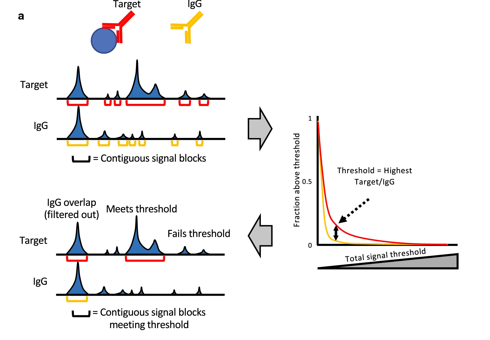


### SEACR 选项

为了简化用户的分析流程，SEACR 仅提供了两个主要的选项

* IgG数据集或全局阈值：

   * **IgG数据集**：默认选项，用户可以提供 IgG作为对照样本数据集，用于去除背景噪声。**通常建议使用这种方法**。

   * **全局阈值**：如果用户没有 IgG 对照样本，SEACR 允许使用全局阈值进行峰值调用。

* stringent pattern and relaxed pattern：

   * **stringent**：默认选项，它设定一个阈值，使得能够保留最大比例的目标信号块，而对照 IgG 信号块尽可能被排除。这种模式强调高精度，通常用于信号较为强烈的实验。
   
   * **relaxed**：这种模式的阈值较为灵活，设定在目标信号比例曲线的最高点和“膝点”（曲线开始急剧变化的地方）之间的中间位置。这样可以检测到更多的峰值，但可能包含更多噪声。

  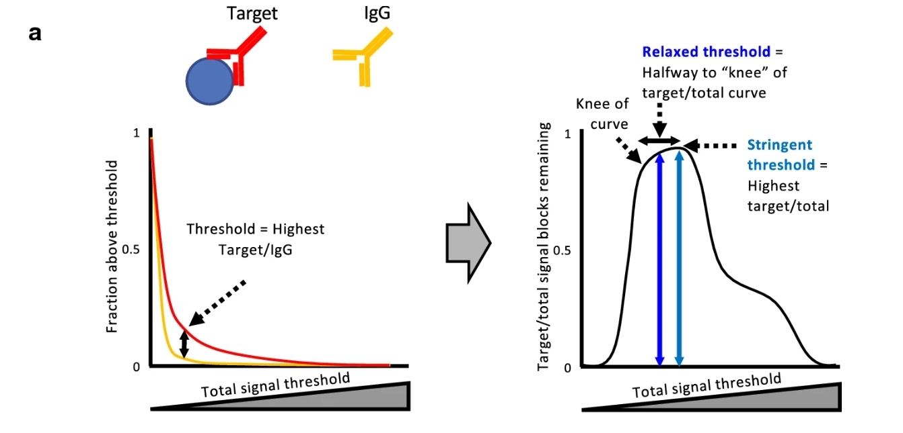


### SEACR安装与用法

* [SEACR GitHub](https://github.com/FredHutch/SEACR)

* SEACR是一个sh脚本，其1.3版本下载：`wget https://raw.githubusercontent.com/FredHutch/SEACR/master/SEACR_1.3.sh`

* SEACR需要R的支持，其1.3的R脚本下载：`wget https://github.com/FredHutch/SEACR/blob/master/SEACR_1.3.R`

* **其SEACR的R脚本需要和SEACR的sh脚本需要放在同一文件下才能正常运行**

* SEACR运行：`bash SEACR_1.3.sh <signalFile> <controlFile> <norm> <stringency> <outputPrefix>`

  * `signalFile`: 实验样本的 BEDgraph 文件。

  * `controlFile`:
   * 有对照组：对照样本的 BEDgraph 文件
     
   * 无对照组：使用介于 `0` 和 `1` 之间的全局阈值 `n`，选择信号最高的前 n% 的区域作为峰值。（推荐`0.01`）
  
* **`norm`**: 归一化处理，有两个选项：
     * `non`: 不进行归一化处理。
     
     * `norm`: 进行归一化处理，并从信号中减去对照噪声。
     
  * `stringency`: 指定严格性阈值，两个选项：
   * `relaxed`: 更宽松的峰调用标准，允许检测到更多峰。
     
   * `stringent`: 严格的标准，检测到的峰数量相对更少，但精确度更高。
  
* `outputPrefix`: 输出文件的前缀，结果将输出为 .bed 格式。


**Example**

```bash
#!/bin/bash

# creat file to store resuts
mkdir -p SEACR

# path of SEACR
seacr="SEACR_1.3.sh"

# samples name
samples=(KCHIP2 KCHIP2-OE)

# path of controlFile
controlFile="${samples[0]}.fragments.bedgraph"

# define Top peaks threshold
peaks=(0.01 0.05)

# traversa samples
for sample in "${samples[@]}"
do
   # path of samples
   signalFile="${sample}.fragments.bedgraph"

   # traversa peaks
   for peak in "${peaks[@]}"
   do
   
       # top peaks
       bash "$seacr" "$signalFile" "$peak" norm stringent "SEACR/${sample}_seacr_top${peak}.peaks"

       # Report with green text
       echo -e "\e[32m${signalFile}_top${peak} is done\e[0m"
    done

done


# KCHIP2 as background to calculate KCHIP2-OE peaks
bash "$seacr" "${samples[1]}.fragments.bedgraph" "$controlFile" norm stringent "SEACR/${samples[1]}_seacr_${samples[0]}ascontrol.peaks"

# Report final result with green text
echo -e "\e[32mBackground peak calculation for ${samples[1]} using ${samples[0]} as control is done.\e[0m"
```


### SEACR网页版

* 作者开发了 [SEACR 网络服务器](http://seacr.fredhutch.org)用于随时随地地分析CUT&Tag和CUT&RUN 数据。 

* 该网络服务器接受最大 500 Mb 的bedgraph文件作为输入，用户可以切换所需的参数（归一化或非归一化模式、严格或宽松模式），在运行过程中报告进度，并提供可下载的包含结果的 BED 文件链接。 

  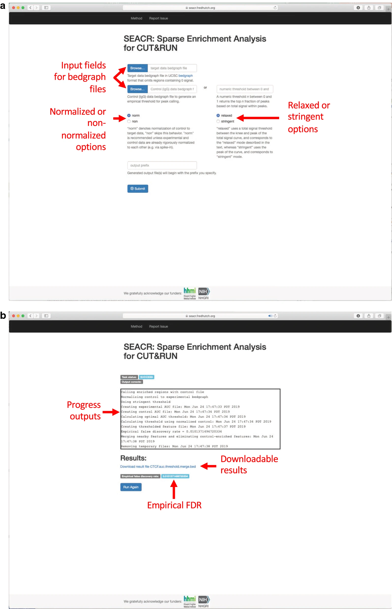


### Structure of SEACR bed file

**Example SEACR BED Entry：**

| Chromosome | Start     | End       | total signal | max signal | max signal region     |
| ---------- | --------- | --------- | ------------ | ---------- | --------------------- |
| 1          | 216897094 | 216897762 | 816          | 2          | 1:216897348-216897496 |
| 1          | 217018188 | 217018946 | 919          | 2          | 1:217018442-217018890 |
| 1          | 217197126 | 217198022 | 902          | 2          | 1:217197517-217197523 |


**SEACR BED File Structure:**


| Column Number | Field             | Description                                                  |
| ------------- | ----------------- | ------------------------------------------------------------ |
| 1             | Chromosome        | The chromosome where the peak is located (e.g., `1`, `chrX`) |
| 2             | Start             | Start position of the peak (0-based, inclusive)              |
| 3             | End               | End position of the peak (0-based, exclusive)                |
| 4             | total signal      | Total signal contained within denoted coordinates            |
| 5             | max signal        | Maximum bedgraph signal attained at any base pair within denoted coordinates |
| 6             | max signal region | region representing the farthest upstream and farthest downstream bases within the denoted coordinates that are represented by the maximum bedgraph signal, formatted as `chr:start-end` |


***

## Number of peaks

**通过读取生成的bed文件，获取不同样本，不同peak类型的数目**

```python
import pandas as pd
import os

# Define the sample list
sampleList = ["KCHIP2","KCHIP2-OE"]

# Define the types of peaks to analyze
peakType = ["top0.01", "top0.05", "KCHIP2ascontrol"]

# Initialize empty lists to store peak count (peakN), peak width
peakN = []
peakWidth = []


# Traverse over the sample list
for sample in sampleList:
    # Traverse over the peakType
    for ptype in peakType:
        
        # Construct the peak file path 
        file_path = os.path.join("SEACR", f"{sample}_seacr_{ptype}.peaks.stringent.bed")

        # Check if the file exists to avoid errors
        if os.path.exists(file_path):
        
            # Read the peak file (without headers) 
            peakInfo = pd.read_csv(file_path, sep="\t", header=None, low_memory=False)

            # calculate the width of each peak
            # v3(end)-v2(start)
            peakInfo['width'] = abs(peakInfo[2] - peakInfo[1])  

            # Store the peak count and type information
            peakN.append({
                "sample": sample,  # sample type
                "peakType": ptype,  # Peak type (control or top0.01)
                "peakN": peakInfo.shape[0]  # Number of peaks (rows in the dataframe)
            })

            # Store the peak width information
            for width in peakInfo['width']:
                peakWidth.append({
                    "sample": sample,  
                    "peakType": ptype,  
                    "width": width  
                })
        else:
            # 输出文件未找到的消息
            print(f"File not found: {file_path}")


# Convert the peakN and peakWidth lists into pandas DataFrames for further analysis or saving
peakN_df = pd.DataFrame(peakN)[['sample', 'peakType', 'peakN']]
peakWidth_df = pd.DataFrame(peakWidth)
```


```python
# check the peak count
peakN_df
```

|      |  sample   |    peakType     | peakN  |
| :--: | :-------: | :-------------: | :----: |
|  0   |  KCHIP2   |     top0.01     |  9294  |
|  1   |  KCHIP2   |     top0.05     | 46527  |
|  2   | KCHIP2-OE |     top0.01     | 34989  |
|  3   | KCHIP2-OE |     top0.05     | 175082 |
|  4   | KCHIP2-OE | KCHIP2ascontrol |  7089  |


```python
# check the peak widrh
peakWidth_df
```

|        |    sample |        peakType | width |
| -----: | --------: | --------------: | ----: |
|      0 |    KCHIP2 |         top0.01 |   597 |
|      1 |    KCHIP2 |         top0.01 |   690 |
|      2 |    KCHIP2 |         top0.01 |   848 |
|      3 |    KCHIP2 |         top0.01 |   797 |
|      4 |    KCHIP2 |         top0.01 |   952 |
|    ... |       ... |             ... |   ... |
| 272976 | KCHIP2-OE | KCHIP2ascontrol |  1007 |
| 272977 | KCHIP2-OE | KCHIP2ascontrol |   420 |
| 272978 | KCHIP2-OE | KCHIP2ascontrol |   615 |
| 272979 | KCHIP2-OE | KCHIP2ascontrol |   487 |
| 272980 | KCHIP2-OE | KCHIP2ascontrol |   847 |

272981 rows × 3 columns


**Visualization of peak count**

```python
import pandas as pd
import seaborn as sns
import matplotlib.pyplot as plt

# Create the FacetGrid to separate plots by 'peakType'
g = sns.FacetGrid(peakN_df, col='peakType', height=5, aspect=1)


# Create a barplot for each subplot with sample on x-axis and peakN on y-axis
g.map(sns.barplot, 'sample', 'peakN', order=peakN_df['sample'].unique(), hue=peakN_df['sample'], palette="viridis")


# Add labels and title for the entire plot
g.set_axis_labels('Sample', 'Peak Count (peakN)')
g.fig.suptitle('Peak Counts per Sample for Different Peak Types', fontsize=16, y=1.05)


# Show the plot
plt.show()
```


**Visualization of peak width**

```python
import pandas as pd
import seaborn as sns
import matplotlib.pyplot as plt

# Create the FacetGrid to separate plots by 'peakType'
g = sns.FacetGrid(peakWidth_df, col='peakType', height=5, aspect=1)

# Create a barplot for each subplot with sample on x-axis and peakN on y-axis
g.map(sns.violinplot, 'sample', 'width', order=peakWidth_df['sample'].unique(), hue=peakWidth_df['sample'], palette="viridis")

# Add labels and title for the entire plot
g.set_axis_labels('Sample', 'peak width')
g.fig.suptitle('Peak Counts per Sample for Different Peak Types', fontsize=16, y=1.05)

# Show the plot
plt.show()
```


***

## Comparing the same peaks on replicate sample data sets(optial)

* Using tools: [Bedtools intersect](#Bedtools-intersect)


**Comparing the same peaks on replicate sample data**

```bash
#!/bin/bash

###################per setting####################
# Define variables
samples=("K27me3" "K4me3")
repL=("rep1" "rep2")
peakType=("control" "top0.01")

# Define your bed path
bedpath="SERCA"

# Output file
output_file="output/peak_reproducibility.txt"

#####################################################
# Initialize an array for peak overlap information
declare -A peakOverlap

# Clear the output file before writing new data
> "$output_file"

# Create a header for the table and write it to the output file
echo "Sample,PeakType,TotalPeaks,ReproduciblePeaks,ReproducibilityRate" > "$output_file"
    
# Loop over peak types and samples
for type in "${peakType[@]}"; do
    for sample in "${samples[@]}"; do
        
        # Initialize an empty file to hold overlapping peaks
        overlap_file="overlap_${sample}_${type}.bed"
        rm -f "$overlap_file"

        # Initialize the first replicate for comparison
        first_rep="${bedpath}/${sample}_rep1_seacr_${type}.peaks.stringent.bed"
        
        # Check if the first replicate file exists
        if [[ ! -f "$first_rep" ]]; then
            echo "First replicate not found: $first_rep"
            continue
        fi

        # copy the first_rep file and save it as the overlap file
        cp "$first_rep" "$overlap_file"

        # Loop over the remaining replicates
        for rep in "${repL[@]:1}"; do
            peak_file="${bedpath}/${sample}_${rep}_seacr_${type}.peaks.stringent.bed"
            
            # Check if the replicate file exists
            if [[ ! -f "$peak_file" ]]; then
                echo "Replicate file not found: $peak_file"
                continue
            fi

            # Find the overlapping peaks between replicates using bedtools
            bedtools intersect -a "$overlap_file" -b "$peak_file" > tmp_overlap.bed
            
            # Replace overlap_file with the updated overlapping peaks
            mv tmp_overlap.bed "$overlap_file"
        done

        # Count the number of overlapping peaks
        overlap_count=$(wc -l < "$overlap_file")

        # Calculate the total peaks in the first replicate (to get peakN)
        total_peaks=$(wc -l < "$first_rep")

        # Calculate peak reproducibility rate
        reproducibility_rate=$(echo "scale=2; ($overlap_count / $total_peaks) * 100" | bc)

         # Store the result as a row in the CSV file
        echo "$sample,$type,$total_peaks,$overlap_count,$reproducibility_rate%" >> "$output_file"

    done
done 

# Print the final reproducibility rates for all samples and peak types
echo "Peak reproducibility results have been saved to $output_file."
```


**Check the output**

```python
import pandas as pd
from tabulate import tabulate

# Read the output_file
df = pd.read_csv("./peak_reproducibility.txt", sep='\t')

# Display the table 
print(df)
```


***

## Calculates FRiPs (Fraction of Reads in Peaks)

* **FRiPs** is a measure of how many sequencing reads fall within peak regions.

*  A higher **FRiP score** indicates a better signal-to-noise ratio in the data, which is often used to assess the quality of ChIP-seq or CUT&Tag experiments.

*  we can use tool with [Bedtools intersect](#Bedtools-intersect) to calcuate FRiP

   *  A BED file containing the peak regions

   *  A BAM file containing your sequencing reads

   *  calcuate the Number of Reads in Peaks :

      `bedtools intersect -a "$bed_file" -b "$bam_file"| awk '{sum += $NF} END {print sum}`


   *  $\text{FRiP} = \frac{\text{Number of Reads in Peaks}}{\text{Total Number of Reads}}$


*  **Ensure your bed file chromosome order consistent with your bam file !!!**


### Sorting file procedure

**1 Check your bam file order**

* check your bam file order : `samtools view -H <bam>`

  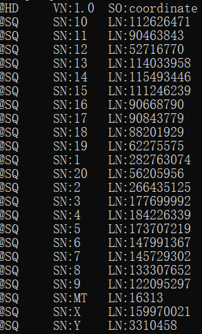

* This BAM file's sorting mode is currently set to **coordinate (SO:coordinate in the header)**

* However, the order of chromosomes (shown in the @SQ lines) follows the **lexicographical order**, meaning that chromosomes 10, 11, 12, etc., come before chromosome 1, 2, 3, etc. This is because **lexicographical sorting** treats numbers as strings, where "10" comes before "2"


**2.Check your bed file order**

* check your bed file order :`cut -f1 <bed> | uniq`

  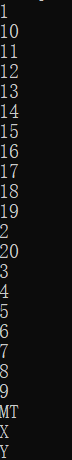


* you found your bed file chromosome order not consistent with your bam file

* you can fix this problem with sorrting your bed file with **custom order(bam file order)**


**3 Create a Custom Order File**


* First, create a custom chromosome order file that matches the order you specified. Let's call this file chromosome_order.txt. 

* The code will be:

    `samtools view -H <bam> | grep '^@SQ' | awk '{print $2}' | cut -d':' -f2 > chromosome_order.txt`
    * `samtools view -H <bam>` :see head information of bam file
    
    *  `grep '^@SQ'` :Filter out all lines starting with @ SQ

    *  `awk '{print $2}'` :awk is used to print the second field of each line(SN:<chromosome>)

    *  `cut -d':' -f2` : cut is used to further process the output by splitting each line on the colon (:) and extracting the second part


**4.sort your bed file with custom order**

* sort your bed file with custom order

  `awk 'NR==FNR {order[$1]=NR; next} {print order[$1], $0}' chromosome_order.txt <unsorted.bed> | sort -k1,1n -k3,3n | cut -d' ' -f2- > <sorted.bed>`

  
  
   * `NR==FNR` :

     * `NR` : is the total number of input records read

     * `FNR` : is the number of records read from the **current file**.

     * This means that as long as we are reading the first file, `order[$1]=NR` is executed

       

   * `order[$1]=NR` : This creates an associative array called **order** where the key is the chromosome name (from the first column of chromosome_order.txt)
  
     - It creates an order mapping:
     - `chr1` → 1
     - `chr2` → 2
     - `chrX` → 3
     - `chrY` → 4
  
   

   * `next`: This skips the remaining actions for the current line to the next line. 
  
   * `print order[$1], $0}` : For lines in the second file (unsorted.bed),  this prints the chromosome rank (from the **order** array) followed by the entire line (`$0` represents the whole line)

| order | Chromosome | Start | End  | Peak  |
| ----- | ---------- | ----- | ---- | ----- |
| 3     | chrX       | 100   | 200  | peak1 |
| 1     | chr1       | 150   | 250  | peak2 |
| 2     | chr2       | 50    | 150  | peak3 |


   * `sort -k1,1n -k3,3n` :sort by **order** array ,subsort by the start position of the peak

   * `cut -d' ' -f2-` :
     
      * `-d' '` : Sets the delimiter as a space.
      * `-f2-`  : This specifies that we want to extract fields from the second one onward. Essentially, it removes the first field (**order**) from the output.


### Code with Sorting file and calcuating FRIPs 

```bash
#!/bin/bash

###################per setting####################
# Define the variables
sampleMarks=("KCHIP2" "KCHIP2-OE")
peakType=("top0.01" "top0.05" "KCHIP2ascontrol")

# Define the threads
threads=10

# Define your peak file directory
bedDir="SERCA"

# BAM directory
bamDir="deduplicated.bam"

# Output file
output_file="output/FRiPs.txt"


#####################################################
# Initialize an empty list to store the number of reads falling within peaks
declare -A FRIPsData

# Clear the output file before writing new data
> "$output_file"

# Define the function to get fragment counts in peak regions
get_fragment_counts() {
    local bam_file=$1
    local peaks_bed=$2

    # Use bedtools intersect to find reads that overlap with peaks      
    overlap_counts=$(bedtools intersect -sorted -c -a "$peaks_bed" -b "$bam_file" | awk '{sum += $NF} END {print sum}')
    
    # Return the total count of reads overlapping peaks
    echo "$overlap_counts"
}


# create a tem file to store temporary data
mkdir -p tmp
                  
# Loop over the sampleMarks and peakType
for sample in "${sampleMarks[@]}"; do
    for peak in "${peakType[@]}"; do

        # Construct the path of the peak information file (BED format)
        peak_file="${bedDir}/${sample}_seacr_${peak}.peaks.stringent.bed"
        sort_peak_file="tmp/${sample}_seacr_${peak}.peaks.stringent.sort.bed"
 
        # Check if the peak file exists
        if [[ -f "$peak_file" ]]; then
            
            # BAM file path
            bam_file="${bamDir}/filter${sample}deduplicated.bam"
            sort_bam_file="tmp/filter${sample}deduplicated.sort.bam"
    
            # Check if the BAM file exists
            if [[ -f "$bam_file" ]]; then

                
                # Sort the BAM file (skip sorting if sorted already)
                if [[ ! -f "$sort_bam_file" ]]; then
                    echo "Sorting BAM file: $bam_file"
                    samtools sort -o "$sort_bam_file" "$bam_file" -@ "$threads"
                fi


                # Create a Custom Order File(skip create if Custom Order already)
                Custom_Order="tmp/${sample}.chromosome_order.txt"
                if [[ ! -f "$Custom_Order" ]]; then
                    echo "Create a Custom Order File: $Custom_Order"
                    samtools view -H "$sort_bam_file" | grep '^@SQ' | awk '{print $2}' | cut -d':' -f2 > "$Custom_Order"
                fi

    
                # Sort the bed file (sort by Custom Order)
                echo "Sorting peak file: $peak_file"
                awk 'NR==FNR {order[$1]=NR; next} {print order[$1], $0}' "$Custom_Order" "$peak_file" | sort -k1,1n -k3,3n | cut -d' ' -f2- > "$sort_peak_file"

                
                # Get the Number of Reads in Peaks
                echo "Get the Number of Reads in Peaks: $sort_peak_file and $sort_bam_file"
                reads_in_peaks=$(get_fragment_counts "$sort_bam_file" "$sort_peak_file")

                # Get the Total Number of Reads
                total_reads=$(samtools view -c "$bam_file") 

                # calcuate the FRIP(Fraction of Reads in Peaks)(4 decimal places)
                frip=$(echo "scale=4; $reads_in_peaks / $total_reads" | bc)
                           
                # Append the results to the inPeakData array
                FRIPsData["$sample,$peak"]="Reads in Peaks: $reads_in_peaks, Total Reads: $total_reads, FRiP: $frip"
            else
                echo -e "\e[31mBAM file not found: $peak_file\e[0m"
            fi
        else
            echo -e "\e[31mPeak file not found: $peak_file\e[0m"
        fi
    done
done


# Output the header of the table
echo -e "Sample\tPeak Type\tReads in Peaks\tTotal Reads\tFRiP" >> "$output_file"

# Output the results to the text file
for key in "${!FRIPsData[@]}"; do
    sample=${key%,*}
    peak_type=${key#*,}
    reads_in_peaks=${FRIPsData[$key]#*Reads in Peaks: }
    total_reads=${reads_in_peaks#*, Total Reads: }
    frip=${total_reads#*, FRiP: }
    
    # Clean up values
    reads_in_peaks=${reads_in_peaks%%,*}
    total_reads=${total_reads%%,*}
    frip=${frip%%,*}

    # Format the output as a table
    printf "%s\t%s\t%s\t%s\t%s\n" "$sample" "$peak_type" "$reads_in_peaks" "$total_reads" "$frip" >> "$output_file"
done

# remove tmp file
rm -r tmp

# Confirmation message
echo "Results have been saved to $output_file"
```

 

**Check the output**

```python
import pandas as pd
from tabulate import tabulate

# Read the output_file
df = pd.read_csv("./FRiPs.txt", sep='\t')

# Display the table 
print(df)
```

```text
      Sample        Peak Type  Reads in Peaks  Total Reads    FRiP
0     KCHIP2          top0.05         1388331      4463744  0.3110
1     KCHIP2          top0.01         1115334      4463744  0.2498
2  KCHIP2-OE  KCHIP2ascontrol          418309     17177518  0.0243
3  KCHIP2-OE          top0.01         1440794     17177518  0.0838
4  KCHIP2-OE          top0.05         3051352     17177518  0.1776
```


**Draw picture**

```python
import pandas as pd
import matplotlib.pyplot as plt
import seaborn as sns

# Create a box plot with seaborn
plt.figure(figsize=(6, 4))

# Box plot of FRiP scores grouped by Sample 
sns.boxplot(x='Sample', y='FRiP', data=df)

# Add titles and labels
plt.title('Box Plot of FRiP Scores Grouped by Sample')
plt.xlabel('Sample')
plt.ylabel('FRiP Score')

# Display the plot
plt.tight_layout()
plt.show()
```


***

# Genome browser
* Typically we are interested in visualizing a chromatin landscape in regions using a genome browser.

* You can input **bed** and **bedgraph** file

* [The Integrative Genomic Viewer(IGV)](https://igv.org/doc/desktop/)provides a web app version and a local desktop version that is easy to use.

* [The UCSC Genome Browser](https://genome.ucsc.edu/) provides the most comprehensive supplementary genome information.


***

# Normalization methods

## RPKM

**RPKM(Reads Per Kilobase Million)**

* **Definition**: Normalizes read counts by both the sequencing depth (in millions of reads) and the length of each region (in kilobases).

* **Purpose**: Corrects for sequencing depth and gene/feature length, commonly used in **RNA-seq**.

$$
\text{RPKM} = \frac{\text{reads in a region} \times 10^9}{\text{total mapped reads} \times \text{region length(measured in base pairs) }}
$$


***

## CPM

**CPM (Counts Per Million)**

* **Definition**: Normalizes read counts based only on sequencing depth, ignoring region length.

* **Purpose**: Useful when **comparing coverage** across samples with different read counts, but **region length is not a consideration.**

$$
\text{CPM} = \frac{\text{reads in a region} \times 10^6}{\text{total mapped reads}}
$$


***

## BPM

**BPM (Bins Per Million mapped reads)**

* **Definition**: Similar to CPM but applies normalization across **equal-size bins** rather than distinct genomic regions.

* **Purpose**: Often used in whole-genome coverage analysis, where it’s important to normalize read counts across consistent bins.

    * **equal-size bins** ：dividing the entire genome into segments or windows of the same fixed length (e.g., 100 bp, 500 bp, or 1 kb)

$$
\text{BPM} = \frac{\text{reads in a bin} \times 10^6}{\text{total mapped reads}}
$$


***

## RPGC

**RPGC (Reads Per Genomic Content)**

* **Definition**: Normalizes read counts based on the **effective genome size**, usually to adjust for mappability in the genome. It’s commonly used in **ChIP-seq** and **ATAC-seq**.
    * **Effective Genome Size**:This refers to the mappable portion of the genome. For example, the human genome is about 3 billion base pairs, but due to repetitive sequences, only a portion of it (~2.7 billion base pairs) is actually usable for most short-read alignments.
    
    * By using the effective genome size, you account only for the regions where reads can be uniquely mapped, which makes the normalization more accurate, especially for data like ChIP-seq or ATAC-seq.
    
* **Purpose**: Useful for adjusting read counts by the mappable portion of the genome rather than total read count.

$$
\text{RPCG} =  \frac{\text{reads in a region} \times \text{effective genome size}}{\text{total mapped reads} \times \text{region length}}
$$


***

## ChIPseqSpikeInFree

### ChIPseqSpikeInFree perface

- [ChIPseqSpikeInFree: A Spike-in Free ChIP-Seq Normalization Approach for Detecting Global Changes in Histone Modifications](https://github.com/stjude/ChIPseqSpikeInFree)

- **Traditional reads per million (RPM)** normalization method is **inappropriate** for the evaluation of ChIP-seq data when the **treatment or mutation has the global effect**
  $$
  \text{RPM} = \frac{\text{Raw read count for region}}{\text{Total mapped reads in sample}} \times 10^6
  $$

  > [!TIP]
  >
  > **那为什么RPM不适用于“global effect”的 ChIP-seq 数据？**
  >
  > 在某些情况下，比如：药物处理、基因突变、某种转录因子失活/过表达， 这些干预可能导致 **全基因组范围的组蛋白修饰或转录因子结合水平发生普遍改变**，而不是仅仅局部变化
  >
  > 
  >
  > 假设你研究某个药物是否会提升 H3K27ac（组蛋白乙酰化）的总体水平：
  >
  > | Sample  | 总 ChIP read count        | 某区域的read count | RPM  |
  > | ------- | ------------------------- | ------------------ | ---- |
  > | Control | 10M                       | 1000               | 100  |
  > | Treated | 20M (可能是global effect) | 2000               | 100  |
  >
  > 你看到 RPM 一样，可能会以为这个区域没有变化，但实际上：
  >
  > - 总信号量上升了（表明全基因组水平有提升），
  > - 这个区域的原始读数也翻倍了！
  >
  > → **RPM 掩盖了全局效应，失去了比较价值！**

  

- However, most of the ChIP-seq studies have **overlooked** the **normalization problem** that have to **be corrected with spike-in**. A method that retrospectively renormalize data sets without spike-in is lacking. 

  > [!TIP]
  >
  > **Spike-in **
  >
  >  是在样本中**人为加入**的一小部分**外源性的（exogenous）DNA 或 RNA**，通常来源于**另一物种**，用于在后续的数据分析中作为作为**内参（internal control）**，帮助进行数据标准化和校正

  

- `ChIPseqSpikeInFree` 是一种新的 ChIP-seq 数据标准化方法，即可在不同条件和处理之间**有效确定缩放因子**，从而揭示**组蛋白修饰**的globel effect。且不依赖于**外源性 spike-in DNA或峰值检测**。

* **How is scaling factor calculated?**

  对于使用**相同抗体**进行 ChIP 的 $n$ 个样本，我们选择其中一个样本作为参考样本（其斜率为 $\beta_r$）。  
  然后，对于任意其他样本 $i$，我们根据该样本的斜率 $\beta_i$ 计算其缩放因子 $S_i$，公式如下：
  $$
  S_i = \frac{\beta_r}{\beta_i}
  $$
  

* 


> [!CAUTION]
>
> - ⚠️ 不建议**盲目使用** `ChIPseqSpikeInFree`：如果实验组和对照组之间 **是否存在全局变化（如组蛋白修饰水平变化）** 并不明确，那么应该通过其他生物学手段（例如 **Western blot 检测组蛋白修饰水平**）来验证这一前提，否则标准化的结果可能具有偏差或误导性
>
> - ⚠️ **转录因子 ChIP-seq**不建议使用 `ChIPseqSpikeInFree`: 
>
>   ChIPseqSpikeInFree 的核心假设是 
>
>   - **组蛋白修饰在全基因组上分布广泛**，且有部分区域即使在globel effect时也相对“稳定"
>   - 转录因子的 ChIP-seq 通常：
>     - binding site 很少，且非常局部化（不像 H3K27me3 那样大片区域修饰）
>     - binding 容易受条件剧烈影响（比如某个 TF 只在刺激状态下结合）
>     - 没有“相对稳定”的参考区域可供校准


### ChIPseqSpikeInFree code

```R
# R包安装
#library(devtools)
#install_github("stjude/ChIPseqSpikeInFree")

# loading package
library("ChIPseqSpikeInFree")  # 加载 ChIPseqSpikeInFree 包，用于无 spike-in 的 ChIP-seq 归一化处理


# 设置 BAM 文件所在目录路径
bamDir = paste0(projPath, "/alignment/bam")

metaData = c()  # 初始化存储元数据的对象

# 遍历每个样本名称（格式类似于 "H3K27ac_Treated"），从中提取抗体信息和组别信息
for(hist in sampleList){
  histInfo = strsplit(hist, "_")[[1]]  # 拆分样本名为抗体名和处理组，如 "H3K27ac_Treated" 拆成 "H3K27ac" 和 "Treated"

  # 构建一条样本数据，包含 BAM 文件名、抗体名、组别信息
  metaData = data.frame(
    ID = paste0(hist, "_bowtie2.mapped.bam"),  # BAM 文件名
    ANTIBODY = histInfo[1],                    # 抗体类型（如 H3K27ac）
    GROUP = histInfo[2]                        # 组别信息（如 Treated/Control）
  ) %>% rbind(metaData, .)  # 将该记录添加到元数据表中
}

# 将构建好的样本数据表保存为文本文件，用于后续分析
write.table(
  metaData,
  file = paste0(projPath, "/alignment/ChIPseqSpikeInFree/metaData.txt"),
  row.names = FALSE,
  quote = FALSE,
  sep = "\t"
)

# 设置样本数据文件路径
metaFile = paste0(projPath, "/alignment/ChIPseqSpikeInFree/metaData.txt")

# 构建 BAM 文件的完整路径向量
bams = paste0(projPath, "/alignment/bam/", metaData$ID)

# 运行 ChIPseqSpikeInFree 主函数进行无 spike-in 的标准化分析
ChIPseqSpikeInFree(
  bamFiles = bams,                        # 输入 BAM 文件路径
  chromFile = "hg38",                     # 参考基因组——hg19, mm9, mm10, hg38 are included in the package.如果不纯在，可以自行提供.chrom.sizes文件
  metaFile = metaFile,                    # 样本数据文件
  prefix = paste0(projPath, "/alignment/ChIPseqSpikeInFree/SpikeInFree_results")  # 输出结果文件的前缀路径
)

```

* [metaData 格式](https://github.com/stjude/ChIPseqSpikeInFree?tab=readme-ov-file#1-generate-sample_metatxt-tab-delimited-txt-file-with-header-line-as-follows)

  | ID                        | ANTIBODY | GROUP |
  | ------------------------- | -------- | ----- |
  | WT-H3K27me3.rmdupq1.bam   | H3K27me3 | WT    |
  | K27M-H3K27me3.rmdupq1.bam | H3K27me3 | K27M  |
  | WT-INPUT.rmdupq1.bam      | INPUT    | WT    |
  | K27M-INPUT.rmdupq1.bam    | INPUT    | K27M  |

- [Interpretation of the ChIPseqSpikeInFree output](https://github.com/stjude/ChIPseqSpikeInFree#interpretation-of-scaling-factor-table).

  | ID                        | GROUP | ANTIBODY | COLOR | QC                                            | SF   | TURNS                   |
  | ------------------------- | ----- | -------- | ----- | --------------------------------------------- | ---- | ----------------------- |
  | WT-H3K27me3.rmdupq1.bam   | WT    | H3K27me3 | grey  | pass                                          | 1    | 0.25,0.3817,6.1,0.9523  |
  | K27M-H3K27me3.rmdupq1.bam | K27M  | H3K27me3 | green | pass                                          | 5.47 | 0.2,0.3429,34.7,0.9585  |
  | WT-INPUT.rmdupq1.bam      | WT    | INPUT    | black | fail: complete loss, input or poor enrichment | NA   | 0.2,0.1860,0.7,0.9396   |
  | K27M-INPUT.rmdupq1.bam    | K27M  | INPUT    | grey  | fail: complete loss, input or poor enrichment | NA   | 0.15,0.0675,0.35,0.8476 |

  - **COLOR**: defines color for each sample in cumulative distribution curve `*_distribution.pdf`

  - **QC**: quality control testing. QC failure indicates poor or no enrichment. 说明该样本可能没有富集出有效的组蛋白修饰区域

  - **SF**: scaling factor. Only sample that **passes QC** will be given a **SF** and **NA** indicates sample with **poor enrichment.**

    * **较大的 SF 值** 👉 表示该样本的 **组蛋白修饰水平较低**；

    * **较小的 SF 值** 👉 表示该样本的 **组蛋白修饰水平较高**

  - **TURNS**: 在累计分布图中，识别出两个关键点（Xa, Ya, Xb, Yb）坐标，用于基于斜率的缩放因子计算

- [How to use ChIPseqSpikeInFree scaling factor.](https://github.com/stjude/ChIPseqSpikeInFree#how-to-use-chipseqspikein-scaling-factor)


### ChIPseqSpikeInFree 网页版

- To use the tool, you will need to create a **DNAnexus** account at https://platform.dnanexus.com/register?client_id=sjcloudplatform. 

  > [!NOTE]
  >
  > 🔬**DNAnexus** 是一个基于云计算的生物信息学平台，主要为 **大规模基因组数据分析** 提供支持，尤其在 **临床测序、科研项目、药物研发等领域** 得到广泛应用。
  >
  > 它将复杂的生信流程“打包”成易于使用的 **图形化界面** 和 **工作流程（workflow）**，允许用户上传数据、运行分析、管理结果，**无需本地部署服务器** 或自己写大量脚本。

  

- After logging in DNAnexus, you can create a project , upload your data to your project folder and you can run ChIPseqSpikeInFree [v1.2.3] at https://platform.dnanexus.com/app/ChIPseqSpikeInFree and get results in an hour


***

# Deeptools

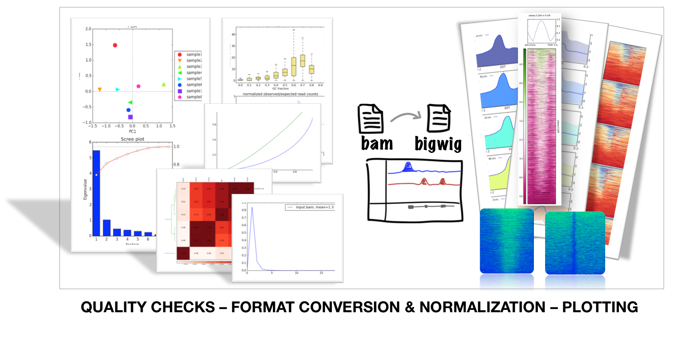
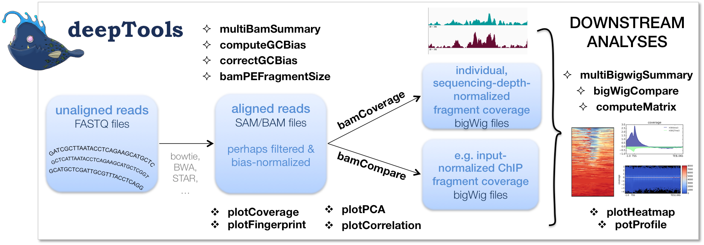

* **deepTools** is a suite of python tools particularly developed for the efficient analysis of high-throughput sequencing data, such as ChIP-seq, RNA-seq or MNase-seq

* [deepTools manual](https://test-argparse-readoc.readthedocs.io/en/latest/index.html)

* [deepTools Galaxy server](https://usegalaxy.eu/) you use the deepTools within the familiar Galaxy framework without the need to master the command line


## Deeptools installation

* Requirements
   * **Python 2.7 or Python 3.x**
   * numpy >= 1.8.0
   * scipy >= 0.17.0
   * py2bit >= 0.1.0
   * pyBigWig >= 0.2.1
   * pysam >= 0.8
   * matplotlib >= 1.4.0

* Install

  `conda install -c bioconda deeptools`


## BamCoverage

* [bamCoverage — deepTools 3.2.1 documentation](https://test-argparse-readoc.readthedocs.io/en/latest/content/tools/bamCoverage.html)

* The `bamCoverage` tool, part of the deepTools suite

* It’s designed for generating **coverage tracks** (bigWig or bedGraph files) from BAM files, for visualization in [Genome browser](#Genome browser)
    * **Coverage tracks** visually represent the density of reads across genomic regions, often used in genomics to interpret the depth and intensity of coverage in different regions

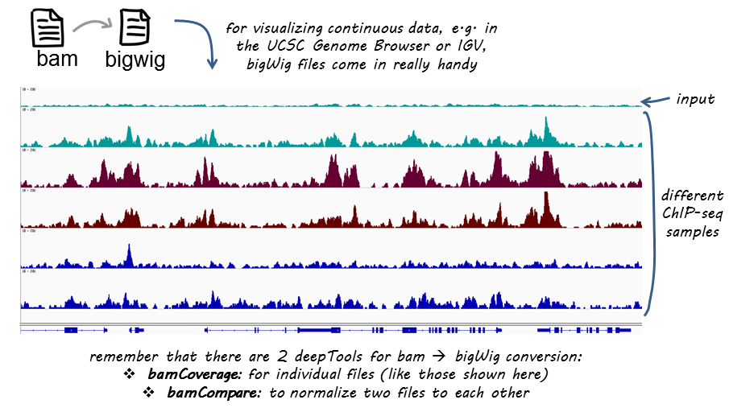


**Parameters**

```bash
bamCoverage

# ==General Parameters==
    -b <BAM>  # Input BAM file.
    -o  # Output file name (commonly with .bigWig or .bw extension).
    --outFileFormat # Format of the output file, typically bigwig or bedgraph.
    -P # Number of processors to use for multithreading, speeding up processing on larger files,(Default: 1)


# ==Normalization and Scaling==
    --effectiveGenomeSize 
    # The effective genome size is the portion of the genome that is mappable.
    # Large fractions of the genome are stretches of NNNN that should be discarded
    #  A table of values is available here: http://deeptools.readthedocs.io/en/latest/content/feature/effectiveGenomeSize.html
    
    --exactScaling 
    # bamCoverage calculates the scaling factor based on a sample of the reads, which is faster but less precise in some situations
    # Using exactScaling modifies this behavior to calculate the scaling factor based on all reads in the BAM file

    --normalizeUsing # Specify normalization method. Options include:
                     # RPKM (Reads Per Kilobase Million)
                     # CPM (Counts Per Million)
                     # BPM (Bins Per Million mapped reads)
                     # RPGC (Reads Per Genomic Content)
                     # None (no normalization)
                     # Default: None 
    --ignoreForNormalization 
    # A list of space-delimited chromosome names containing those chromosomes that should be excluded for computing the normalization. 
    # This is useful when considering samples with unequal coverage across chromosomes, like male samples. 
    # An usage examples is --ignoreForNormalization chrX chrM


# ==Coverage Computation==
    --binSize <int bp> 
    # Bin size (in bp) to use for calculating coverage. Smaller values yield higher resolution but increase file size.
    # Default: 50    
    
    --region <CHR:START:END> # Specify a specific genomic region to calculate coverage.   
    --smoothLength <int bp> # The smooth length defines a window, larger than the binSize, to average the number of reads.
    
    --skipNonCoveredRegions # Exclude regions with zero coverage from the output file.


# ==Read processing options==
    --extendReads <int bp> 
    # This parameter allows the extension of reads to fragment size
    # NOTE:This feature is generally NOT recommended for spliced-read data, such as RNA-seq 
    # *Single-end*: Reads that already exceed this fragment length will not be extended. 
    # *Paired-end*: Reads with mates are always extended to match the fragment size defined by the two read mates. 
    # mate reads that map too far apart (>4x fragment length) or even map to different chromosomes are treated like single-end reads.    

    --ignoreDuplicates   
    # If set, reads that have the same orientation and start position will be considered only once. 
    # If reads are paired, the mate's position also has to coincide to ignore a read.     

    --centerReads
    # adjusts the alignment position of each read to its central location, rather than using the read’s original start or end position     
    # *Paired-end*: The read is centered based on the fragment size defined by the positions of the two mates in the pair.
    # *Single-end*: Centering requires a specified fragment length.  
    # Be use in Sharp Peak Detection,like: ATAC-seq，chip-seq，CUT&Tag。
    


# ==Filtering Options==  
    --minMappingQuality <int>
    # Minimum mapping quality score to include reads in the coverage calculation (useful for filtering out low-quality alignments)
    
    --blackListFileName <bed> 
    # Specifies regions to exclude, useful for ignoring problematic regions like repetitive elements

    --minFragmentLength <int>
    # The minimum fragment length needed for read/pair inclusion. 
    # This option is primarily useful in ATACseq experiments, for filtering mono-or di-nucleosome fragments
    # Default: 0       

    --maxFragmentLength <int>
    # The maximum fragment length needed for read/pair inclusion. 
    # Default: 0    


# ==SAM flag option==
    --samFlagInclude <int>  
    # This option includes reads that match a specified flag
    # For example, to get only reads that are the first mate, use a flag of 64    

    --samFlagExclude <int> 
    # This option excludes reads with a specified SAM flag    
    # For example, to get only reads that map to the forward strand, use --samFlagExclude 16


# ==special seq option==
    --MNase 
    # Designed for MNase-seq, counts only the center 3 nucleotides of fragments between 130-200 bp for nucleosome positioning.
    # To over-write this, use the--minFragmentLength and --maxFragmentLength options, which will default to 130 and 200
    # *NOTE*: Requires paired-end data. A bin size of 1 is recommended. (default: False)
    
    --Offset <int> 
    # Specifies the base offset from the start (or end) of each read for counting coverage
    # useful for methods like RiboSeq or GROseq.
    # A value of 1 indicates the first base of the alignment (taking alignmentorientation into account). 
    # Likewise, a value of -1 is the last base of the alignment
    # If two values are specified, then they will be used to specify arange of positions

    --filterRNAstrand <forward,reverse> 
    # Filters reads based on the strand
    # This is particularly relevant for libraries prepared with strand-specific protocols, like dUTP-based library preparation
```


***

## computeMatrix

### computeMatrix perface

[computeMatrix — deepTools 3.2.1 documentation](https://test-argparse-readoc.readthedocs.io/en/latest/content/tools/computeMatrix.html) 

`computeMatrix` 由两种主要使用模式组成

| 模式                            | 说明                                                         |
| ------------------------------- | ------------------------------------------------------------ |
| `computeMatrix scale-regions`   | 将所有输入的 region 缩放成统一长度（无论原始region长短），然后在统一region上分析信号分布。**适合比较整个区域（如整个基因体）上的信号模式** |
| `computeMatrix reference-point` | 以每个region的一个特定点为中心（比如 TSS、TES），向上下游延伸一段距离，对这个范围内的信号进行统计。**适合分析信号在某个特定位置的分布趋势** |

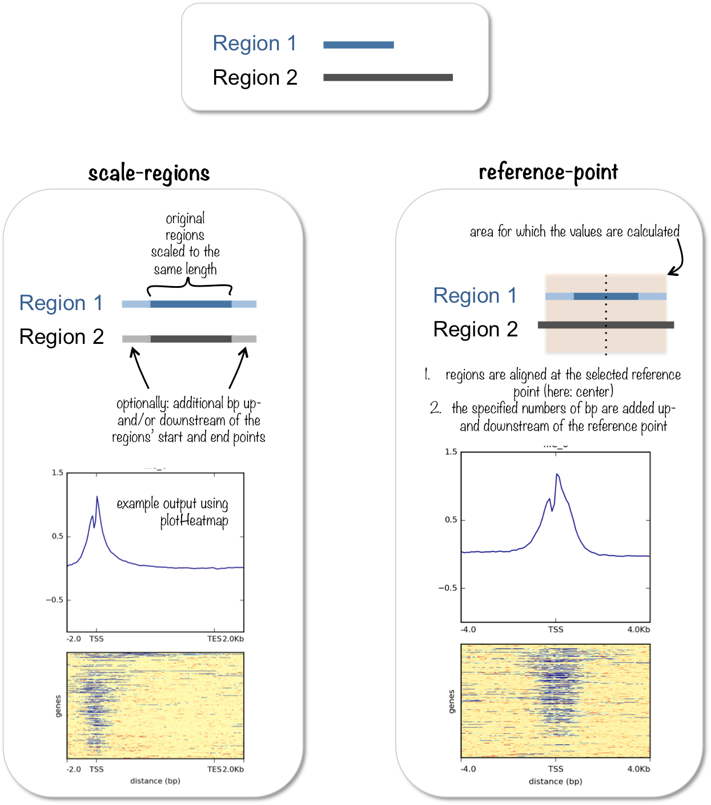


📌 它最终会输出一个 `.gz` 的矩阵文件，可以直接用于热图 (`plotHeatmap`) 或轮廓图 (`plotProfile`) 的绘制。

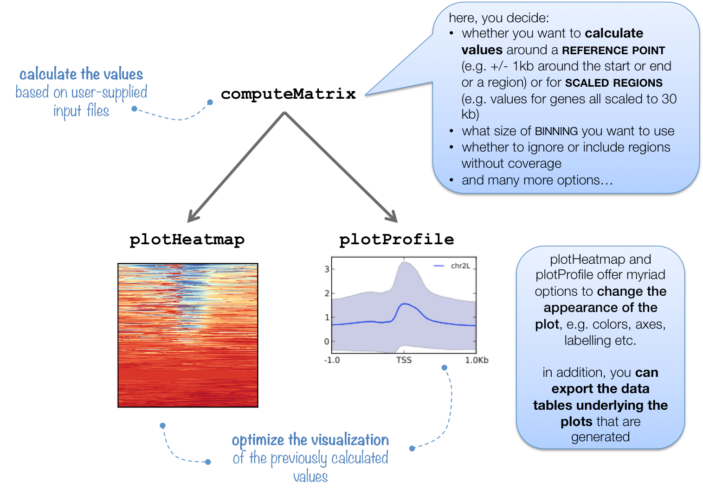


***

### computeMatrix scale-regions

`computeMatrix scale-regions` 的工作流程是这样的：

1. 输入 **bigWig** 文件 (`-S`)，

2. 输入 BED 或 GTF 文件 (`-R`)：这些是你关心的区域，通常是一组基因、peak、启动子等。每一行会作为一个**region**参与后续统计

3. `--regionBodyLength` 将所有region**缩放**成统一长度

4. 对缩放的region，deepTools 会按照`--binSize`进行 bin 的划分。

5. **信号值提取**：对每个 bin，从 **bigWig** 文件提取出该 bin 信号值。组成一个**Matrix（如下所示）**

   ```text
            Bin1   Bin2   Bin3  ...   BinN
   region1   10     12     13         15
   region2   0      0      0          0
   region3   20     23     22         25
   ...
   ```


> [!TIP]
>
> **缩放原理**
>
> 原始 region 长度：1000bp 或 2000bp
>
> `--regionBodyLength 1500`（我们想把所有region统一“压缩/拉伸”为 1500bp 长）
>
> `--binSize 50`（缩放后区域每 50bp 一个 bin → 共 1500 / 50 = 30 个 bin）
>
> - ✅ 对于长度为 1000bp 的 region：
>
>   - 每 1000/1500 ≈ **0.667bp 映射到 1bp**
>
>   - 所以第一个 bin（0-50bp）在原始区域中对应 0–33bp（大约）
>
>   - 第二个 bin → 33–66bp，以此类推
>
> **→ 整个 1000bp 被拉伸成 1500bp 的格式**


**parameters**

```bash
computeMatrix scale-regions


# == input file==
    --regionsFileName    # File name or names, in BED or GTF format
                         # 每个文件会被当作一个 group 来处理
                         # 也可以在一个 BED 文件内部用 # 把区域分group：BED文件中每遇到一个 #，就将前面的区域归为一个group。		
    
    --scoreFileName      # 指定一个或多个 bigWig 文件

    --blackListFileName  # 指定一个 BED 文件，这个文件里列出了你想从分析中排除的region
    

 
# == output file==
    --outFileName	        # 输出 .gz 矩阵文件，供 plotHeatmap 使用
    --outFileNameMatrix	    # 输出可读的矩阵（tab 分隔）
    --outFileSortedRegions	# 排序后的region保存到一个 BED 文件中


# == Matrix setting==
    --binSize	           # 设置bin大小（默认10），决定矩阵的 resolution
    --averageTypeBins	   # bin内信号统计量计算方式：mean(deafult), median, min, max, std, sum
    --scale                # 将所有信号值乘以一个缩放因子（scale factor）(Default: 1)
    
    
    --missingDataAsZero	   # 将 Na 数据视为0 (default: False)。在default下，Na在heatmap中为黑色显示
     
    --skipZeros            # 如果某个 region 的 所有 bin 都是 0，是否跳过该region。(default: False，不跳过)
    --minThreshold         # 如果某个 region中有任意一个 bin的数值小于或等于这个阈值，那么这个区域会被跳过。(Default: None)
    --maxThreshold         # 如果某个 region中有任意一个 bin的数值大于或等于这个阈值，那么这个区域会被跳过。(Default: None)


# ==region scale setting==
    --regionBodyLength	         # 将所有region缩放成统一长度 (Default: 1000)
    
    --beforeRegionStartLength	 # 分析region向前延伸的长度 (Default: 0)
    --afterRegionStartLength	 # 分析region向后延伸的长度 (Default: 0)
 
    --unscaled5prime             # 设置区域 5' 端保留多少碱基不进行缩放，适用于查看如 TSS 附近的真实信号(Default: 0)
    --unscaled3prime             # 设置区域 3' 端保留多少碱基不进行缩放，适用于查看如 TES 附近的真实信号(Default: 0)


# ==region sort==  
    --sortRegions	    # 是否对region排序
                        # optional parameters:descend（降序排列）、ascend（升序排列）、no （不排序，保持原始顺序）(deafult)
                        # 使用 plotHeatmap 等工具来可视化结果，这些工具会自动覆盖排序设置，因此该参数在这些情况下没有效果

     --sortUsing	    # 排序标准：mean,median,max,min,sum,region_length
     
     --sortUsingSamples	<SORTUSINGSAMPLES>   # SORTUSINGSAMPLES是一个 样本编号列表，用于指定哪些样本将参与排序过程 (deafult:全部样本进行排序)


# == GTF / BED12 options ==
	--metagene         # 不开启：以每个转录本从起始到终止（也就是 BED 的第2列到第3列）为整体region(default: False)
	                   #  开启： 则会把所有 exon 合并成一个连续region，然后在这个合并后的region上进行分析。适合用来看转录本结构下的富集情况
     
     --transcriptID    # 当你使用 GTF 文件时，这个参数指定哪种 feature 类型被视为transcripts (Default: transcript)
     --exonID          # 当你使用 GTF 文件时，这个参数指定哪种 feature 类型被视为exon (Default: exon)
     
     --transcript_id_designator # GTF 格式的最后一列(attributes),那个key作为id(Default: transcript_id)


# == 文件标签，这些标签会用于后续的可视化，作为图列标签 ==
    --samplesLabel      # 为每个文件设置自定义的标签名称(default: None)
    --smartLabels       # 自动地把输入文件名去掉路径和扩展名，作为标签(default: False)


# ==Draw picture setting==
    --startLabel           # 设置你在绘图中 region 起始位置的标签文字 (Default: TSS)
    --endLabel             # 设置你在绘图中 region 结束位置的标签文字 (Default: TES)


# ==Log display==
	--quiet     # 让程序“安静”地运行，不显示任何警告或中间处理信息 (default: False)
	--verbose   # 让程序“话多”，显示非常详细的运行信息 (default: False)


# ==performance optimization==
    --numberOfProcessors	# 并行处理线程数
                            # optional parameters:<numb>, max, max/2  
 
 
 
# == DeepBlue parameters（仅适用于使用远程的 bedGraph/wig 文件）==
    --deepBlueURL           # 指定 deepBlue 服务器的 URL 地址,不需要更改(default: http://deepblue.mpi-inf.mpg.de/xmlrpc)
    --userKey               # 指定访问 deepBlue 数据时用的用户密钥，(default:anonymous_key，足够用于访问公开数据集)
    --deepBlueTempDir       # 指定 deepBlue 数据预加载过程中临时文件保存的位置(default: None)
    --deepBlueKeepTemp      # 保留从 deepBlue 下载生成的临时 bigWig 文件(default:False，不保留)
```


**Example**

```bash
computeMatrix scale-regions \
  --regionsFileName testFiles/genes.bed \                             # 输入region文件（BED 格式），定义你感兴趣的基因区域
  --scoreFileName testFiles/log2ratio_H3K4Me3_chr19.bw  \             # 输入信号文件（bigWig 格式）
  --beforeRegionStartLength 3000 --afterRegionStartLength 3000 \      # 上游3000bp，下游3000bp
  --regionBodyLength 5000 \                                           # 将基因体统一缩放到5000bp
  --skipZeros \                                                       # 跳过全为0的region
  --outFileName matrix1_H3K4me3_l2r_TSS.gz \                          # 输出的压缩矩阵文件（供绘图使用）
  --outFileNameMatrix matrix2_multipleBW_l2r_twoGroups_scaled.tab \   # 输出可读的文本矩阵
  --outFileSortedRegions regions2_multipleBW_l2r_twoGroups_genes.bed  # 输出排序后的bed文件
```


***

### computeMatrix referencePoint

`omputeMatrix reference-point` 的工作流程如下：

1. **输入 bigWig 文件 (`-S`)**

2. **输入 BED 或 GTF 文件 (`-R`)**：这些是你感兴趣的区域（如 TSS、peak 等），每一行定义一个 **region**。

3. **设定参考点 (`--referencePoint`)**

   定义参考位置，如 `TSS`（转录起始点）、`TES`（转录终止点）或 `center`（区域中点）。所有信号的对齐都基于这个位置。

4. **定义 flanking 区域 (`--beforeRegionStartLength`, `--afterRegionStartLength`)**

   `--beforeRegionStartLength`：参考点**上游**多少 bp（before）
    `--afterRegionStartLength`：参考点**下游**多少 bp（after）
    合起来就是对每个 region，提取 `referencePoint ± X bp` 的窗口。

5. **bin 划分 (`--binSize`)**

   将上述窗口分割为固定大小的 bin。

6. **信号值提取**:对每个 bin，从对应 bigWig 文件中提取信号强度，计算平均值，构成一个 **Matrix（如下所示）**

   ```text
            Bin1   Bin2   Bin3  ...   BinN
   region1   10     12     13         15
   region2   0      0      0          0
   region3   20     23     22         25
   ...
   ```


**computeMatrix referencePoint parameter**

```bash
computeMatrix reference-point


# == input file==
    --regionsFileName    # File name or names, in BED or GTF format
                         # 每个文件会被当作一个 group 来处理
                         # 也可以在一个 BED 文件内部用 # 把区域分group：BED文件中每遇到一个 #，就将前面的区域归为一个group。		
    
    --scoreFileName      # 指定一个或多个 bigWig 文件

    --blackListFileName  # 指定一个 BED 文件，这个文件里列出了你想从分析中排除的region
    

 
# == output file==
    --outFileName	        # 输出 .gz 矩阵文件，供 plotHeatmap 使用
    --outFileNameMatrix	    # 输出可读的矩阵（tab 分隔）
    --outFileSortedRegions	# 排序后的region保存到一个 BED 文件中


# == Matrix setting==
    --binSize	           # 设置bin大小（默认10），决定矩阵的 resolution
    --averageTypeBins	   # bin内信号统计量计算方式：mean(deafult), median, min, max, std, sum
    --scale                # 将所有信号值乘以一个缩放因子（scale factor）(Default: 1)
    
    
    --missingDataAsZero	   # 将 Na 数据视为0 (default: False)。在default下，Na在heatmap中为黑色显示
     
    --skipZeros            # 如果某个 region 的 所有 bin 都是 0，是否跳过该region。(default: False，不跳过)
    --minThreshold         # 如果某个 region中有任意一个 bin的数值小于或等于这个阈值，那么这个区域会被跳过。(Default: None)
    --maxThreshold         # 如果某个 region中有任意一个 bin的数值大于或等于这个阈值，那么这个区域会被跳过。(Default: None)


# ==reference-point setting==
    --referencePoint	         # 指定参考点，TSS、TES或center(Default: TSS)
    
    --beforeRegionStartLength	 # 参考点上游提取长度，即在参考点前延伸多少 bp。(Default: 500)
    --afterRegionStartLength	 # 参考点下游提取长度，即在参考点后延伸多少 bp。(Default: 1500)
 
    --nanAfterEnd                # True，任何位于所定义的region结束后（即参考点 + afterRegionStartLength 距离后）的信号值会被标记为 NaN
                                 # False，即不会丢弃region结束后的信号数据。即便在绘图时，region结束后的数据仍会被显示 (deafult)


# ==region sort==  
    --sortRegions	    # 是否对region排序
                        # optional parameters:descend（降序排列）、ascend（升序排列）、no （不排序，保持原始顺序）(deafult)
                        # 使用 plotHeatmap 等工具来可视化结果，这些工具会自动覆盖排序设置，因此该参数在这些情况下没有效果

     --sortUsing	    # 排序标准：mean,median,max,min,sum,region_length
     
     --sortUsingSamples	<SORTUSINGSAMPLES>   # SORTUSINGSAMPLES是一个 样本编号列表，用于指定哪些样本将参与排序过程 (deafult:全部样本进行排序)


# == GTF / BED12 options ==
	--metagene         # 不开启：以每个转录本从起始到终止（也就是 BED 的第2列到第3列）为整体region(default: False)
	                   #  开启： 则会把所有 exon 合并成一个连续region，然后在这个合并后的region上进行分析。适合用来看转录本结构下的富集情况
     
     --transcriptID    # 当你使用 GTF 文件时，这个参数指定哪种 feature 类型被视为transcripts (Default: transcript)
     --exonID          # 当你使用 GTF 文件时，这个参数指定哪种 feature 类型被视为exon (Default: exon)
     
     --transcript_id_designator # GTF 格式的最后一列(attributes),那个key作为id(Default: transcript_id)


# == 文件标签，这些标签会用于后续的可视化，作为图列标签 ==
    --samplesLabel      # 为每个文件设置自定义的标签名称(default: None)
    --smartLabels       # 自动地把输入文件名去掉路径和扩展名，作为标签(default: False)


# ==Log display==
	--quiet     # 让程序“安静”地运行，不显示任何警告或中间处理信息 (default: False)
	--verbose   # 让程序“话多”，显示非常详细的运行信息 (default: False)


# ==performance optimization==
    --numberOfProcessors	# 并行处理线程数
                            # optional parameters:<numb>, max, max/2  
 
 
 
# == DeepBlue parameters（仅适用于使用远程的 bedGraph/wig 文件）==
    --deepBlueURL           # 指定 deepBlue 服务器的 URL 地址,不需要更改(default: http://deepblue.mpi-inf.mpg.de/xmlrpc)
    --userKey               # 指定访问 deepBlue 数据时用的用户密钥，(default:anonymous_key，足够用于访问公开数据集)
    --deepBlueTempDir       # 指定 deepBlue 数据预加载过程中临时文件保存的位置(default: None)
    --deepBlueKeepTemp      # 保留从 deepBlue 下载生成的临时 bigWig 文件(default:False，不保留)
```


**Example**

```bash
computeMatrix reference-point 
    --referencePoint TSS \                                             # 参考点选择 TSS
    --beforeRegionStartLength 3000 --afterRegionStartLength 3000 \     # 上游3000bp，下游3000bp
    --regionsFileName testFiles/genes.bed \                            # 输入region文件（BED 格式），定义你感兴趣的基因区域
    --scoreFileName testFiles/log2ratio_H3K4Me3_chr19.bw  \            # 输入信号文件（bigWig 格式）
    --skipZeros \                                                      # 跳过全为0的region 
    --outFileName matrix1_H3K4me3_l2r_TSS.gz \                         # 输出的压缩矩阵文件（供绘图使用）
    --outFileSortedRegions regions1_H3K4me3_l2r_genes.bed              # 输出排序后的bed文件
```


***

## plotHeatmap

- [plotHeatmap — deepTools 3.2.1 documentation](https://test-argparse-readoc.readthedocs.io/en/latest/content/tools/plotHeatmap.html)

- `plotHeatmap` does not change the values that `computeMatrix` calculated, it simply translates them into **heatmaps** and **summary plots**

- 输入使用 `computeMatrix` 生成**.gz 矩阵文件**

- `plotHeatmap` 默认由3个图构成summary plot (上方)+ heatmap(下方)+ colorba(右方)

  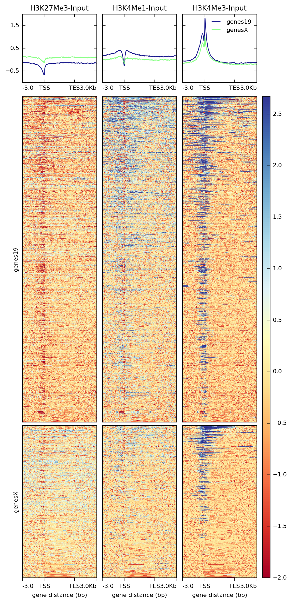


**📌 必填参数（Required arguments）**

| 参数                            | 含义                                                         |
| ------------------------------- | ------------------------------------------------------------ |
| `--matrixFile` 或 `-m`          | 输入使用 `computeMatrix` 工具生成的矩阵文件。**这是绘图的基础数据。** |
| `--outFileName` 或 `-out`, `-o` | 输出图片的文件名。根据文件名后缀自动决定格式（如 `.png`, `.pdf`, `.svg` 等） |


**📤 输出选项（Output options）**

| 参数                     | 含义                                                         |
| ------------------------ | ------------------------------------------------------------ |
| `--outFileSortedRegions` | 输出排序后区域的 BED 文件，可用于之后再用相同排序绘图。      |
| `--outFileNameMatrix`    | 输出heatmap下方实际使用的矩阵数据（`.gz` 格式），便于重复使用或自定义分析。 |
| `--interpolationMethod`  | 插值方式，可让图像在列数很多时更平滑。可选：`nearest`, `bilinear`, `bicubic`, `gaussian` 等。[详见点此](https://matplotlib.org/2.0.2/examples/images_contours_and_fields/interpolation_methods.html) (default: auto) |
| `--dpi`                  | 设置图片分辨率（单位为 DPI）(default: 200)                   |


**🔗 聚类参数（Clustering）**

| 参数           | 含义                                                         |
| -------------- | ------------------------------------------------------------ |
| `--kmeans`     | 使用 K-means 算法对区域进行聚类，值为聚类个数（如 `--kmeans 3` 表示聚 3 类）。(default: None) |
| `--hclust`     | 使用层次聚类（hierarchical clustering）进行聚类，值为聚类个数，使用 `ward linkage` 方法来构建聚类树。(default: None) |
| `--silhouette` | 若使用聚类，可计算每个区域的 **silhouette** 分数来评估聚类效果。可写入 BED 文件末列。(default: False) |


> [!TIP]
>
> **K-means 聚类与层次聚类？**
>
> | 方法         | 适合场景                                        |
> | ------------ | ----------------------------------------------- |
> | 层次聚类     | 小规模数据（区域数量 < 1000），追求树状结构关系 |
> | K-means 聚类 | 中大规模数据，速度更快，效果可接受              |


**🧩排序选项（sort arguments）**

| **参数**                | 含义                                                         |
| ----------------------- | ------------------------------------------------------------ |
| `--sortRegions`         | 排序区域的方式，默认是 `descend`（按均值从高到低），也可设为 `ascend`, `no`, `keep`。 |
| `--sortUsing`           | 选择用于排序的统计方法：`mean`, `median`, `max`, `min`, `sum`, `region_length`。 |
| `--sortUsingSamples`    | 指定用于排序的样本索引（如 `--sortUsingSamples 1 3`）(default: None) |
| `--clusterUsingSamples` | 指定用于聚类的样本编号（默认使用所有样本）。                 |


🎨**颜色选项（color arguments)**

| 参数                 | 含义                                                         |
| -------------------- | ------------------------------------------------------------ |
| `--missingDataColor` | 指定缺失数据的颜色，默认是黑色（black）。可用灰度值`0–1`或颜色名 `#hex`。 |
| `--colorMap`         | 指定heatmap使用的颜色图谱（colormap）[Choosing Colormaps ](https://matplotlib.org/2.0.2/users/colormaps.html) |
| `--alpha`            | heatmap透明度，0 表示全透明，1 表示完全不透明 (default: 1.0) |
| `--colorList`        | 自定义颜色过渡列表，例如 `--colorList black,yellow,blue`，会覆盖 `--colorMap` 设置。 |
| `--colorNumber`      | 用于指定颜色过渡的级数，仅在设置 `--colorList` 时有效。      |


🎢**标签与坐标轴选项（Label and axis argument）**

| 参数                             | 含义                                                         |
| -------------------------------- | ------------------------------------------------------------ |
| `--xAxisLabel XAXISLABEL`        | 设置 x 轴标签的描述。默认值为 "gene distance (bp)"。         |
| `--startLabel STARTLABEL`        | 仅在 `scale-regions` 模式下使用，设置区域起始位置的标签。默认为 TSS 。 |
| `--endLabel ENDLABEL`            | 仅在 `scale-regions` 模式下使用，设置区域结束位置的标签。默认为 TES 。 |
| `--refPointLabel REFPOINTLABEL`  | 仅在 `reference-point` 模式下使用，设置参考点的标签。默认为所选参考点。 |
| `--labelRotation LABEL_ROTATION` | 设置 x 轴标签的旋转角度，正值为逆时针旋转。(default: 0.0)    |
| `--regionsLabel REGIONSLABEL`    | 设置heatmap 中展示的区域标签，如果有多个区域，需用空格分隔。(default: None) |
| `--samplesLabel SAMPLESLABEL`    | 设置展示的样本标签，默认使用文件名。如果标签包含空格，需用引号括起来。(default: None) |
| `--plotTitle PLOTTITLE`          | 设置图表的标题。(default: None)                              |
| `--yAxisLabel YAXISLABEL`        | 设置 y 轴标签。(default: None)                               |
| `--yMin YMIN`                    | 设置 y 轴的最小值，可以为多个值，为每个图表单独设置。(default: None) |
| `--yMax YMAX`                    | 设置 y 轴的最大值，可以为多个值，为每个图表单独设置。(default: None) |
| `--legendLocation`               | 设置图例的位置，常用的位置选项包括 `best`, `upper-right`, `lower-left`, `none`等。默认值为 `best`。 |


🔧 **其他常用选项（Optional arguments）**

| 参数                                | 含义                                                         |
| ----------------------------------- | ------------------------------------------------------------ |
| `--plotType`                        | 设置 summary plot 的样式，如 `lines`（deafult）（绘制平均曲线），`fill`（用半透明颜色填充曲线下方区域）, `se`（显示标准误差区域）, `std`（显示标准差区域） |
| `--linesAtTickMarks`                | 在heatmap上从 **所有 tick marks（坐标轴上的刻度线）** 处，向下绘制 **虚线（dashed lines）**(default: False) |
| `--averageTypeSummaryPlot`          | 设置 summary plot 的统计方式，默认是 `mean`，也可用 `median`, `max`, `min`, `std`, `sum` 等。 |
| `--zMin`, `--zMax`                  | 分别设置heatmap显示的最小和最大数值。支持多个值用于多图绘制。支持 `"auto"` 自动选择百分位数。(default: None) |
| `--heatmapHeight`, `--heatmapWidth` | 图像尺寸，单位为 cm。默认是 28 cm × 4 cm。                   |
| `--whatToShow`                      | 指定图像显示哪些内容，(deafult: summary plot + heatmap+ colorbar）。 |
| `--boxAroundHeatmaps`               | 是否在heatmap周围加黑框，默认是 `yes`，可设为 `no` 取消。    |
| `--perGroup`                        | 控制是否按组别绘制所有样本的数据。默认为按样本绘制所有组别数据(False)。 |
| `--verbose`                         | 启用此选项时，显示警告信息和其他附加信息。(default: False)   |


**Example**

```bash
plotHeatmap -m matrix.mat.gz \
      -out ExampleHeatmap1.png \
```


***

## DeepBlue 

- [MPIIComputationalEpigenetics/DeepBlue: DeepBlue Epigenomic Data Server](https://github.com/MPIIComputationalEpigenetics/DeepBlue?tab=readme-ov-file)（这个好像挂掉了）
- DeepBlue 是一个生物信息学的在线平台，提供了多种基因组数据和生物标志物的数据集。用户可以在 DeepBlue 上访问、查询和下载不同类型的基因组数据，通常包括类似 **bigWig** 和 **BED** 格式的文件，这些文件存储了各类组学数据（如 ChIP-seq、RNA-seq 等）的信号。
- 如果你不想下载数据到本地，可以直接使用 `computeMatrix` 或 `plotProfile` 来读取和分析 deepBlue 上的数据


***

# Convert Bam to BigWIG and BigWIG Operate

## Convert Bam to BigWIG 

* We use [Samtools sort](#Samtools-sort) to sort the BAM file

* We use [BamCoverage of deeptools](#BamCoverage) to convert BAM to BigWIG

  ```bash
  #!/bin/bash
  # create bigwig folder
  mkdir -p ./bigwig
  
  # Define the threads
  threads=10
  
  # Define the variables
  samples=("KCHIP2" "KCHIP2-OE")
  
  # BAM directory
  bigwigDir="bigwig"
  
  # BAM directory
  bamDir="deduplicated.bam"
  
  # Loop over the samples
  for sample in "${samples[@]}"; do
  
      # BAM file path
      bam_file="${bamDir}/filter${sample}deduplicated.bam"
      sort_bam_file="${bamDir}/filter${sample}deduplicated.sort.bam"
      
      # Sort the BAM file (skip sorting if sorted already)
      if [[ ! -f "$sort_bam_file" ]]; then
          echo "Sorting BAM file: $bam_file"
          samtools sort -o "$sort_bam_file" "$bam_file" -@ "$threads"
      fi                                                    
  
      # create index
      samtools index "$sort_bam_file"
  
      # bigwig file path
      bigwig_file="${bigwigDir}/filter${sample}deduplicated.sort.bigwig"
      
      # convert BAM TO bigwig
      bamCoverage -b "$sort_bam_file" -o "$bigwig_file"
  done
  ```

  

***

## Heatmap visualization

* We are also interested in looking at chromatin features at a list of annotated sites(such as promoters sites)
* For example,  We can use the [computeMatrix](#computeMatrix) and [plotHeatmap](#plotHeatmap) functions from deepTools to generate the heatmap of gene promoters


### Heatmap over transcription units

```bash
# 设置并行处理的核心数
cores=8

# Step 1: 使用 computeMatrix 工具来生成信号矩阵，适用于可视化染色质修饰在基因区域的分布模式
computeMatrix scale-regions \
    -S $projPath/alignment/bigwig/K27me3_rep1_raw.bw \     # 输入 bigWig 信号文件1（H3K27me3 replicate 1）
       $projPath/alignment/bigwig/K27me3_rep2_raw.bw \     # 输入 bigWig 信号文件2（H3K27me3 replicate 2）
       $projPath/alignment/bigwig/K4me3_rep1_raw.bw \      # 输入 bigWig 信号文件3（H3K4me3 replicate 1）
       $projPath/alignment/bigwig/K4me3_rep2_raw.bw \      # 输入 bigWig 信号文件4（H3K4me3 replicate 2）
    -R $projPath/data/hg38_gene/hg38_gene.tsv \            # 输入基因注释文件（TSV 格式，包含区域信息）
    --beforeRegionStartLength 3000 \                       # 参考区域上游延伸长度：3000bp
    --regionBodyLength 5000 \                              # 区域本体长度（基因主体长度）：5000bp
    --afterRegionStartLength 3000 \                        # 参考区域下游延伸长度：3000bp
    --skipZeros \                                          # 跳过所有 bin 都为 0 的区域（可去除无信号区域）
    -o $projPath/data/hg38_gene/matrix_gene.mat.gz \       # 输出的压缩矩阵文件（供 plotHeatmap 使用）
    -p $cores                                              # 指定并行处理使用的核心数


# Step 2: 使用 plotHeatmap 可视化 computeMatrix 生成的信号矩阵
plotHeatmap \
    -m $projPath/data/hg38_gene/matrix_gene.mat.gz \       # 输入 computeMatrix 生成的矩阵文件
    -out $projPath/data/hg38_gene/Histone_gene.png \       # 输出的热图图片文件（PNG格式）
    --sortUsing sum                                        # 根据每个区域的信号总和进行排序（从低到高）

```


### Heatmap on CUT&Tag peaks

- We use the **midpoint of the signal block** returned from `SEACR` to align signals in heatmaps. 

- The sixth column of the [SEACR output](#Structure of SEACR bed file) is an entry in the form `chr:start-end` that represents  the region with the maximum signal of the region. 

- We first generate a new **bed file containing this midpoint information** in column 6 and use [computeMatrix](#computeMatrix) and  [plotHeatmap](#plotHeatmap) of `deeptools` for the heatmap visualization.

  ```bash
  # 使用 awk 从 SEACR 输出的 peak 文件中提取 summit 区域
  awk '{
      split($6, summit, ":");            # 将第6列内容按冒号分割，如 "chr1:12345-12500"，得到 summit[1]="chr1"，summit[2]="12345-12500"
      split(summit[2], region, "-");     # 将 summit 的区段部分按 - 分割，region[1]=12345，region[2]=12500
      print summit[1]"\t"region[1]"\t"region[2]   # 输出格式为 BED：chr\tstart\tend
  }' $projPath/peakCalling/SEACR/${histName}_${repName}_seacr_control.peaks.stringent.bed \
  > $projPath/peakCalling/SEACR/${histName}_${repName}_seacr_control.peaks.summitRegion.bed
  # 输出为一个 BED 文件，包含 peak summit 区域（用于后续画图的区域定义）
  
  
  # 使用 computeMatrix 构建以 peak summit 为中心的信号矩阵
  computeMatrix reference-point \
      -S $projPath/alignment/bigwig/${histName}_${repName}_raw.bw \      # 输入 bigWig 信号文件（某组 ChIP-seq 数据）
      -R $projPath/peakCalling/SEACR/${histName}_${repName}_seacr_control.peaks.summitRegion.bed \ # 输入以 summit 为中心的 BED 区域
      --skipZeros \              # 跳过所有 bin 都为 0 的区域，减少无意义背景
      -o $projPath/peakCalling/SEACR/${histName}_${repName}_SEACR.mat.gz \ # 输出压缩信号矩阵文件
      -p $cores \                # 并行线程数（提高运行速度）
      -a 3000 \                  # 在参考点（summit）下游延伸 3000bp
      -b 3000 \                  # 在参考点（summit）上游延伸 3000bp
      --referencePoint center    # 设置参考点为区域中心（即 summit 的中心）
  
  
  # 使用 plotHeatmap 对上面生成的矩阵进行可视化
  plotHeatmap \
      -m $projPath/peakCalling/SEACR/${histName}_SEACR.mat.gz \         # 输入信号矩阵文件
      -out $projPath/peakCalling/SEACR/${histName}_SEACR_heatmap.png \ # 输出热图图像文件（PNG）
      --sortUsing sum \                 # 按每个 peak 区域的总信号排序
      --startLabel "Peak Start" \       # 设置热图 X 轴左侧标签
      --endLabel "Peak End" \           # 设置热图 X 轴右侧标签
      --xAxisLabel "" \                 # 取消默认 X 轴标签（可避免显示“Distance from center”等）
      --regionsLabel "Peaks" \          # Y轴区域名称，统一标注为“Peaks”
      --samplesLabel "${histName} ${repName}"  # 热图图例标签，显示为样本名称（例如 H3K27me3 rep1）
  ```


***

# Differential analysis

## DESeq2

### DEseq2 perface

- DESeq2: [Moderated estimation of fold change and dispersion for RNA-seq data with DESeq2](https://genomebiology.biomedcentral.com/articles/10.1186/s13059-014-0550-8)
- 其通过估计高通量测序实验中计数数据的方差与均值之间的依赖关系，并基于**负二项分布**模型进行差异表达分析。


> [!TIP]
>
> **Negative Binomial vs Poisson Distribution (μ = 20)**
>
> 下图展示了在相同均值 (μ = 20) 下，**负二项分布**和**泊松分布**的概率质量函数（PMF）比较：
>
> 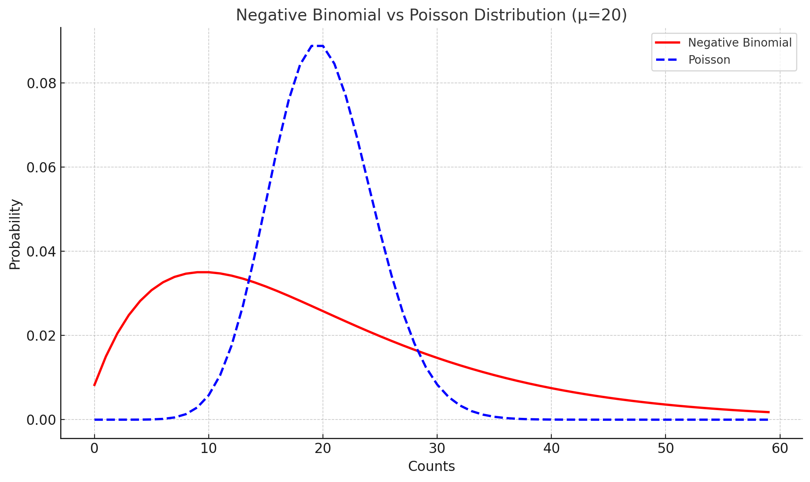
>
> 🔍 **观察说明：**
>
> - **Poisson 分布**（蓝色虚线）假设：
>   - 方差 = 均值（Var = μ）
>   - 因此其分布较窄，集中在均值附近。
>
> - **Negative Binomial 分布**（红色实线）假设：
>   - 方差 > 均值（Var = μ + α·μ²）
>   - 更能描述 RNA-seq 等高通量测序数据中常见的“过度离散”（overdispersion）现象，尾部更长，整体更宽。
>


### Code

**loading package**

```R
library(DESeq2)
library(Rsamtools)  # 用于读取BAM文件
library(GenomicAlignments)  # 用于计算peak区域的counts
```


**Create a master peak list merging all the peaks called for each sample**

> [!TIP]
>
> **master peak**
>
> 将样本中重叠或相邻的 peak 区域合并成一个更大的 peak 区域
>
> ```ASCII
> SAMPLES:
> ───────────────────────────────────────────────────────────────────────
> Sample 1:  ██████████               ██████████             █████      
>           [100-200]               [300-400]               [700-800]   
> 
> Sample 2:    ██████████              ██████████                        
>             [150-250]              [350-450]                          
> 
> Sample 3:      ████                    ███████████                     
>               [180-220]              [380-500]                         
> 
> 
> MASTER PEAK AFTER reduce():
> ───────────────────────────────────────────────────────────────────────
>            ██████████████        ███████████████        █████         
>           [100-250]            [300-500]              [700-800]       
> ```
>
> 


```R
# 加载必要的包
library(DESeq2)
library(Rsamtools)  # 用于读取BAM文件
library(GenomicAlignments)  # 用于计算peak区域的counts


# 初始化一个空的 GRanges 对象，用于保存所有 peak 区域
mPeak = GRanges()

## 遍历每一个组学标记（hist）和其对应的重复（rep）
## 从每个对应的 SEACR peak 文件中读取 peak 区域，并构建 GRanges 对象
## 将所有 peak 合并进 mPeak 中
for(hist in histL){
  for(rep in repL){
    # 读取 peak 文件（SEACR 输出的文件）
    peakRes = read.table(paste0(projPath, "/peakCalling/SEACR/", hist, "_", rep, "_seacr_control.peaks.stringent.bed"), header = FALSE, fill = TRUE)
    
    # 构建 GRanges 对象，包含染色体名称、起始和终止位置，链信息设置为通配 '*'
    # 并将其追加到 mPeak 中
    mPeak = GRanges(seqnames = peakRes$V1,
                    IRanges(start = peakRes$V2, end = peakRes$V3),
                    strand = "*") %>%
            append(mPeak, .)
  }
}

# 使用 reduce() 函数将所有 peak 区域合并为 master peak 区域（即合并重叠或相邻区域）
masterPeak = reduce(mPeak)
```


**Get the fragment counts for each peak in the master peak list.**

```R
# 定义包含 BAM 文件的目录（项目路径拼接 "/alignment/bam"）
bamDir = paste0(projPath, "/alignment/bam")

# 初始化一个矩阵来存储计数值（行表示 peaks，列表示样本）
countMat = matrix(NA, length(masterPeak), length(histL) * length(repL))

# 遍历 histL（组蛋白标记）和 repL（重复实验）组合
i = 1  # 初始化计数器，用于在 countMat 中的列索引
for(hist in histL) {
  for(rep in repL) {

    # 构造 BAM 文件路径，包含组蛋白标记和重复实验
    bamFile = paste0(bamDir, "/", hist, "_", rep, "_bowtie2.mapped.bam")
    
    # 从 BAM 文件中提取区域（由 masterPeak 定义）上的片段计数
    # 参数说明：
    # - paired = TRUE: 数据为Paired-end
    # - by_rg = FALSE: 不按 read group 进行分组（根据 BAM 文件结构选择是否使用）
    # - format = "bam": 输入文件格式为 BAM
    fragment_counts <- getCounts(bamFile, masterPeak, paired = TRUE, by_rg = FALSE, format = "bam")
    
    # 将提取的计数值存储到 countMat 矩阵中
    countMat[, i] = counts(fragment_counts)[,1]
    
    # 增加列索引，用于处理下一个样本
    i = i + 1
  }
}

# 给 countMat 矩阵的列名命名，列名由组蛋白标记和重复实验组成
# 示例：histL = c("H3K27ac", "H3K4me3"), repL = c("rep1", "rep2")
# 结果列名将是 "H3K27ac_rep1", "H3K27ac_rep2" 等等
colnames(countMat) = paste(rep(histL, 2), rep(repL, each = 2), sep = "_")
```


**Sequencing depth normalization and differential enriched peaks detection**

```R
# 选择那些总计数大于 5 的行，即去除低表达基因
selectR = which(rowSums(countMat) > 5)

# 从 countMat 中选择符合条件的行，得到一个新的数据集 dataS
dataS = countMat[selectR,]

# 创建一个 factor 变量 'condition'，表示不同的实验条件（组蛋白标记）
condition = factor(rep(histL, each = length(repL)))

# 使用 DESeq2 创建一个 DESeqDataSet 对象，数据来自 dataS，条件来自 'condition'
# 'design = ~ condition' 表示实验设计是基于条件（组蛋白标记）来分析
dds = DESeqDataSetFromMatrix(countData = dataS,
                              colData = DataFrame(condition),
                              design = ~ condition)

# 使用 DESeq2 进行差异分析，得到一个 DESeq 结果对象 DDS
DDS = DESeq(dds)

# 获取标准化后的计数数据，标准化是基于测序深度进行的
normDDS = counts(DDS, normalized = TRUE)  # normalization with respect to the sequencing depth

# 给标准化后的计数数据添加列名后缀 "_norm"
colnames(normDDS) = paste0(colnames(normDDS), "_norm")

# 获取差异分析的结果，设置独立过滤为 FALSE，指定备择假设为 "greaterAbs"（表达水平显著增加）
res = results(DDS, independentFiltering = FALSE, altHypothesis = "greaterAbs")

# 将原始数据、标准化计数数据和差异分析结果合并为一个新的数据框 countMatDiff
countMatDiff = cbind(dataS, normDDS, res)

# 显示合并后的数据框的前几行
head(countMatDiff)

```


-  DESeq2 requires the input matrix should be **un-normalized counts** 
- \- **countMatDiff** summarizes the differential analysis results: 
-   \- First 4 columns: raw reads counts after filtering the peak regions with low counts
-   \- Second 4 columns: normalized read counts eliminating library size difference.
-   \- Remaining columns: differential detection results


***

